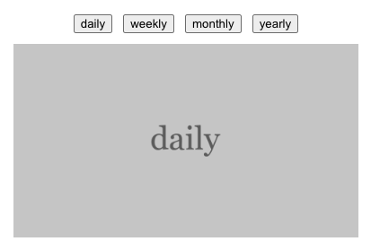

## 案例

要实现如下效果：点击按钮，切换响应的图片。图片资源放置在 `src/assets/images` 目录下，考虑如何实现。



## Vite 打包

- Vite 在打包时会进行依赖分析，而这个分析是静态资源分析，不会运行代码，因此有些资源不会被打包到最终的构建产物中，导致无法访问。
- Vite 有自动依赖分析机制，除了 `import` 语句外，还会自动导入其他依赖：
  - 标签**静态**链接路径 (如 `` 会被自动导入，“静态”表示路径中不能包含变量)
  - CSS 中的**静态**链接路径 (如 `background-image: url("@/assets/images/daily.png")` 会被自动导入)
  - 动态导入语句
  - URL 构造器

## 解决方案

### 1️⃣ 将资源放在 `public` 目录下

`public` 目录下的资源会被直接复制到 `dist` 目录下，因此可以直接访问。但是这样会丢失文件指纹，不推荐使用。

### 2️⃣ 使用 `import` 逐个导入资源

太麻烦，不推荐使用。

### 3️⃣ 使用 `import` 动态导入

在运行代码时动态导入。这里的 `import` 语句是动态导入语句，Vite 会自动处理这里的依赖，分析动态导入的模板字符串，它会将 `@/assets/images` 路径下所有的 `.png` 文件打包到最终的构建产物中。

```js
const handleClick = (item) => {
  import(`@/assets/images/${item}.png`).then((p) => {
    path.value = p.default;
  });
};
```

::: note

- 动态导入语句的模板字符串中不能全部是变量，必须包含静态部分 (限制目录、限制后缀等)
- 打包后产物中每个静态资源图片对应一个 `.js` 文件，如下所示。代码运行的时候，`import` 导入的是这个 `.js` 文件
- 这种方式有个小缺陷，就是会生成很多个 `.js` 文件，每个资源都会生成一个对应的 `.js` 文件

:::

::: file-tree

- dist
  - assets
    - daily-B16oBp6t.js
    - daily-VIy4zTB2.png

:::

::: code-tabs
@tab daily-B16oBp6t.js

```js
const a = "/assets/daily-VIy4zTB2.png";
export { a as default };
```

:::

### 4️⃣ 使用 URL 对象

Vite 在依赖分析时会自动处理 URL 构造器，因此可以通过 URL 对象来动态访问资源。

::: note
当使用 URL 构造器时，路径必须使用**相对路径**，不能使用绝对路径。 (`@/assets/images/${item}.png` 结果为 `undefined`)

因为 `new URL()` 是 JavaScript 原生的 API，用于解析相对路径时，依赖于 `import.meta.url` 提供的上下文，不支持别名解析。
:::

```js
const handleClick = (item) => {
  const url = new URL(`../assets/images/${item}.png`, import.meta.url);
  path.value = url.pathname;
};
```

### 5️⃣ 使用 `import.meta.glob`

Vite 支持使用特殊的 [`import.meta.glob`](https://cn.vite.dev/guide/features#glob-import) 函数从文件系统导入多个模块：

```js
const handleClick = (item) => {
  const images = import.meta.glob('@/assets/images/*.png', {
    eager: true
  })
  // {
  //   "/src/assets/images/daily.png": {
  //       "default": "/assets/daily-VIy4zTB2.png"
  //   },
  //   ...
  // }
  const key = `/src/assets/images/${item}.png`;
  if (images[key]) {
    const module = images[key] as { default: string }; // 获取默认导出的路径
    path.value = module.default; // 设置路径
  } else {
    console.error(`Image for ${item} not found.`);
  }
}
```

## 其他
