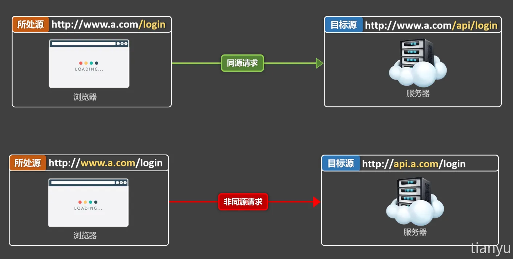
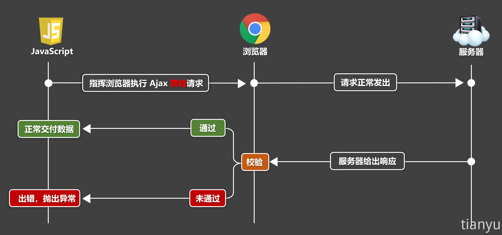
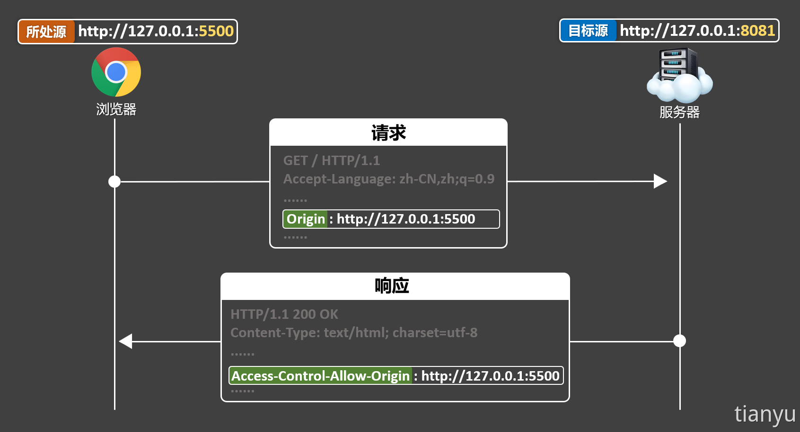
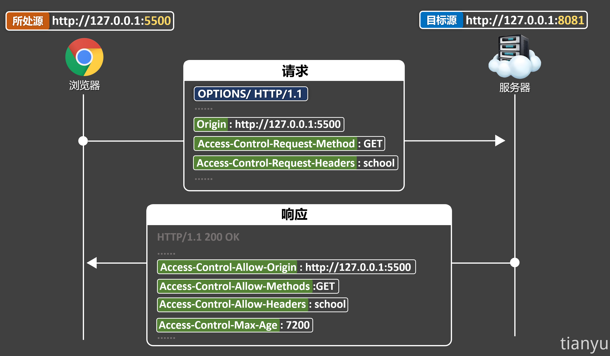
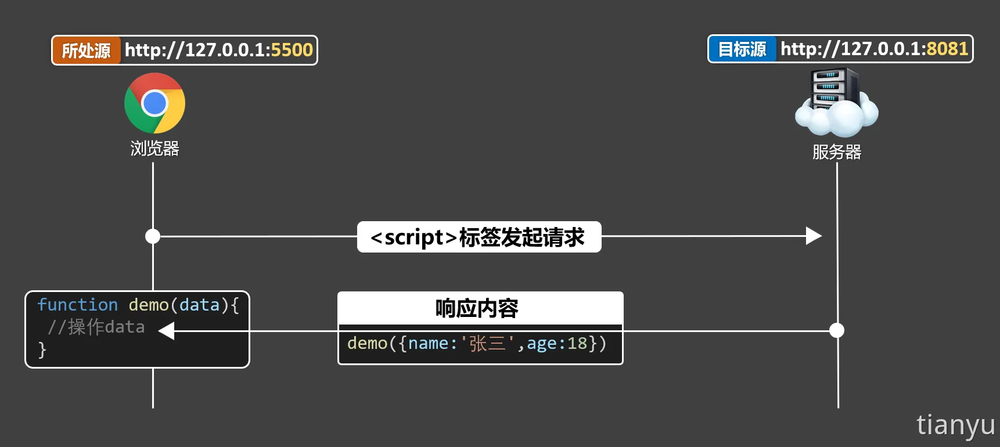

::: note
<https://www.bilibili.com/video/BV1pT421k7yz>
:::

## 浏览器的同源策略

同源策略是浏览器为确保资源安全，而遵循的一种策略，该策略对访问资源进行了一些限制。

### 源的构成

::: tip
**源 = 协议 + 域名 + 端口号** (不看路径)
:::


当所处源与目标源不一致，就是非同源，又称异源或跨域。

## 跨域的限制

例如有两个源：「源 A」和「源 B」，它们是「非同源」的，那么浏览器会有如下限制：

### 1️⃣ 限制 DOM 访问

「源 A」的脚本不能访问「源 B」的 DOM

```html
<iframe id="framePage1" src="./demo.html"></iframe>
<iframe id="framePage2" src="https://www.baidu.com"></iframe>

<script type="text/javascript">
  function showDOM() {
    const framePage1 = document.getElementById("framePage1");
    const framePage2 = document.getElementById("framePage2");

    // 同源，可以访问
    console.log(framePage1.contentWindow.document);
    // 非同源，不能访问
    console.log(framePage2.contentWindow.document);
  }
</script>
```

### 2️⃣ 限制 Cookie 访问

「源 A」不能访问「源 B」的 cookie

```html
<iframe id="baidu" src="http://www.baidu.com"></iframe>

<script type="text/javascript">
  // 访问的是当前源的 cookie，并不是 baidu 的 cookie
  console.log(document.cookie);
</script>
```

### 3️⃣ 限制 Ajax 获取数据

「源 A」可以给「源 B」发请求，但是无法获取「源 B」响应的数据

```js
// 当前源：http://localhost:3000
const url = "https://www.toutiao.com/hot-event/hot-board/?origin=toutiao_pc";
const result = await fetch(url);
const data = await result.json();
// 跨域，无法获取数据
console.log(data);
```

> 在上述限制中，浏览器对 Ajax 获取数据的限制是影响最大的一个，且实际开发中经常遇到

## 注意

1. 跨域限制仅存在浏览器端，服务端不存在跨域限制
2. 即使跨域了，Ajax 请求也可以正常发出，但响应数据不会交给开发者
3. `<link>`、`<script>`、``...... 这些标签发出的请求也可能跨域，只不过浏览器对标签跨域不做严格限制，对开发几乎无影响



::: tip
解决跨域就是要让上图中的 **「校验」** 通过
:::

## CORS 解决跨域 (正统方法)

### CORS 介绍

CORS 全称：Cross-Origin Resource Sharing (跨域资源共享)，是用于控制浏览器校验跨域请求的一套规范，**服务器依照 CORS 规范，添加特定响应头来控制浏览器校验**，大致规则如下：

- 服务器明确表示拒绝跨域请求，或没有表示，则浏览器校验不通过
- 服务器明确表示允许跨域请求，则浏览器校验通过

### 简单请求与复杂请求

CORS 会把请求分为两类，分别是简单请求和复杂请求

#### 简单请求

- 请求方法 (method) 为：GET、HEAD、POST
- 请求头字段要符合《CORS 安全规范》 (只要不手动修改请求头，一般都能符合该规范)
- 请求头的 Content-Type 的值只能是以下三种：
  - `text/plain`
  - `multipart/form-data`
  - `application/x-www-form-urlencoded`

::: info
前端通过 ajax 向后端发送请求时的请求头中的 Content-Type 通常为 `application/json`
:::

#### 复杂请求

- 不是简单请求，就是复杂请求
- 复杂请求会自动发送预检请求

#### 预检请求

1. 发送时机：预检请求在实际跨域请求之前发出，是由浏览器自动发起的
2. 主要作用：用于向服务器确认是否允许接下来的跨域请求
3. 基本流程：先发起 OPTIONS 请求，如果通过预检，继续发起实际的跨域请求
4. 请求头内容：一个 OPTIONS 预检请求，通常会包含如下请求头：
   - Origin ：表示请求源
   - Access-Control-Request-Method 实际请求的 HTTP 方法
   - Access-Control-Request-Headers 实际请求中使用的自定义头 (如果有)

### 解决「简单请求」跨域

服务器在给出响应时，通过添加 `Access-Control-Allow-Origin` 响应头，来明确表达允许某个源发起跨域请求，随后浏览器在校验时，直接通过。



服务端核心代码 (以 express 框架为例)

```js
// 处理跨域中间件
function corsMiddleWare(req, res, next) {
  // 允许 http://127.0.0.1:5500 这个源发起跨域请求
  // res.setHeader('Access-Control-Allow-Origin','http://127.0.0.1:5500')

  // 允许所有源发起跨域请求
  res.setHeader("Access-Control-Allow-Origin", "*");
  next();
}

// 配置路由并使用中间件
app.get("/", corsMiddleWare, (req, res) => {
  res.send("hello!");
});
```

### 解决「复杂请求」跨域

#### 1️⃣ 服务器先通过浏览器的预检请求，服务器需要返回如下响应头

- Access-Control-Allow-Origin —— 表示允许跨域请求的源
- Access-Control-Allow-Methods —— 表示允许跨域请求的方法
- Access-Control-Allow-Headers —— 表示允许跨域请求的请求头字段
- Access-Control-Max-Age —— 表示预检请求的有效期 (单位：秒)



#### 2️⃣ 处理实际的跨域请求 (与处理简单请求跨域的方式相同)


服务端核心代码

```js
// 处理预检请求
app.options("/students", (req, res) => {
  // 设置允许的跨域请求源
  res.setHeader("Access-Control-Allow-Origin", "http://127.0.0.1:5500");
  // 设置允许的请求方法
  res.setHeader("Access-Control-Allow-Methods", "GET");
  // 设置允许的请求头
  res.setHeader("Access-Control-Allow-Headers", "school");
  // 设置预检请求的缓存时间（可选）
  res.setHeader("Access-Control-Max-Age", 7200);
  // 发送响应
  res.send();
});

// 处理实际请求
app.get("/students", (req, res) => {
  // 设置允许的跨域请求源
  res.setHeader("Access-Control-Allow-Origin", "http://127.0.0.1:5500");
  // 随便设置一个自定义响应头
  res.setHeader("abc", 123);
  // 设置允许暴露给客户端的响应头
  res.setHeader("Access-Control-Expose-Headers", "abc");
  // 打印请求日志
  console.log("有人请求/students了");
  // 发送响应数据
  res.send(students);
});
```

### 借助 CORS 中间件完成配置

1. 安装 cors 中间件

```sh
npm install cors
```

2. 完整配置

```js
// cors 中间件配置
const corsOptions = {
  origin: "http://127.0.0.1:5500", // 允许的源
  methods: ["GET", "POST", "PUT", "DELETE", "HEAD", "OPTIONS"], // 允许的方法
  allowedHeaders: ["school"], // 允许的自定义头
  exposedHeaders: ["abc"], // 要暴露的响应头
  optionsSuccessStatus: 200, // 预检请求成功的状态码
};

app.use(cors(corsOptions)); // 使用cors中间件
```

## JSONP 解决跨域

了解即可

JSONP 概述： JSONP 是利用了 `<script>` 标签可以跨域加载脚本，且不受严格限制的特性，可以说是程序员智慧的结晶，早期一些浏览器不支持 CORS 的时，可以靠 JSONP 解决跨域。

### 基本流程

1. 客户端创建一个 `<script>` 标签，并将其 src 属性设置为包含跨域请求的 URL，同时准备一个回调函数，这个回调函数用于处理返回的数据。
2. 服务端接收到请求后，将数据封装在回调函数中并返回。
3. 客户端的回调函数被调用，数据以参数的形势传入回调函数。



```html
<button onclick="getTeachers()">获取数据</button>

<script type="text/javascript">
  function callback(data) {
    console.log(data);
  }

  function getTeachers(url) {
    // 创建 script 元素
    const script = document.createElement("script");
    // 指定 script 的 src 属性
    script.src = "http://127.0.0.1:8081/teachers";
    // 将 script 元素添加到 body 中触发脚本加载
    document.body.appendChild(script);
    // script 标签加载完毕后移除该标签
    script.onload = () => {
      script.remove();
    };
  }
</script>
```

## 配置代理解决跨域

参考 [项目部署](./deployment.md)
