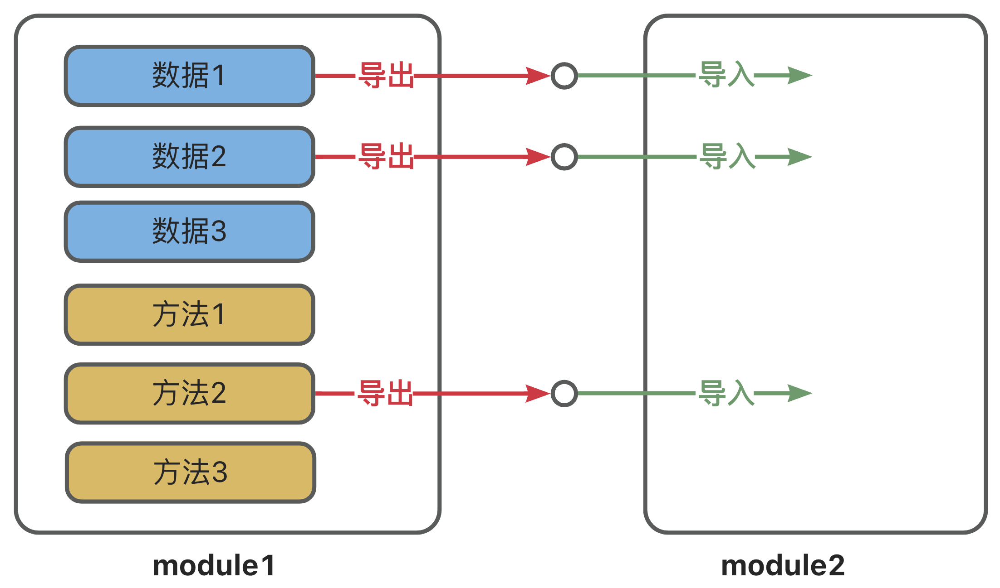

::: note
<https://www.bilibili.com/video/BV13W42197jR>
:::

## 模块化概述

### 什么是模块化？

- 将程序文件依据一定规则拆分成多个文件，这种编码方式就是模块化的编码方式
- 拆分出来每个文件就是一个模块，模块中的数据都是私有的，模块之间互相隔离
- 同时也能通过一些手段，可以把模块内的指定数据“交出去”，供其他模块使用

### 为什么需要模块化？

随着应用的复杂度越来越高，其代码量和文件数量都会急剧增加，会逐渐引发以下问题：

1. 全局污染问题
2. 依赖混乱问题
3. 数据安全问题

## 模块化规范分类

1. CommonJS —— 服务端应用广泛
2. AMD —— 了解即可
3. CMD —— 了解即可
4. ES6 模块化 —— 浏览器端应用广泛

## 导入与导出的概念

模块化的核心思想就是：模块之间是隔离的，通过导入和导出进行数据和功能的共享。

- 导出 (暴露)：模块公开其内部的一部分 (如变量、函数等)，使这些内容可以被其他模块使用
- 导入 (引入)：模块引入和使用其他模块导出的内容，以重用代码和功能



## CommonJS 规范

最早仅供服务端使用，后来在浏览器端可以通过 `browserify` 编译使用。目前在服务端项目中大量使用。

### 示例

::: code-tabs

@tab school.js

```js
const name = "尚硅谷";
const slogan = "让天下没有难学的技术！";

function getTel() {
  return "010-56253825";
}

function getCities() {
  return ["北京", "上海", "深圳", "成都", "武汉", "西安"];
}

// 通过给 exports 对象添加属性的方式，来导出数据 (注意：此处没有导出 getCities)
exports.name = name;
exports.slogan = slogan;
exports.getTel = getTel;
```

@tab student.js

```js
const name = "张三";
const motto = "相信明天会更好！";

function getTel() {
  return "13877889900";
}

function getHobby() {
  return ["抽烟", "喝酒", "烫头"];
}

// 通过给 exports 对象添加属性的方式，来导出数据 (注意：此处没有导出 getHobby)
exports.name = name;
exports.slogan = slogan;
exports.getTel = getTel;
```

@tab index.js

```js
// 引入 school 模块暴露的所有内容
const school = require("./school");

// 引入 student 模块暴露的所有内容
const student = require("./student");
```

:::

### 导出数据

在 CommonJS 标准中，导出数据有两种方式：

- 第一种方式：`module.exports = { value }`
- 第二种方式：`exports.name = value`

#### 注意

1. 每个模块内部的 `this`、`exports`、`modules.exports` 在初始时，都指向同一个空对象，该空对象就是当前模块导出的数据
2. 无论如何修改导出对象，最终导出的都是 `module.exports` 的值
3. `exports` 是对 `module.exports` 的初始引用，仅为了方便给导出象添加属性，所以不能使用 `exports = value` 的形式导出数据，但是可以使用 `module.exports = xxxx` 导出数据

### 导入数据

在 CommonJS 标准中，使用内置的 `require` 函数进行导入数据

```js
// 直接引入模块
const school = require("./school");

// 引入同时解构出要用的数据
const { name, slogan, getTel } = require("./school");

// 引入同时解构+重命名
const { name: stuName, motto, getTel: stuTel } = require("./student");
```

### 扩展

一个 CommonJS 模块在执行时，是被包裹在一个内置函数中执行的，所以每个模块都有自己的作用域，我们可以通过如下方式验证这一说法：

```js
console.log(arguments);
console.log(arguments.callee.toString());
```

内置函数的大致形式如下：

```js
function (exports, require, module, __filename, __dirname){
  /** */
}
```

### 浏览器端运行

Node.js 默认是支持 CommonJS 规范的，但浏览器端不支持，所以需要经过编译，步骤如下：

1. 全局安装 `browserify`

```sh
npm i browserify -g
```

2. 编译

```sh
# index.js 是用 CommonJS 写的源文件，build.js 是编译后输出的目标文件
browserify index.js -o build.js
```

3. 页面中引入使用

```html
<script type="text/javascript" src="./build.js"></script>
```

## ES6 模块化规范

ES6 模块化规范是一个官方标准的规范，它是在语言标准的层面上实现了模块化功能，是目前最流行的模块化规范，且浏览器与服务端均支持该规范。 (在服务端运行需要稍微配置一下)

### 示例

::: code-tabs

@tab school.js

```js
// 导出 name
export const name = { str: "尚硅谷" };
// 导出 slogan
export const slogan = "让天下没有难学的技术！";

// 导出 name
export function getTel() {
  return "010-56253825";
}

function getCities() {
  return ["北京", "上海", "深圳", "成都", "武汉", "西安"];
}
```

@tab student.js

```js
// 导出 name
export const name = "张三";
// 导出 motto
export const motto = "相信明天会更好！";

// 导出 getTel
export function getTel() {
  return "13877889900";
}

function getHobby() {
  return ["抽烟", "喝酒", "烫头"];
}
```

@tab index.js

```js
// 引入 school 模块暴露的所有内容
import * as school from "./school.js";

// 引入 student 模块暴露的所有内容
import * as student from "./student.js";
```

@tab index.html

```html
<!-- type 要改成 module -->
<script type="module" src="./index.js"></script>
```

:::

### Node 中运行 ES6 模块

Node.js 中运行 ES6 模块代码有两种方式：

- 将 JavaScript 文件后缀从 `.js` 改为 `.mjs`，Node 则会自动识别 ES6 模块
- 在 `package.json` 中设置 `type` 属性值为 `module`

### 导出数据

ES6 模块化提供 3 种导出方式：分别导出、统一导出、默认导出

::: code-tabs

@tab 分别导出

```js
// 导出 name
export const name = { str: "尚硅谷" };
// 导出 slogan
export const slogan = "让天下没有难学的技术！";

// 导出 getTel
export function getTel() {
  return "010-56253825";
}
```

@tab 统一导出

```js
const name = { str: "尚硅谷" };
const slogan = "让天下没有难学的技术！";

function getTel() {
  return "010-56253825";
}

function getCities() {
  return ["北京", "上海", "深圳", "成都", "武汉", "西安"];
}

// 统一导出 name, slogan, getTel
export { name, slogan, getTel };
```

@tab 默认导出

```js
const name = "张三";
const motto = "走自己的路，让别人五路可走！";

function getTel() {
  return "13877889900";
}

function getHobby() {
  return ["抽烟", "喝酒", "烫头"];
}

// 默认导出：name, motto, getTel
export default { name, motto, getTel };
```

:::

### 导入数据

对于 ES6 模块化来说，使用何种导入方式，要根据导出方式决定。

#### 1️⃣ 导入全部

可以将模块中的所有导出内容整合到一个对象中。

```js
import * as school from "./school.js";
```

#### 2️⃣ 具名导入 (对应导出方式：分别导出、统一导出)

导出数据

```js
// 分别导出
export const name = { str: "尚硅谷" };
export const slogan = "让天下没有难学的技术！";

function getTel() {
  return "010-56253825";
}

function getCities() {
  return ["北京", "上海", "深圳", "成都", "武汉", "西安"];
}

// 统一导出
export { getTel };
```

具名导入

```js
import { name, slogan, getTel } from "./school.js";
// 还可以通过 as 重命名:
import { name as myName, slogan, getTel } from "./school.js";
```

#### 3️⃣ 默认导入 (对应导出方式：默认导出)

导出数据

```js
const name = "张三";
const motto = "走自己的路，让别人无路可走！";

function getTel() {
  return "13877889900";
}

function getHobby() {
  return ["抽烟", "喝酒", "烫头"];
}

// 使用默认导出的方式，导出一个对象，对象中包含着数据
export default { name, motto, getTel };
```

默认导入

```js
import student from "./student.js"; // 默认导出的名字可以修改，不是必须为 student

console.log(student.name);
```

#### 4️⃣ 动态导入

允许在运行时按需加载模块，返回值是一个 Promise。

```js
const school = await import("./school.js");

console.log(school);
```

#### 5️⃣ 不接收数据

例如只是让 `mock.js` 参与运行

```js
import "./mock.js";
```

## 数据引用问题

### 1️⃣ CommonJS

分析下方案例

::: code-tabs
@tab data.js

```js
let sum = 1;

function increment() {
  sum++;
}

module.exports = { sum, increment };
```

@tab index.js

```js
const { sum, increment } = require("./data.js");

console.log(sum); // 1
increment();
increment();
console.log(sum); // 1
```

:::

::: tip
在 `index.js` 中通过 `require` 和解构赋值得到的 sum 只是 `data.js` 中 sum 的一个拷贝，调用 increment 修改的是 `data.js` 中 sum，不会修改 `index.js` 中的 sum
:::

### 2️⃣ ES6

::: code-tabs
@tab data.js

```js
// data.js
let sum = 1;

function increment() {
  sum++;
}

export { sum, increment };
```

@tab index.js

```js
// index.js
import { sum, increment } from "./data.js";

console.log(sum); // 1
increment();
increment();
console.log(sum); // 3
```

:::

::: tip
在 ES6 中就存在这种数据引用的问题 (符号绑定)，导出的数据和导入的数据是共用的一块内存空间

- `export` 导出的数据 A 和 `import` 导入的数据 A 指向的是同一块内存空间，也叫做符号绑定
- `import` 导入的数据都是当作**常量**来处理的
- 所以在 ES6 中要求导出的数据必须是**常量**
  :::
