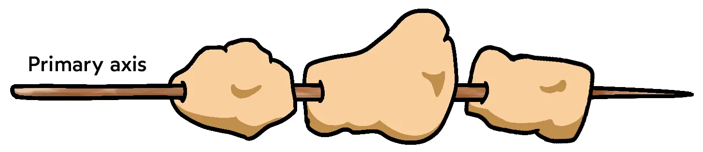
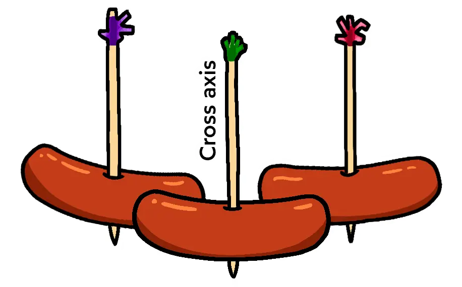

::: note
语法：<https://www.ruanyifeng.com/blog/2015/07/flex-grammar.html>

实战：<https://www.ruanyifeng.com/blog/2015/07/flex-examples.html>

<https://www.joshwcomeau.com/css/interactive-guide-to-flexbox/>
:::

Flex 是 Flexible Box 的缩写，意为"弹性布局"，用来为盒状模型提供最大的灵活性。任何一个容器都可以指定为 Flex 布局。

## 基本概念

采用 Flex 布局的元素，称为 Flex 容器（flex container），简称"容器"。它的所有子元素自动成为容器成员，称为 Flex 项目（flex item），简称"项目"。

容器默认存在两根轴：水平的主轴（main axis）和垂直的交叉轴（cross axis）。主轴的开始位置（与边框的交叉点）叫做 `main start`，结束位置叫做 `main end`；交叉轴的开始位置叫做 `cross start`，结束位置叫做 `cross end`。

项目默认沿主轴排列。单个项目占据的主轴空间叫做 `main size`，占据的交叉轴空间叫做 `cross size`。

## 容器属性 (6)

### 1️⃣ `flex-direction`

该属性决定主轴的方向（即项目的排列方向）。

- `row`（默认值）：主轴为水平方向，起点在左端。
- `row-reverse`：主轴为水平方向，起点在右端。
- `column`：主轴为垂直方向，起点在上沿。
- `column-reverse`：主轴为垂直方向，起点在下沿。

### 2️⃣ `flex-wrap`

该属性决定如何换行，默认在一条轴线上排列不换行。

- `nowrap`（默认值）：不换行。
- `wrap`：换行，第一行在上方。
- `wrap-reverse`：换行，第一行在下方。

### 3️⃣ `flex-flow`

该属性是 `flex-direction` 属性和 `flex-wrap` 属性的简写形式，默认值为 `row nowrap`。

### 4️⃣ `justify-content`

该属性定义了项目在**主轴**上的对齐方式。

- `flex-start`（默认值）：左对齐
- `flex-end`：右对齐
- `center`：居中
- `space-between`：两端对齐，项目之间的间隔都相等。
- `space-around`：每个项目两侧的间隔相等。所以，项目之间的间隔比项目与边框的间隔大一倍。
- `space-evenly`：项目与项目之间的间隔相等，项目与边框的间隔也相等。

### 5️⃣ `align-items`

该属性定义项目在**交叉轴**上的对齐方式。**(一根轴线)**

- `flex-start`：交叉轴的起点对齐。
- `flex-end`：交叉轴的终点对齐。
- `center`：交叉轴的中点对齐。
- `baseline`: 项目的第一行文字的基线对齐。
- `stretch`：如果项目未设置高度或设为 auto，将占满整个容器的高度（默认值）。

### 6️⃣ `align-content`

该属性定义了多根轴线的对齐方式。如果项目只有一根轴线，该属性不起作用。**(多根轴线)**

- `flex-start`：与交叉轴的起点对齐。
- `flex-end`：与交叉轴的终点对齐。
- `center`：与交叉轴的中点对齐。
- `space-between`：与交叉轴两端对齐，轴线之间的间隔平均分布。
- `space-around`：每根轴线两侧的间隔都相等。所以，轴线之间的间隔比轴线与边框的间隔大一倍。
- `stretch`：轴线占满整个交叉轴（默认值）。

## 项目属性 (6)

### 1️⃣ `order`

定义项目的排列顺序。数值越小，排列越靠前，默认为 0。

### 2️⃣ `flex-grow`

定义项目的放大比例，默认为 0，即如果存在剩余空间，也不放大。

### 3️⃣ `flex-shrink`

定义了项目的缩小比例，默认为 1，即如果空间不足，该项目将缩小。

::: note
对于一些元素，比如 `svg` 等，我们需要防止它收缩，可以将 `flex-shrink` 设置为 0。
:::

### 4️⃣ `flex-basis`

定义了在分配多余空间之前，项目占据的主轴空间（main size）。浏览器根据这个属性，计算主轴是否有多余空间。它的默认值为 `auto`，即项目的本来大小。

### 5️⃣ `flex`

该属性是 `flex-grow`, `flex-shrink` 和 `flex-basis` 的简写，默认值为 `0 1 auto`。后两个属性可选。

该属性有两个快捷值：`auto` (`1 1 auto`) 和 `none` (`0 0 auto`)。

建议优先使用这个属性，而不是单独写三个分离的属性，因为浏览器会推算相关值。

### 6️⃣ `align-self`

该属性允许单个项目有与其他项目不一样的对齐方式，可覆盖 `align-items` 属性。默认值为 `auto`，表示继承父元素的 `align-items` 属性，如果没有父元素，则等同于 `stretch`。

该属性可能取 6 个值，除了 `auto`，其他都与 `align-items` 属性完全一致。

## 进阶用法

### CSS 的布局模式

CSS 可以分为几种布局模式，默认的是“流式布局” (Flow Layout)，即按照文档的顺序，从上到下，从左到右，按照顺序一个一个放置元素。

可以通过更改元素的 `display` 属性来改变布局模式，当该属性值设为 `flex` 时，我们就创造了一个 Flex 格式化上下文，该元素的子元素就会变成 Flex 布局模式。

### `justify-content` 和 `align-items` 的区别

- 我们可以将沿着**主轴**排列的元素想象成**一串烤肉串**，**交叉轴**上的每个元素相当于一个**维也纳香肠**。

- 因此，在讨论主轴对齐时，我们只能考虑如何分配组，使用的是 `justify-content`；而在讨论交叉轴对齐时，我们可以决定每个元素的位置，使用的是 `align-items`。

- `align-items` 可以理解为统一设置每个子元素的 `align-self` 属性。

#### 主轴

#### 交叉轴

### 假设尺寸

在 Flex 布局中，当设置元素的 `width` 属性时，可以理解为设置的是元素的**假设尺寸**，而元素的实际尺寸可能并不是我们设置的值。只有当 Flex 容器的大小足够时，元素才会按照假设尺寸来显示。

### `flex-basis`

该属性设置的是元素占据的主轴空间，或者说是元素在主轴方向上的假设尺寸。在 Flex Row 布局时，它的作用与 `width` 相同，而在 Flex Column 布局时，它的作用与 `height` 相同。

### 最小尺寸

Flex 容器在缩小到某一点时也可能出现内容溢出，尽管设置了默认的 `flex-shrink` 属性。

因为 Flex 布局的算法拒绝缩小子元素到它的**最小尺寸**以下，当 Flex 容器宽度小于子元素的最小尺寸时，子元素会溢出。

文本输入元素的最小尺寸一般在 `170px-200px`，不同浏览器之间略有不同；一段文本的最小尺寸是它的最长的单词的宽度。

使用 `min-width` 可以重新定义最小尺寸

### Auto margins

`margin` 属性用于在特定元素周围添加空间。当设置 `margin` 属性值为 `auto` 时可以有很多妙用，比如实现导航栏左边一个元素，右边两个元素的布局，只需要对左边一个元素设置 `margin-right: auto` 即可。

Auto margins 将吞噬额外的空间，并将其应用于元素的边距。它使我们可以精确控制在何处分配额外的空间。
