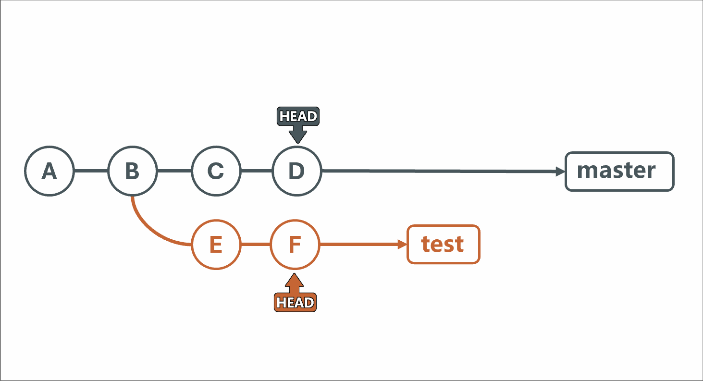
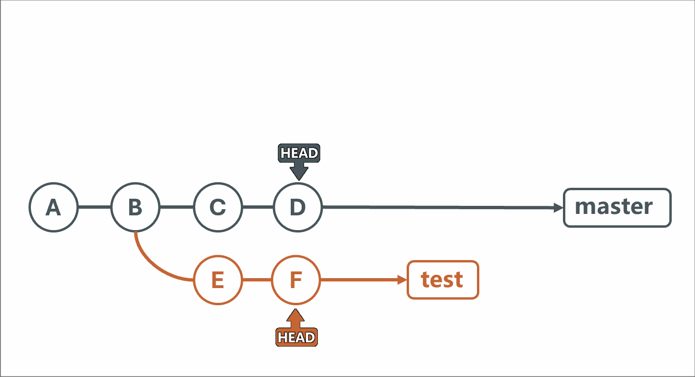

::: note
<https://www.yuque.com/tianyu-coder/openshare/ccpa0mz1pq213lhw>

<https://git-scm.com/book/zh/v2/>
:::

## 快速入门指南

### 用户信息

```sh
# 查看 git 版本
git -v

# 每台设备初次使用时的设定
git config --global user.name "John Doe"
git config --global user.email johndoe@example.com

# 查看设置
git config --list
```

### 仓库基础操作

```sh
# 初始化一个仓库
git init

# 克隆一个仓库
git clone <repo directory> [repo name]

# 本地仓库连接到远程仓库 (origin 是默认推荐的远程仓库名称)
git remote add origin <server>

# 取消本地仓库与远程仓库的关联
git remote remove origin

# 添加到暂存区
git add <filename>
git add *

# 移除暂存区
git rm --cached <filename>

# 提交到存储区
git commit -m <msg>

# 推送到远程仓库
git push -u origin master # -u 参数表示关联远程仓库和本地分支
git push origin master

# 从远程仓库拉取
git pull origin master

# 显示工作区和暂存区的状态
git status

# 显示远程仓库地址
git remote -v

# 查看提交历史
git log
git log --oneline

# 恢复删除的文件（仅在工作区删除）
git restore <filename>  # 从存储区恢复到工作区

# 恢复删除的文件（存储区中也删除了）
git reset --hard <hash>  # 修改head头，部分提交历史会丢失
git revert <hash>  # 恢复删除的文件，提交历史不会丢失

# 查看指定文件的修改记录
git blame <file>
```

### 分支操作

- 从 main 主分支创建分支的时候，会把 main 上的内容都复制到新分支中，之后在分支上的操作不会互相影响；
- 合并分支时，新分支中删除的文件在 main 中会被删除，新分支添加的文件在 main 中会被添加
- 合并冲突

```sh
# 创建分支
git branch <branchname>

# 查看本地分支
git branch -v

# 查看远程分支
git branch -r

# 切换分支
git checkout <branchname>
git checkout -b <branchname> # 创建并切换到新分支

# 删除分支
git branch -d <branchname>

# 合并分支
git merge <branchname>  # 把 branchname 合并到当前分支

# fetch
git pull = git fetch + git merge
```

### 解决冲突

```sh

```

## Git 的基本使用

### 起始配置

第一次使用 Git 的时候，我们需要配置**姓名**和**邮箱**，让 Git 知道当前开发者的基本信息

```sh
git config --global user.name "John Doe"
git config --global user.email johndoe@example.com
```

可以使用 `git config --list`或`git config -l` 命令来查看配置信息

### 常用命令

```sh
# 初始化仓库
git init

# 查看仓库状态
git status
git status -s # 简洁模式

# 添加文件到暂存区
git add <file>
git add . # 添加所有文件

# 提交文件到仓库
git commit -m "commit message"

# 删除暂存
git rm --cached <file>

# 对比差异
git diff # 工作区和暂存区的差异
git diff --cached # 暂存区和仓库的差异

# 查看提交历史
git log
git log --oneline # 简洁模式
```

### 版本回退

- 硬回退
  - 将当前分支的 HEAD 指针移到指定的提交
  - 修改暂存区和工作区的文件，与指定提交完全一致
  - 注意： 这种方式会丢失回退之后的代码改动

```sh
git reset --hard <hash>
```

- 软回退
  - 将 HEAD 指针移到指定的提交
  - 暂存区不变，工作区的文件保留当前的改动
  - 通常用于想要重新整理提交

```sh
git reset --soft <hash>
```

- 混合回退
  - 将 HEAD 指针移到指定的提交
  - 暂存区重置，但工作区的文件保留当前改动

```sh
git reset --mixed <hash>
```

- 回滚提交
  - 生成一个新的提交，撤销指定提交的更改
  - 不会修改历史记录，适合在多人协作的情况下使用

```sh
git revert <hash>
```

### 修改提交

```sh
git commit --amend -m "commit message"
```

具有两个功能：

1. 修改最后一次提交的提交信息
2. 将新的修改合并到最后一次提交中

### 忽略文件

::: code-tabs
@tab .gitignore

```plaintext
# 忽略任何路径下的名为 temp 的文件、文件夹
temp

# 忽略任何路径下以 .log 结尾的文件
*.log

# 忽略根目录下的 dist 文件，不会忽略其他目录下的 dist 文件
/dist
```

:::

### 分支操作

分支是 git 的一个重要特性，它可以让开发人员从主线上分离出来，在一个独立的线路上继续开发，最后可以灵活的选择合并分支，还是丢弃分支。

- 创建分支

```sh
git branch <branchname>
```

- 查看分支

```sh
git branch # 查看本地分支
git branch -v # 查看本地分支
git branch -r # 查看远程分支
```

- 切换分支

```sh
git checkout <branchname> # 切换分支

git checkout -b <branchname> # 创建并切换到新分支

# 推荐使用 switch
git switch <branchname> # 切换分支
git switch -c <branchname> # 创建并切换到新分支
```

- 删除分支

```sh
git branch -d <branchname> # 删除分支

git push <remote> -d <branch> # 删除远程分支
git push origin -d feature
```

- 合并分支

1️⃣ 快速合并

例如我们有 master 和 test 两个分支，test 分支是领先于 master 分支的，且 test 分支包含 master 的所有历史记录，那么这时就可以触发 git 的快速合并。无需填写提交信息

```sh
git merge test # 将 test 分支合并到当前分支
```

2️⃣ 提交合并

当进行分支合并时，若两个分支有不一致的版本，则会提示输提示输入提交信息，在当前分支形成一个新的提交记录。

- 分支变基

在 Git 中，合并（merge）和变基（rebase）都是用于整合来自不同分支的更改的操作，它们的区别如下：

**合并**：将两个分支的历史合并在一起，git 会创建一个新的“合并提交”，所有的分支和合并点都会被保留在历史中，有完整的历史记录。



**变基**：将一个分支（test）上的提交重新应用到另一个分支（master）上，变基会重写项目历史，因为它实际上是在创建一系列新的提交，会产生一个更线性的历史记录，看起来更干净、更简单。



