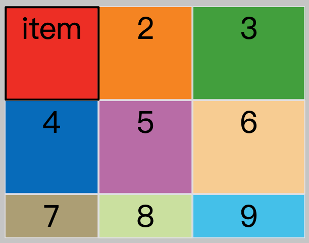
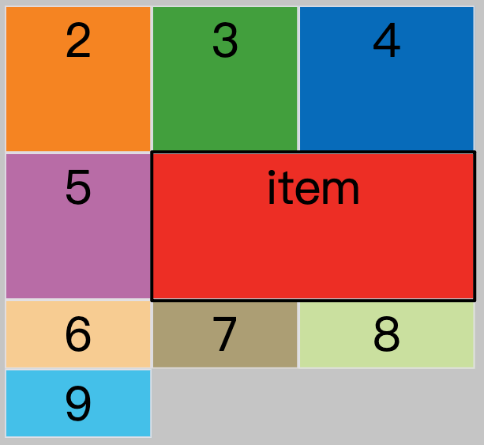
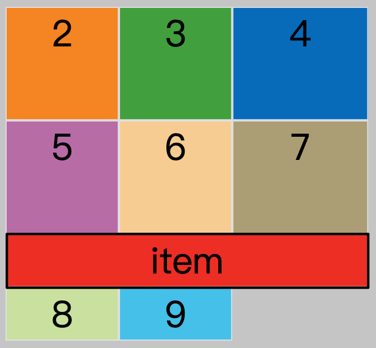

::: note
<https://www.ruanyifeng.com/blog/2019/03/grid-layout-tutorial.html>
:::

网格布局（Grid）是最强大的 CSS 布局方案。

Flex 布局是轴线布局，只能指定"项目"针对轴线的位置，可以看作是一维布局。Grid 布局则是将容器划分成"行"和"列"，产生单元格，然后指定"项目所在"的单元格，可以看作是二维布局。Grid 布局远比 Flex 布局强大。

## 基本概念

### 容器和项目

采用网格布局的区域，称为"容器"（container）。容器内部采用网格定位的子元素，称为"项目"（item）。

::: note
项目只能是容器的顶层子元素，不包含项目的子元素
:::

### 行和列

容器里面的水平区域称为"行"（row），垂直区域称为"列"（column）。

### 单元格

行和列的交叉区域，称为"单元格"（cell）。

正常情况下，n 行和 m 列会产生 n x m 个单元格。比如，3 行 3 列会产生 9 个单元格。

### 网格线

划分网格的线，称为"网格线"（grid line）。水平网格线划分出行，垂直网格线划分出列。

正常情况下，n 行有 n + 1 根水平网格线，m 列有 m + 1 根垂直网格线，比如三行就有四根水平网格线。

## 容器属性

Grid 布局的属性分成两类。一类定义在容器上面，称为容器属性；另一类定义在项目上面，称为项目属性。这部分先介绍容器属性。

### display

`display: grid` 指定一个容器采用网格布局，默认为块级元素。

```css
.container {
  display: grid;
}
```

`display: inline-grid` 指定行内元素采用网格布局。

```css
.container {
  display: inline-grid;
}
```

### grid-template-X

容器指定了网格布局以后，接着就要划分行和列。`grid-template-columns` 属性定义每一列的列宽，`grid-template-rows` 属性定义每一行的行高。

```css
.container {
  display: grid;
  /* 定义每一列的列宽 */
  grid-template-columns: 100px 100px 100px;
  /* 定义每一行的行高 */
  grid-template-rows: 100px 100px 100px;
}
```

除了使用绝对单位，也可以使用百分比。

#### `repeat()`

有时候，重复写同样的值非常麻烦，尤其网格很多时。这时，可以使用 `repeat()` 函数，简化重复的值。该函数第一个参数为重复的次数，第二个参数为所要重复的值或模式。

```css
.container {
  display: grid;
  grid-template-columns: repeat(3, 33.33%);
  grid-template-rows: repeat(3, 33.33%);

  /* 也可以重复某种模式 */
  grid-template-columns: repeat(2, 100px 20px 80px);
  /* 上面代码定义了6列，第一列和第四列的宽度为100px，第二列和第五列为20px，第三列和第六列为80px。 */
}
```

#### `auto-fill`

有时，单元格的大小是固定的，但是容器的大小不确定。如果希望每一行（或每一列）容纳尽可能多的单元格，这时可以使用 auto-fill 关键字表示自动填充。

```css
.container {
  display: grid;
  grid-template-columns: repeat(auto-fill, 100px);
  /* 上面代码表示每列宽度100px，然后自动填充，直到容器不能放置更多的列。 */
}
```

::: note
除了 auto-fill，还有一个关键字 auto-fit，两者的行为基本是相同的。只有当容器足够宽，可以在一行容纳所有单元格，并且单元格宽度不固定的时候，才会有行为差异：auto-fill 会用空格子填满剩余宽度，auto-fit 则会尽量扩大单元格的宽度。
:::

#### `fr`

为了方便表示比例关系，网格布局提供了 `fr` 关键字（fraction 的缩写，意为"片段"）。如果两列的宽度分别为 `1fr` 和 `2fr`，就表示后者是前者的两倍。

```css
.container {
  display: grid;
  grid-template-columns: 1fr 1fr;
  /* 上面代码表示两个相同宽度的列。 */
}
```

`fr` 可以与绝对单位结合使用，这时会先满足绝对单位，再分配剩余空间。

```css
.container {
  display: grid;
  grid-template-columns: 150px 1fr 2fr;
  /* 上面代码表示，第一列的宽度为150px，第二列的宽度是第三列的一半。 */
}
```

#### `minmax()`

`minmax()` 函数产生一个长度范围，表示长度就在这个范围之中。它接受两个参数，分别为最小值和最大值。

```css
grid-template-columns: 1fr 1fr minmax(100px, 1fr);
```

上面代码中，`minmax(100px, 1fr)` 表示列宽不小于 100px，不大于 `1fr`。

#### `auto`

`auto` 关键字表示由浏览器自己决定长度。

```css
grid-template-columns: 100px auto 100px;
```

上面代码中，第二列的宽度，浏览器自己决定。

#### 网格线的名称

`grid-template-columns` 和 `grid-template-rows` 属性里面，还可以使用方括号，指定每一根网格线的名字，方便以后的引用。

```css
.container {
  display: grid;
  grid-template-columns: [c1] 100px [c2] 100px [c3] auto [c4];
  grid-template-rows: [r1] 100px [r2] 100px [r3] auto [r4];
}
```

上面代码指定网格布局为 3 行 x 3 列，因此有 4 根垂直网格线和 4 根水平网格线。方括号里面依次是这八根线的名字。

网格布局允许同一根线有多个名字，比如 `[fifth-line row-5]`。

**在定义子项位置的时候，可以引用网格线名称**

```css
.item {
  grid-column: c1 / c2; /* 第 1 条到第 2 条列网格线 */
  grid-row: r1 / r2; /* 第 1 条到第 2 条行网格线 */
}
```



```css
.item {
  /*  */
  grid-column: c2 / c4; /* 第 2 条到第 4 条列网格线 */
  grid-row: r2 / r3; /* 第 2 条到第 3 条行网格线 */
}
```



```css
.item {
  grid-column: c1 / c4; /* 第 1 条到第 4 条列网格线 */
  grid-row: r3 / r4; /* 第 3 条到第 4 条行网格线 */
}
```



### grid-X-gap

`grid-row-gap` 属性设置行与行的间隔（行间距），`grid-column-gap` 属性设置列与列的间隔（列间距）。

`grid-gap` 属性是 `grid-column-gap` 和 `grid-row-gap` 的合并简写形式，语法如下。如果 `grid-gap` 省略了第二个值，浏览器认为第二个值等于第一个值。

```css
grid-gap: <grid-row-gap> <grid-column-gap>;
```

::: note
根据最新标准，上面三个属性名的 `grid-` 前缀已经删除，`grid-column-gap` 和 `grid-row-gap` 写成 `column-gap` 和 `row-gap`，`grid-gap` 写成 `gap`。
:::

### grid-template-areas

网格布局允许指定"区域"（area），一个区域由单个或多个单元格组成。`grid-template-areas` 属性用于**定义区域**。

```css
.container {
  display: grid;
  grid-template-columns: 100px 100px 100px;
  grid-template-rows: 100px 100px 100px;
  /* 划分出9个单元格，然后将其定名为a到i的九个区域，分别对应这九个单元格 */
  grid-template-areas:
    "a b c"
    "d e f"
    "g h i";

  /* 多个单元格合并成一个区域的写法 */
  grid-template-areas:
    "a a a"
    "b b b"
    "c c c";

  /* 如果某些区域不需要利用，则使用"点"（.）表示 */
  grid-template-areas:
    "a . c"
    "d . f"
    "g . i";

  /* 布局实例 */
  grid-template-areas:
    "header header header"
    "main main sidebar"
    "footer footer footer";
}
```

::: note
注意，区域的命名会影响到网格线。每个区域的起始网格线，会自动命名为 `区域名-start`，终止网格线自动命名为 `区域名-end`。

比如，区域名为 `header`，则起始位置的水平网格线和垂直网格线叫做 `header-start`，终止位置的水平网格线和垂直网格线叫做 `header-end`。
:::

**在定义子项位置的时候，可以引用区域名称**

```css
.header {
  grid-area: header; /* 使用 grid-area 属性指定项目占据的区域 */
}

.sidebar {
  grid-area: sidebar;
}

.content {
  grid-area: content;
}
```

### grid-auto-flow

划分网格以后，容器的子元素会按照顺序，自动放置在每一个网格。默认的放置顺序是"先行后列"，即先填满第一行，再开始放入第二行。

这个顺序由 `grid-auto-flow` 属性决定，默认值是 `row`，即"先行后列"。也可以将它设成 `column`，变成"先列后行"。

`grid-auto-flow` 属性除了设置成 `row` 和 `column`，还可以设成 `row dense` 和 `column dense`。这两个值主要用于，某些项目指定位置以后，剩下的项目怎么自动放置。

### X-items

`justify-items` 属性设置**单元格内容**的水平位置（左中右），`align-items` 属性设置**单元格内容**的垂直位置（上中下）。`place-items` 属性是 `align-items` 属性和 `justify-items` 属性的合并简写形式。** (如果省略第二个值，浏览器就会假定第二个值等于第一个值。)**

```css
.container {
  justify-items: start | end | center | stretch;
  align-items: start | end | center | stretch;

  /* 简写 */
  place-items: <align-items> <justify-items>;
}
```

**取值**

- start：对齐单元格的起始边缘。
- end：对齐单元格的结束边缘。
- center：单元格内部居中。
- stretch：拉伸，占满单元格的整个宽度（默认值）。

### X-content

`justify-content` 属性是**整个内容区域**在容器里面的水平位置（左中右），`align-content` 属性是**整个内容区域**的垂直位置（上中下）。`place-content` 属性是 `align-content` 属性和 `justify-content` 属性的合并简写形式。

```css
.container {
  justify-content: start | end | center | stretch | space-around | space-between | space-evenly;
  align-content: start | end | center | stretch | space-around | space-between | space-evenly;

  /* 简写 */
  place-content: <align-content> <justify-content>;
}
```

**取值**

- start：对齐容器的起始边缘。
- end：对齐容器的结束边缘。
- center：容器内部居中。
- stretch：项目大小没有指定时，拉伸占据整个网格容器。
- space-around：每个项目两侧的间隔相等。
- space-between：项目与项目的间隔相等，项目与容器边框之间没有间隔。
- space-evenly：项目与项目的间隔相等，项目与容器边框之间也是同样长度的间隔。

### grid-auto-X

`grid-auto-columns` 属性和 `grid-auto-rows` 属性用来设置，浏览器自动创建的多余网格的列宽和行高。它们的写法与 `grid-template-columns` 和 `grid-template-rows` 完全相同。如果不指定这两个属性，浏览器完全根据单元格内容的大小，决定新增网格的列宽和行高。

## 项目属性

### grid-column-X grid-row-X

项目的位置是可以指定的，具体方法就是指定项目的四个边框，分别定位在哪根网格线。这样可以灵活指定项目在网格容器中的位置

- `grid-column-start` 属性：左边框所在的垂直网格线
- `grid-column-end` 属性：右边框所在的垂直网格线
- `grid-row-start` 属性：上边框所在的水平网格线
- `grid-row-end` 属性：下边框所在的水平网格线

```css
.item {
  grid-column-start: 1;
  grid-column-end: 3;
  grid-row-start: 2;
  grid-row-end: 4;
}
```

这四个属性的值，除了指定为第几个网格线，还可以指定为**网格线的名字**。

```css
.item {
  grid-column-start: header-start;
  grid-column-end: header-end;
}
```

这四个属性的值还可以使用 `span` 关键字，表示"跨越"，即左右边框（上下边框）之间跨越多少个网格。

```css
.item {
  /* 项目的左边框距离右边框跨越2个网格 */
  grid-column-start: span 2;
}
```

### grid-column grid-row

`grid-column` 属性是 `grid-column-start` 和 `grid-column-end` 的合并简写形式，`grid-row` 属性是 `grid-row-start` 属性和 `grid-row-end` 的合并简写形式。

```css
.item {
  grid-column: <start-line> / <end-line>;
  grid-row: <start-line> / <end-line>;
}
```

示例：项目 item-1 占据第一行，从第一根列线到第三根列线。

```css
.item-1 {
  grid-column: 1 / 3;
  grid-row: 1 / 3;
}
/* 等同于 */
.item-1 {
  grid-column: 1 / span 2;
  grid-row: 1 / span 2;
}
```

斜杠以及后面的部分可以省略，**默认跨越一个网格**。

### grid-area

`grid-area` 属性指定项目放在哪一个**区域**。 (对应 `grid-template-areas` 属性指定的区域)

```css
.item-1 {
  grid-area: e;
}
```

`grid-area` 属性还可用作 `grid-row-start`、`grid-column-start`、`grid-row-end`、`grid-column-end` 的合并简写形式，直接指定项目的位置。

```css
.item {
  grid-area: <row-start> / <column-start> / <row-end> / <column-end>;
}
```

### X-self

`justify-self` 属性设置单元格内容的水平位置（左中右），跟 `justify-items` 属性的用法完全一致，但只作用于单个项目。

`align-self` 属性设置单元格内容的垂直位置（上中下），跟 `align-items` 属性的用法完全一致，也是只作用于单个项目。

`place-self` 属性是 `align-self` 属性和 `justify-self` 属性的合并简写形式。
