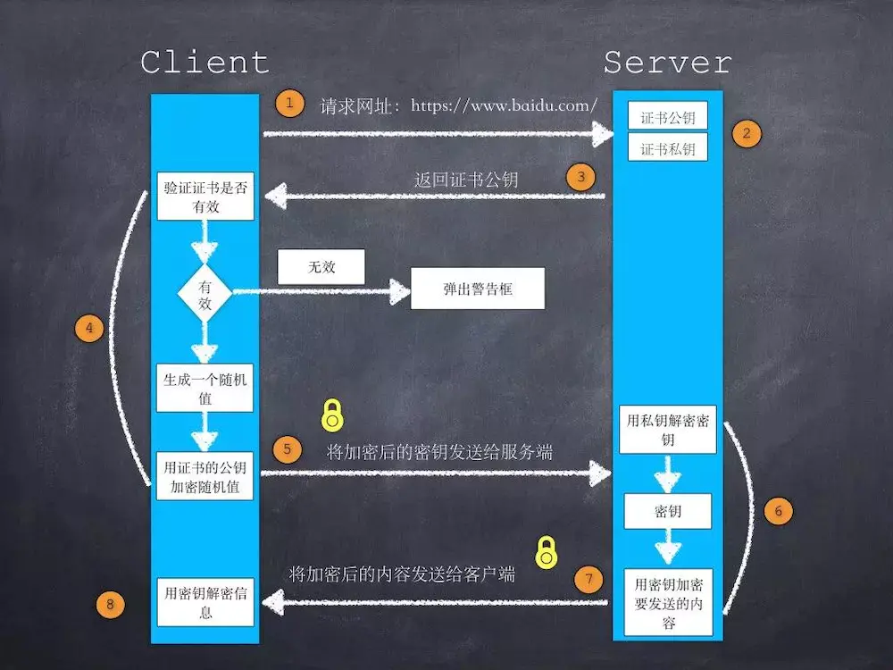

## 01 HTML+CSS

### 🎯 H5 新特性

- 语义化标签：header、nav、footer、aside、article、section
- 多媒体标签：video、audio
- 画布：Canvas
- 本地存储：sessionStorage、localStorage
- 表单控件：calendar, datetime, date, time, email, url, search, number, color, month, week
- 拖拽释放
- 新技术：webworker、websocket、Geolocation 地理位置 API

### 🎯 基础

link -> visited -> hover -> visited
a:hover 必须跟在 a:link 和 a:visited 后面；a:active 必须跟在 a:hover 后面

块元素是一个元素，占用了全部宽度，在前后都是换行符；内联元素只需要必要的宽度，不强制换行。

### 🎯 各种单位的区别

- px：像素，绝对单位
- em：相对于当前对象内文本的字体尺寸（和当前字体大小相等），相对单位（1em = 16px）
  - em 的值不固定，会继承父元素的字体大小；rem 就不会变，永远相对根元素
- rem：相对于根元素 font-size 的值，相对单位
- vh，vw：根据窗口的宽度，分成 100 等份；vw 和 vh 表示视口宽度和高度，vmin 表示视口宽高中较小值；使用 vmin 对横屏更友好

### 🎯 CSS 不可继承的属性

a 标签的字体颜色不能被继承；h1-h6 标签字体的大小也是不能被继承的

- display
- 文本属性：vertical-align、text-decoration
- 盒子模型的属性：宽度、高度、内外边距、边框等
- 背景属性：背景图片、颜色、位置等
- 定位属性：浮动、清除浮动、定位 position 等
- 生成内容属性：content、counter-reset、counter-increment
- 轮廓样式属性：outline-style、outline-width、outline-color、outline
- 页面样式属性：size、page-break-before、page-break-after

### 🎯 隐藏页面元素

- `display: none`：不占空间，不可触发
- `visibility: hidden`：占据空间，不可触发
- `opacity: 0`：占据空间，可触发
- `height: 0; width: 0`：不占空间，不可触发
- `position: absolute`：将元素移出可视区域，不影响布局
- `clip-path`

### 🎯 BFC 块级格式化上下文

Block Formatting Context 块级格式化上下文

**BFC 是一种渲染机制，用于确定块级盒子在页面上的布局和相互之间的关系**

1️⃣ **形成条件**

- **根元素**或其他包含块（如 `body`）
- **浮动元素**（使用 `float` 属性）
- **绝对定位元素**（使用 `position: absolute` 或 `position: fixed`）
- **溢出属性** `overflow` 属性值不为 `visible` 的块元素

  - 如 `overflow: hidden`，`overflow: auto`，`overflow: scroll` 均可

- **行内块元素**（使用 `display: inline-block`）
- **表格单元格**（使用 `display: table-cell` 或 `table-caption`）
- **弹性容器**（使用 `display: flex` 或 `inline-flex`）
- **网格容器**（使用 `display: grid` 或 `inline-grid`）

```css
overflow: hidden; /* 最常用 */
```

2️⃣ **BFC 特性和应用场景**

- BFC 区域不会与 `float` 元素区域重叠（**自适应多栏布局**）

  - 实现两列自适应布局，左边宽度固定，右边自适应宽度

- 不同 BFC 的 `margin` 不会发生重叠（**防止 margin 塌陷**）
- BFC 内部包含浮动元素时，计算 BFC 区域的高度，浮动元素也会参与计算，可以解决浮动高度塌陷，**清除内部浮动**
- BFC 是一个独立的容器。不影响外面的元素

### 🎯 元素水平垂直居中

1️⃣ 子绝父相定位 + margin: auto

子元素左右、上下值相同，一般设为 0，子级的虚拟占位已经撑满了整个父级；margin: auto 使其居中

```css
.parent {
  position: relative;
}

.child {
  position: absolute;
  top: 0;
  right: 0;
  bottom: 0;
  left: 0;
  margin: auto;
}
```

2️⃣ 子绝父相定位 + margin 负值

子元素 `top` 和 `left` 都为 50%（这时子元素左上角在父元素中心）；margin 负值为子元素宽高的一半（不能用 margin 的负百分数，因为它是相对于父元素的，我们需要相对于子元素的一半）

```css
.parent {
  width: 300px;
  height: 300px;
  position: relative;
}

.child {
  width: 100px;
  height: 100px;
  position: absolute;
  top: 50%;
  left: 50%;
  margin-top: -50px;
  margin-left: -50px;
}
```

3️⃣ 子绝父相定位 + transform（CSS3）

子元素 `top` 和 `left` 都为 50%，`transform: translate(-50%, -50%)`，类似于 margin 负值，但是不需要知道自己的宽高

```css
.parent {
  position: relative;
}

.child {
  position: absolute;
  top: 50%;
  left: 50%;
  transform: translate(-50%, -50%);
}
```

4️⃣ table 布局

```css
.parent {
  display: table-cell;
  vertical-align: middle;
  text-align: center;
}

.child {
  display: inline-block;
}
```

5️⃣ flex 布局

```css
.parent {
  display: flex;
  justify-content: center;
  align-items: center;
}

/* 或者 */
.parent {
  display: flex;
}
.child {
  margin: auto;
}
```

6️⃣ grid 布局

```css
.parent {
  display: grid;
  justify-content: center;
  align-items: center;
}
```

### 🎯 两栏布局，三栏布局

**两栏布局**

1. 左边左浮动；右边用 margin-left **或者** overflow: hidden（BFC）；外面大盒子也 BFC
2. flex 布局：容器 flex；右边 **flex: 1** 可以让右侧盒子宽度自动扩展

**三栏布局**

1. **两边 float，中间 margin；**

   两边分别设置左右浮动；中间设置 m-l 和 m-r；外面用 BFC；**html 结构里中间盒子要放在最下面**

2. **两边 absolute，中间 margin；**

   两边分别绝对定位到左右；中间设置 m-l 和 m-r

3. 两边使用 float 和负 margin；挺麻烦的，不推荐

4. table 布局；

   容器 display: table，table-layout: fixed；三个小盒子用 display: table-cell

5. **flex 布局；**

   容器 display: flex，justify-content: space-between；两边设置宽度，中间宽度 100% 或者 flex:1

6. **grid 布局**

   容器 display: grid，grid-template-columns: 300px auto 300px

### 🎯 弹性盒子 flex

- 容器，主轴和交叉轴，里面的子元素称为 item；
- 容器属性：flex-direction，flex-wrap，flex-flow，justify-content，align-items，align-content；
- 容器成员属性：order，flex-grow，flex-shrink，flex-basis，flex

### 🎯 网格布局 grid

- display: grid 或 display: inline-grid
- 容器属性
  - grid-template-columns，grid-template-rows 属性分别设置列宽和行高
  - grid-row-gap， grid-column-gap， grid-gap 属性 分别设置行间距和列间距，以及合写
  - justify-items 属性， align-items 属性， place-items 属性
  - justify-content 属性， align-content 属性， place-content 属性
  - 等等

### 🎯 选择器权重

`!important` > 行内样式 > ID > 类 || 属性 || 伪类 > 标签(元素) > 通配符

### 🎯 画实心三角形

div 的宽高设为 0；上边框宽度为 0；左右下边框 100px；左右边框透明 transparent

```css
.demo {
  width: 0;
  height: 0;
  border-top: 0;
  border-left: 100px solid transparent;
  border-right: 100px solid transparent;
  border-bottom: 100px solid #000;
}
```

### 🎯 C3 新特性

- 选择器
  - 结构伪类 `:nth-child(n)`
  - 状态伪类 `:disable`
  - 属性选择器 `[attribute^=value]`
  - 其他选择器 `element1~element2`
- 页面布局方式
  - 多列布局 `column-count` 等
  - 弹性盒子布局 flexbox
  - 网格布局 grid
- 元素修饰方法
  - RGBA 和透明度
  - 圆角 `border-radius`
  - 渐变效果 `linear-gradient`
  - 阴影和反射 `box-shadow` `text-shadow`
  - 背景：`background-clip` `background-origin` `background-size`
- 盒子模型 `box-sizing:`
  - `content-box`：标准盒模型，width 不包含 padding 和 border
  - `border-box`：IE 盒模型，width 包含 padding 和 border
- 过度和动画
  - transition：过渡
  - transform：2D 变化，如旋转 rotate、扭曲 skew、缩放 scale 和移动 translate 以及矩形变形 matrix
  - animation
- 媒体查询 `@media screen and (max-width: 1920px) { ... }`
- 开放字体

### 🎯 响应式设计

响应式设计的基本原理是通过媒体查询检测不同的设备屏幕尺寸做处理，为了处理移动端，页面头部必须有`meta`声明`viewport`；使用 `@media` 媒体查询。

- 使用百分比单位，使用 rem 单位，使用 vh 和 vw 单位；相对单位
- 使用弹性盒子

### 🎯 CSS 优化

- **内联首屏关键 CSS：**首屏重要的内容使用内联样式
- **异步加载 CSS：**因为请求 CSS 资源会阻塞渲染，所以将 CSS 放在 head 标签最后面
- **资源压缩：**使用打包工具压缩 CSS 文件大小
- **合理使用选择器：**选择器从右往左匹配，不要嵌套太多层
- 使用精灵图，更改图片编码格式等

### 🎯 文本溢出的处理

**单行文本溢出**

```css
.text {
  overflow: hidden;
  white-space: nowrap;
  text-overflow: ellipsis;
}
```

**多行文本溢出**

基于高度截断：对段落设置相对定位，overflow: hidden，隐藏溢出的元素；用 after 伪元素在段落结尾插入省略号

基于行数截断：不会

### 🎯 CSS 预编语言

sass，less，stylus

可以使用变量，作用域，代码混合，嵌套，模块化等

### 🎯 less

less 是一种 css 语言的预处理器，是用来书写 css 的工具。

- 用变量存储数据
- 混入：将一段 css 代码引入到另一个选择器中
- 嵌套：将后代选择器的代码写在父选择器的大括号内
- 符号：用 `&` 符号表示当前选择的元素本身，用于给伪类添加样式

### 🎯 z-index 属性

该属性设置元素的堆叠顺序，如果两个元素在定位之后共享同一块二维空间，数字越大越在上层；
但是当他们处在不同的**层叠上下文**的时候，数字大的就不一定在最上面了;

**定位元素**可以创建新的层叠上下文，在这个上下文中的所有层叠等级，都会高于或者低于另一个层叠上下文的所有层叠等级。

**同一层叠上下文中的层叠顺序**


🎯 absolute 和 fixed

> **相同点**

**脱离文档流**：两者都脱离文档流，不会影响其他元素的布局。

**使用同样的偏移属性**：都可以使用 top、right、bottom、left 等属性来移动元素。

> **不同点**

**定位上下文**：

​ • absolute：相对于最近的非 static 定位的祖先元素。

​ • fixed：相对于浏览器窗口。

**滚动行为**：

​ • absolute：随页面滚动。

​ • fixed：固定在视口位置，不随页面滚动。

## 02 JavaScript

### 🎯 对象和原型

1️⃣ 创建对象的方法

- 字面量 (包括 new)
- 构造函数
- Object.create

2️⃣ 原型链

**原型链的基本原理**：任何一个**实例**，通过原型链，找到它上面的**原型**，该原型对象中的方法和属性，可以被所有的原型实例共享。
**原型链的关键**：在访问一个实例的时候，如果实例本身没找到此方法或属性，就往原型上找。如果还是找不到，继续往上一级的原型上找。



3️⃣ 判断属性是否为对象自有属性

`object.hasOwnProperty(propertyName)`

`Object.prototype.hasOwnProperty.call(object, propertyName)`

4️⃣ 模拟继承 (对比 extends)

```javascript
// 1. 父构造函数
function Father(uname, age) {
  // this 指向父构造函数的实例对象
  this.uname = uname;
  this.age = age;
}
Father.prototype.money = function () {
  console.log(100000);
};

// 2. 子构造函数
function Son(uname, age, score) {
  // 通过call()方法，调用父构造函数，并将其this指向子类（继承属性）
  Father.call(this, uname, age); // 这里的this相当于Son
  this.score = score;
}

// 3. 原型链实现继承方法
Son.prototype = new Father(); // 子构造函数的原型对象指向父构造函数的实例对象
Son.prototype.constructor = Son; // 更改了原型对象，要利用constructor指回原来的构造函数

var son = new Son("刘德华", 18, 100);
son.money();
```

### 🎯 同步和异步

JS 是单线程，所以必须异步；**同步任务执行完毕后，再来执行异步任务；**
`alert` 函数是同步任务，只有点击之后，才会继续往下执行，它会卡在那里；

> 什么时候需要使用异步？（需要等待的时候）

- 定时任务：setTimeout（定时炸弹）、setInterval（循环执行）
- 网络请求：ajax 请求、动态 `` 加载
- 事件绑定（比如说，按钮绑定点击事件之后）
- ES6 中的 Promise

### 🎯 任务队列和事件循环

**任务队列**：JS 是单线程的语言，为了实现不阻塞，可以使用事件循环。在 JS 中，所有任务可以分成两种

- 同步任务 (synchronous)：在主线程上排队执行的任务，只有前一个任务执行完毕，才能执行后一个任务
- 异步任务 (asynchronous)：不进入主线程、而进入"任务队列" (task queue) 的任务，只有"任务队列"通知主线程，某个异步任务可以执行了，该任务才会进入主线程执行 **(异步永远和队列挂钩)**


```javascript
for (let i = 0; i < 3; i++) {
  setTimeout(() => {
    console.log(i);
  }, 1000);
}
console.log(i);
// 先输出一个 3，接着 1 秒之后，一次性输出三个 3。三个定时器几乎同时设置的
```

**事件循环：**同步任务进入主线程，异步任务进入任务队列，主线程内的任务执行完毕为空，会去任务队列读取对应的任务，推入主线程执行。上述过程的不断重复就事件循环。

**异步任务**也可以细分为两种，一种宏任务（MacroTask）也叫 Task，一种叫微任务（MicroTask）。

- 宏任务：一般 script 代码，用户交互事件、setTimeout、setInterval、requestAnimationFrame (浏览器独有)、I/O、UI rendering (浏览器独有)等；（用户调用的）
- 微任务：Promise 相关任务，process.nextTick (JS 调用的)

1. 先执行同步任务，全部执行完；
2. 执行微任务，如果在执行微任务的过程中，又产生了微任务，那么会加入到队列的末尾，也会在这个周期被调用执行，直到微任务队列为空停止；
3. 微任务队列为空时，取一个宏任务执行；
4. 宏任务执行过程中遇到微任务会添加到微任务队列中，待这个宏任务执行完毕后，再去取微任务；如果有微任务，则执行，如果没有，则再取宏任务执行。（每次要执行宏队列里面的一个任务之前，先看微队列里面是否有待执行的任务，如果有则先执行微任务）

```javascript
setTimeout(() => {
  console.log(0);
}, 0);

new Promise((resolve, reject) => {
  console.log(1);
  resolve();
})
  .then(() => {
    console.log(2);
    new Promise((resolve, reject) => {
      console.log(3);
      resolve();
    })
      .then(() => {
        console.log(4);
      })
      .then(() => {
        console.log(5);
      });
  })
  .then(() => {
    console.log(6);
  });

new Promise((resolve, reject) => {
  console.log(7);
  resolve();
}).then(() => {
  console.log(8);
});

// 输出结果： 172384650
```

事件循环又叫做消息循环，是浏览器渲染主线程的工作方式。

在 Chrome 的源码中，它开启一个不会结束的 for 循环，每次循环从消息队列中取出第一个任务执行，而其他线程只需要在合适的时候将任务加入到队列末尾即可。

过去把消息队列简单分为宏队列和微队列，这种说法目前已无法满足复杂的浏览器环境，取而代之的是一种更加灵活多变的处理方式。

根据 W3C 官方的解释，每个任务有不同的类型，同类型的任务必须在同一个队列，不同的任务可以属于不同的队列。不同任务队列有不同的优先级，在一次事件循环中，由浏览器自行决定取哪一个队列的任务。但浏览器必须有一个微队列，微队列的任务一定具有最高的优先级，必须优先调度执行。

> 异步回调函数要执行的时候才会推入到队列
>
> 指定 Promise 成功或失败的回调函数，如果状态还没改变，回调先挂载在自身，当状态改变后，回调被推入到微队列

### 🎯 箭头函数

- 创造箭头函数是为了消除函数的二义性
- 箭头函数比普通函数更加简洁
- 如果只有一个参数，可以省去参数括号；如果有多个参数，用逗号分割；如果函数体的返回值只有一句，可以省略大括号
- **箭头函数没有自己的 this**；箭头函数不会创建自己的 `this`，所以它没有自己的 `this`，它只会在自己作用域的上一层继承 `this`。所以箭头函数中的 `this` 的指向在它在定义时一旦确定了，之后不会改变；
- **箭头函数继承来的 `this` 指向永远不会改变**
- `call()`、`apply()`、`bind()` 等方法**不能改变箭头函数中的 this 指向**
- **箭头函数不能作为构造函数使用**
- **箭头函数没有自己的 arguments 和 prototype**
- 箭头函数不能用作 Generator 函数，不能使用 yeild 关键字

### 🎯 New 操作符

new 操作符用于创建一个给定构造函数的实例对象

- 首先创建了一个新对象
- 设置原型，将新对象的原型 `__proto__` 设置为构造函数的 prototype 对象
- 让构造函数的 `this` 指向这个对象，执行构造函数的代码（为这个新对象添加属性）
- 判断构造函数的返回值类型，如果是值类型，返回创建的对象。如果是引用类型，就返回这个引用类型的对象

### 🎯 浅拷贝和深拷贝

**浅拷贝**：浅拷贝只是拷贝一层， 更深层次的**对象级别**的只拷贝引用 (地址值)

- for 循环对每个属性赋值
- `Object.assign()`
- `arr.concat()`
- `arr.slice()`
- 对象扩展运算符

**深拷贝**：深拷贝拷贝多层，每一级别的数据都会拷贝

- 手写递归深拷贝函数
- `JSON.parse(JSON.stringify(obj))`
- 函数库 `lodash` 中的 `cloneDeep()`

```javascript
const obj = {
  id: 1,
  name: "Andy",
  msg: { age: 18 },
};

/** 1. 浅拷贝 */
// for 循环拷贝
const shallow = {};
for (const key in obj) {
  shallow[key] = obj[key]; // 对于 obj 中的 msg（复杂数据类型）只会拷贝其地址
}

// Object.assign()
Object.assign(shallow, obj); // 把 obj 浅拷贝给 shallow

/** 2. 深拷贝 */
const deepClone = (obj) => {
  // 1. 判断是否是对象或者数组
  if (obj === null || typeof obj !== "object") {
    return obj;
  }

  // 2. 创建一个新的对象或数组
  const clone = Array.isArray(obj) ? [] : {};

  // 3. 遍历对象或数组的每一个属性
  for (const key of Object.keys(obj)) {
    clone[key] = deepClone(obj[key]); // 递归拷贝属性
  }

  // 4. 返回新的对象或数组
  return clone;
};
```

### 🎯 垃圾回收机制

> 只有函数内的变量才能被回收，也就是局部变量的生命周期结束

- 标记清除：变量进入环境时标记“进入”，变量离开环境时，标记“离开”
- 引用计数：当变量 A（**引用类型**）赋值给了变量 B，则 A 引用次数加一；当 B 不再指向 A 时，A 引用次数 -1

### 🎯 typeof 和 instanceof

- `typeof` 将 `Null`，`Array`，`Object` 类型的变量都返回 `'object'`
- `typeof` 将 `Function` 返回 `'function'`
- `typeof` 还可以返回其他的基本数据类型，包括 `string`、`number`、`boolean`、`undefined` 等
- `instanceof` 用于检测构造函数的 `prototype` 属性是否出现在某个实例对象的原型链 `__proto__` 上，返回布尔值；可以准确判断复杂引用类型的数据类型，但是不能正确判断基础数据类型

```js
const arr = [1, 2];
console.log(arr instanceof Array); // true
console.log(Array.isArray(arr)); // true

const obj = {};
console.log(obj instanceof Array); // false
console.log(obj instanceof Object); // true
```

- 通用的数据类型检测：`Object.prototype.toString.call()`

```javascript
function getType(obj) {
  const type = typeof obj;
  if (type !== "object") {
    // 先进行 typeof 判断，如果是基础数据类型，直接返回
    return type;
  }
  // 对于 typeof 返回结果是object的，再进行如下的判断，正则返回结果
  return Object.prototype.toString.call(obj).replace(/^\[object (\S+)\]$/, "$1");
}
```

### 🎯 基本包装类型

`Boolean`、`Number` 和 `String`。每当读取一个基本类型值的时候，后台就会创建一个对应的基本包装类型的对象，从而让我们能够调用一些方法来操作这些数据。

**引用类型**与**基本包装类型**的主要区别就是对象的生存期：使用 new 操作符创建的引用类型的实例，在执行流离开当前作用域之前都一直保存在内存中。**而自动创建的基本包装类型的对象，则只存在于一行代码的执行瞬间，然后立即被销毁。**

### 🎯 闭包

有权访问另一个函数作用域中变量的函数

闭包实现了数据的私有化，防止被外部污染

## 03 Web API

### 🎯 DOM 常见操作


### 🎯 DOM 事件的总结

```javascript
// DOM 0
element.onclick = function () {};

// DOM 2
element.addEventListener("click", function () {}, false);
// true 表示事件在捕获阶段触发，false表示事件在冒泡阶段触发（默认）

// DOM 3
element.addEventListener("keyup", function () {}, false);
// DOM 3中，增加了很多事件类型，比如鼠标事件、键盘事件等
```

#### 🎯 DOM 事件流模型

- 捕获：从 window 对象传到 目标元素 (从上往下)
- 冒泡：从目标元素传到 window 对象 (从下往上)


### 🎯 防抖和节流

降低回调的执行频率，节省计算资源

- 防抖和节流函数都用到了闭包，需要返回一个函数，且返回的函数不要用箭头函数，因为需要使用 this；
- 防抖和节流函数自身仅在初始化时执行一次；

1️⃣ 防抖：**n 秒后**再执行该事件，若在 n 秒内被重复触发，则重新计时。

案例：搜索框最后一次输入完再发送请求；手机号邮箱验证输入检测；窗口 resize

```js
// 防抖函数
const debounce(func, delay) = () => {
  let timer = null;

  return function (...args) {
    clearTimeout(timer);
    timer = setTimeout(() => { func.apply(this, args) }, delay);
  }
}
```

2️⃣ 节流：**n 秒内只运行一次**，若在 n 秒内重复触发，只有一次生效

- 滚动加载；搜索联想功能

```js
// 节流函数
const throttle = (func, limit) => {
  let inThrottle = null;
  console.log("🚀🚀🚀 throttle 函数仅初始化时执行一次");

  return function (...args) {
    if (inThrottle) return;
    func.apply(this, args);
    inThrottle = setTimeout(() => {
      inThrottle = null;
    }, limit);
  };
};
```

## 04 Vue

### 🎯 两种工作模式

1️⃣ **Hash 模式**

`hash` 模式是一种把前端路由的路径用井号 `#` 拼接在真实 `url` 后面的模式。当井号 `#` 后面的路径发生变化时，浏览器并不会重新发起请求，而是会触发 `onhashchange` 事件。

- `#` 及其之后的内容不会作为 HTTP 请求发送给服务器；
- hash 变化会触发网页跳转，即浏览器的前进和后退，hash 的改变是记录在 `window.history` 中；
- hash 只能修改 `#` 后面的部分，所以只能跳转到与当前 `url` 同文档的 `url` ；
- hash 通过 `window.onhashchange` 的方式，来监听 hash 的改变，借此实现无刷新跳转的功能；
- hash 永远不会提交到 `server` 端 (可以理解为只在前端自生自灭)。

2️⃣ **History 模式**

`history API` 是 `H5` 提供的新特性，允许开发者**直接更改前端路由**，即更新浏览器 `URL` 地址而**不重新发起请求**。

- 新的 `url` 可以是与当前 `url` 同源的任意 `url` ，也可以是与当前 `url` 一样的地址，但是这样会导致的一个问题是，会把**重复的这一次操作**记录到栈当中；
- 通过 `history.state` ，添加任意类型的数据到记录中；
- 通过 `pushState` 、 `replaceState` 来实现无刷新跳转的功能；
- history 模式存在刷新 404 问题，可以通过后端服务器的中间件解决前端路由和后端路由的识别问题，刷新的时候就不会 404 了。

### 🎯 data 只能是函数

定义组件后会通过`Vue.extend()`构成组件实例；如果采用对象的方式，不同组件的 data 属性的地址相同，改变一个组件会影响其他组件；而采用函数返回的对象地址是不同的，则不会产生污染。

### 🎯 computed 和 watch

- watch 支持异步，computed 不支持
- computed 默认缓存，有 get 和 set 方法，数据会出现在组件实例身上
- watch 不缓存，数据变化直接触发相应的操作

## 05 浏览器相关

### 🎯 URL 加载过程

- 解析 URL，分析所需要使用的**传输协议**和请求的**资源的路径**；
- 缓存判断，判断浏览器中是否有**缓存**；
- DNS 解析;

  - 找浏览器 DNS 缓存解析域名
  - 找本机 DNS 缓存 --> 找路由器 DNS --> 找运营商 DNS --> 递归查询

- TCP 三次握手 建立连接
  - 由浏览器发给服务器，我想和你说话，你能“听见”嘛？
  - 由服务器发给浏览器，我能听得见，你说吧！
  - 由浏览器发给服务器，好，那我就开始说话。
- 发送请求和返回数据 (HTML 文件)
- 页面渲染
- TCP 四次挥手 断开连接
  - 由浏览器发给服务器，我的东西接受完了，你断开吧
  - 由服务器发给浏览器，我还有一些东西没接收完，你等一会，我接收好了且验证好了我告诉你
  - 由服务器发给浏览器，我接收完 (验证完) 了，你断开吧
  - 由浏览器发给服务器，好的，那我断开了

**握手之前，还没有进行数据的传输，确保握手就可以了。挥手之前，正在进行数据的传输，为了确保数据的完整性，必须多经历一次验证（继续接收）**


### 🎯 浏览器缓存机制

缓存策略：根据资源响应头中的 `Cache-Control` 字段使用强缓存，如果没有强缓存或缓存失败，则尝试使用协商缓存，优先使用 `ETag` 协商，其次使用 `Last-Modified` 协商

缓存策略只在 get 请求范围内讨论

1️⃣ **强缓存**

- 浏览器直接从缓存中读取资源，不与服务器通信
- 它基于 **HTTP 响应头**中的 `Cache-Control` 字段 (Expires 是 HTTP 1.0 的产物，已经淘汰了)
  - Cache-Control：更灵活的缓存控制，通过多个指令 (如 max-age、no-cache、no-store 等) 来控制缓存行为
  - Expires：一个表示资源的到期时间。在此时间之前，浏览器会直接使用缓存，不请求服务器 (已淘汰)
- 状态码为 `200 OK (from disk cache)`

```js
// 不使用强缓存
Cache-Control: no-cache // 相当于 max-age=0，资源在浏览器有备份，但是不直接使用，允许协商缓存使用

// 强缓存，十分钟内请求该资源，直接使用浏览器的缓存
Cache-Control: max-age=600 // 指定缓存有效期，单位是秒
Date: <当前时间>
Expires: <max-age 后的时间>
```

2️⃣ **协商缓存**

- 基于响应头中的 `Last-Modified` 或 `ETag` 字段进行判断
- 当强缓存过期后
- 浏览器会向服务器发送请求，询问资源是否修改过
  - 浏览器检查**响应头**中的 `Last-modified/ETag` 字段
  - 浏览器在**请求头**中携带 `If-Modified-Since/If-Not-Match` 字段，值就是 `Last-modified/ETag` 的值
  - `Last-modified` 字段记录当前资源上一次的修改时间；`ETag` 字段记录当前资源的哈希值
  - `Last-modified` 对应 `If-Modified-Since`；`ETag` 对应 `If-Not-Match`
- 服务器比较该资源最新修改时间，如果资源没有变动，则不返回资源，响应 `304 (Not Modified)`
- 浏览器重新启用强缓存，并更新有效期


### 🎯 浏览器跨域

**同源策略**：限制从一个源加载的文档或脚本如何与来自另一个源的资源进行交互。这是一个用于隔离潜在恶意文件的关键的安全机制。(协议、主机名、端口号)

**跨域解决方案**

- **CORS**：是一个系统，只需要后端在**响应头**中添加 `Access-Control-Allow-Origin` 头，告知浏览器通过此请求即可，前端无需做任何改动，则可以发送跨域 ajax 请求；
- **反向、代理 Proxy**：依赖和前端同源的服务器对请求做一个转发处理；
  - 在 `vite.config.ts` 中配置代理服务器
  - 使用 Nginx 实现代理
  - 在服务端实现代理请求转发，如 express 框架中
- **JSONP**（通过`<script>`标签的异步加载来实现的，src 属性，仅支持 get 请求）
- **WebSocket**（服务器推送技术的一种，服务器和客户端**全双工**对话，允许跨域）
- Hash（url 的 `#`后面的内容就叫 Hash。**Hash 的改变，页面不会刷新**）
- `postMessage()` 方法

```javascript
res.set("Access-Control-Allow-Origin", "http://localhost:63348");
res.set("Access-Control-Allow-Origin", "*"); // 允许所有
```

### 🎯 页面加载和渲染流程


1. 解析 HTML，构建 DOM 树
2. 解析 CSS，生成 CSS 规则树
3. 合并 DOM 树和 CSS 规则，生成 Render 树
4. 布局 Render 树，负责各元素的尺寸和位置 (layout、reflow) 的计算 **(回流，重排)**
5. 绘制 Render 树，负责绘制 (paint) 页面像素信息 **(重绘)**
6. 浏览器将各层信息发送给 GPU，GPU 将各层合成 (composite)，显示在屏幕上

渲染过程中，如果遇到 JS 脚本，将立即阻塞 DOM 树，进行 JS 引擎的运行，因为 JS 会对 DOM 节点造成修改

### 🎯 重排和重绘

- 重排 (reflow)：页面布局和**几何属性**发生变化

  - 更改 DOM 元素几何属性
  - 更改 DOM 结构
  - 获取特定属性值，如 offsetWidth

- 重绘 (repaint)：颜色，边框，背景，轮廓，可见性，文本方向，阴影

重排一定导致重绘，重绘不一定导致重排

### 🎯 浏览器运行机制

浏览器包含多个进程，其中最主要的进程有三个

- 浏览器主进程：负责界面展示，用户交互，子进程管理
- 网络进程：负责加载网络资源
- 渲染进程：负责执行 HTML，CSS，JS 代码
  - 浏览器为每个标签页开启一个新的渲染进程
  - 渲染进程启动后会开启一个**渲染主线程**，它需要执行很多任务，如何调度这些任务是一个难题
  - 渲染主线程是浏览器中最繁忙的线程，事件循环就发生在这里

### 🎯 文本两端对齐

```html
<body>
  <div>姓名</div>
  <div>手机号码</div>
  <div>账号</div>
  <div>密码</div>
</body>
```

```css
div {
  margin: 10px 0;
  width: 100px;
  border: 1px solid red;
  /* text-align: justify; */
  text-align-last: justify; /* 设置块级元素内最后一行文本的水平对齐 */
}
```

## 06 网络相关

### 🎯 HTTP 协议

HTTP 协议是无状态的，cookie 用于解决这个问题

- http 1.0：不支持长连接
- http 1.1：支持长连接，但是同时发送的资源数量过小
- http 2.0：同时发送的资源数量有所提升

1️⃣ **请求报文**

```bash
### 请求报文首行:请求方式 协议名://主机地址:端口号/？urlencoded参数 HTTP协议名/版本
GET http://localhost:3000/?name=kobe&password=123 HTTP/1.1

### 请求头
Host: localhost:3000 # 发送请求的目标主机
Connection: keep-alive # 浏览器告诉服务器，浏览器支持长连接
Pragma: no-cache # 不走缓存
Cache-Control: no-cache # 不走缓存(强缓存)
Upgrade-Insecure-Requests: 1 # 浏览器告诉服务器可以使用 https或http1.1
DNT: 1 # 浏览器告诉服务器：禁止跟踪。最终是否跟踪，还得看服务器是否配合
User-Agent: Chrome/73.0.3683.75 Safari/537.36 ... # 用户代理，之前用于判断浏览器型号
Accept: text/html,application/xhtml+xml,application/xml;q=0.9,image/webp,image/apng,*/*;q=0.8,application/signed-exchange;v=b3 # 浏览器能够接收资源的类型及优先级，优先级q不写默认是1最高
Referer: http://localhost:63347/0719_node/demo.html?_ijt=tphpp47dag8jevtqrnq4 # 本次请求是“站”在哪里发出去的。可用于 1.防盗链。 2.广告计费
Accept-Encoding: gzip, deflate, br # 浏览器告诉服务器，浏览器所能接受的压缩文件类型
Accept-Language: zh-CN,zh;q=0.9,en-US;q=0.8,en;q=0.7 # 浏览器告诉服务器，浏览器所能支持的语言种类
Cookie: Webstorm-9af2238=09820128-3adb-43e4-8242-a6f65c9e523a # Webstorm给你种下的cookie

### 空行
### 请求体：GET请求没有请求体

### POST请求
Content-Length: 22 # 返回数据的长度
Origin: http://localhost:63347 # 精简版的Referer
Content-Type: application/x-www-form-urlencoded # 浏览器告诉服务器，携带参数的类型
### 请求体
name=kobe&password=123
```

- form 表单的 post 请求和 get 请求 参数均已`urlencoded`形式进行编码
- get 请求将 urlencoded 编码的参数放入请求地址携带给服务器，所以称之为：**查询字符串参数**
- post 请求将 urlencoded 编码的参数放入请求体，所以称之为：**请求体参数**

2️⃣ **响应报文**

```bash
### 响应报文首行
HTTP/1.1 200 OK # 协议名/协议版本 状态码

### 响应头
X-Powered-By: Express # 服务器所采用的框架
Content-Type: text/html; charset=utf-8 # 告诉浏览器返回资源的类型及编码格式
Content-Length: 2 # 返回数据的长度
ETag: W/"2-eoX0dku9ba8cNUXvu/DyeabcC+s" # 协商缓存必要字段
Connection: keep-alive # 服务器告诉浏览器，下次请求时，或许会采用长连接

### 空行
### 响应体
OK
```

3️⃣ **状态码**

- 1XX：服务器收到请求，需要请求者继续执行操作
- 2XX：请求成功
  - 200：请求成功
- 3XX：重定向
  - 301：资源已永久转移到其他地址 Moved Permanently
  - 302：暂时重定向
  - 304：资源重定向到缓存，协商缓存 Not Modified
- 4XX：客户端错误，请求包含语法错误或无法完成请求
  - 400：请求信息错误，服务器无法理解请求的格式 Bad Request
  - 401：请求需要用户身份认证 Unauthorized
  - 403：服务器拒绝客户端的请求 Forbidden
  - 404：服务器找不到请求的资源 Not Found
- 5XX：服务器错误
  - 500：服务器内部错误 Internal Server Error
  - 502：服务器作为网关或代理，从上游服务器收到无效响应 Bad Gateway
  - 503：服务器当前无法处理请求 Service Unavailable
  - 504：服务器作为网关或代理，未及时从上游服务器收到响应 Gateway Timeout

### 🎯 UDP 和 TCP 的区别


### 🎯 TCP/IP 网络模型


### 🎯 HTTP 2.0

- 一个 TCP 连接可以请求多个资源，多路复用
- 服务端推送，服务端可以对一个请求发送多个响应
- 设置请求优先级，服务端根据请求所设置的优先级来分配资源
- HTTP 头部压缩，减小体积

### 🎯 Ajax 工作原理

**发送 Ajax 请求的五个步骤（XMLHttpRequest 的工作原理）**

- 创建 `XMLHttpRequest` 对象
- 使用 `open()` 方法设置请求的参数。`open(method, url, 是否异步)`
- 使用 `send()` 方法发送请求
- 注册 `onreadystatechange` 事件，状态改变时就会调用。如果要在数据完整请求回来的时候才调用，我们需要手动写一些判断的逻辑
- 获取返回的数据，更新页面

```javascript
// 1. 创建对象
const xhr = new XMLHttpRequest();
// 2. 初始化
xhr.open("GET", "https://api.apiopen.top/getJoke");
// 3. 发送请求
xhr.send();
// 4. 绑定事件，处理响应结果
xhr.onreadystatechange = () => {
  if (xhr.readyState === 4) {
    // 判断响应状态码
    if (xhr.status >= 200 && xhr.status < 300) {
      // 输出响应体
      console.log(xhr.response);
    } else {
      // 输出响应状态码
      console.log(xhr.status);
    }
  }
};
```

### 🎯 页面性能优化

1️⃣ **减少 HTTP 请求**

- 将静态资源的请求进行多域名拆分，因为 TCP 有并发数的限制
- 使用雪碧图，字体图标
- 使用构建工具进行资源的压缩与合并
- TreeShaking
- 使用 CDN 可以更快地在全球范围内获取到你的静态文件

2️⃣ **利用浏览器缓存**

强缓存和协商缓存：资源文件 (比如图片或样式文件) 在**本地的硬盘**里存有副本，浏览器下次请求的时候，可能直接从本地磁盘里读取，而不会重新请求资源的 url

3️⃣ **优化图片**

- 优先使用矢量图，WebP
- 使用打包工具压缩图片
- 使用 srcset 属性针对不同设备提供不同分辨率的图片
- 图片懒加载，新技术采用 Intersection Observer
- 资源占位，避免重排

4️⃣ **渲染优化**

- 节流和防抖
- 将一些长时间运行的 JS 迁移到 Web Worker 运行，让主线程空出来执行其他任务
- 避免重排
  - 更改 DOM 元素几何属性
  - 更改 DOM 结构
  - 获取特定属性值，如 offsetWidth
- 使用类名修改样式，避免样式的频繁修改
- 服务端渲染：不是很了解

5️⃣ **其他**

- 资源预加载，预提取等

### 🎯 图片懒加载

图片的懒加载就是在页面打开的时候，不要一次性全部显示页面所有的图片，而是只显示当前视口内的图片，一般在移动端使用 (PC 端主要是前端分页或者后端分页)。

实现方法：由于浏览器会自动对页面中的 img 标签的 src 属性发送请求并下载图片。因此，通过 HTML 5 自定义属性 `data-xxx`先暂存 src 的值，然后在需要显示的时候，再将 `data-xxx` 的值重新赋值到 img 的 src 属性即可。

首先将页面上的图片的 src 属性设为空字符串，而图片的真实路径则设置在 data-src 属性中。当页面滚动的时候需要去监听 scroll 事件，在 scroll 事件的回调中，判断我们的懒加载的图片判断是否出现在视口内，如果出现在视口内，则将 data-src 赋值到 src。

```javascript
// 相关API
document.documentElement.clientHeight; // 获取屏幕可视区域的高度
element.offsetTop; // 获取元素相对于文档顶部的高度
document.documentElement.scrollTop; // 获取浏览器窗口顶部与文档顶部之间的距离，也就是滚动条滚动的距离

const imgs = document.querySelectorAll("img");
//  offsetTop 是元素与 offsetParent 的距离，循环获取直到页面顶部
function getTop(e) {
  let T = e.offsetTop;
  while ((e = e.offsetParent)) {
    T += e.offsetTop;
  }
  return T;
}

function lazyLoad(imgs) {
  const H = document.documentElement.clientHeight; // 获取可视区域高度
  const S = document.documentElement.scrollTop || document.body.scrollTop;
  for (let i = 0; i < imgs.length; i++) {
    if (H + S > getTop(imgs[i])) {
      imgs[i].src = imgs[i].getAttribute("data-src");
    }
  }
}
window.onload = window.onscroll = function () {
  // onscroll() 在滚动条滚动的时候触发
  lazyLoad(imgs);
};
```

新的 intersection observer API 也可以实现图片懒加载

### 🎯 组件通信的方式

- props (父传子，子传父)
- 依赖注入 provide inject（适用于祖先向后代传递数据，避免了 props 的逐层传递）
- 自定义事件 `$emit`
- 全局事件总线 `Vue.prototype.$bus` 在 vue 实例的原型对象上绑定$bus
- 插槽 slot
- 消息订阅与发布
- Vuex

### 🎯 Web 攻击

1️⃣ **XSS 跨站脚本攻击**

允许攻击者将恶意代码植入到提供给其它用户使用的页面中。

目的是盗取存储在客户端的 `cookie` 或者其他网站用于识别客户端身份的敏感信息。

防范方法：

1、HttpOnly 防止劫取 Cookie

2、输入检查-不要相信用户的所有输入

3、输出检查-存的时候转义或者编码

2️⃣ **CSRF 跨站请求伪造攻击**

攻击者诱导受害者进入第三方网站，在第三方网站中，向被攻击网站发送跨站请求

防范方法：

1、验证码

2、Referer Check

3、添加 token 验证

3️⃣ **SQL 注入**

通过将恶意的 `SQL` 查询或添加语句插入到应用的输入参数中，再在后台 `SQL`服务器上解析执行进行的攻击

### 🎯 HTTPS 加密

- HTTP 是直接通过明文在浏览器和服务器之间传递消息，HTTPS 采用 `SSL/TLS` 处理加密信息的模块；服务端和客户端的信息传输都会通过 `TLS` 进行加密，所以传输的数据都是加密后的数据。
- 传统的 HTTP 报文是直接将报文信息传输到 TCP 然后 TCP 再通过 TCP 套接字发送给目的主机上
- HTTPS 是 HTTP 报文直接将报文信息传输给 SSL 套接字进行加密，SSL 加密后将加密后的报文发送给 TCP 套接字，然后 TCP 套接字再将加密后的报文发送给目的主机，目的主机将通过 TCP 套接字获取加密后的报文给 SSL 套接字，SSL 解密后交给对应进程。




1. 客户端发起握手请求，要求与服务器建立 SSL 连接 (以明文传输信息)
2. 服务器生成证书和公私钥，之后将证书和公钥发送给客户端
3. 客户端验证证书的有效性，如果有效则生成一个**随机值 (密钥)**
4. 客户端使用公钥对**随机值 (密钥)**加密，将加密后的**随机值 (密钥)**发送给服务器
5. 服务器使用自己的私钥解密**随机值 (密钥)**，使用这个随机值来对要发送的内容进行加密

## 07 前端工程化

### 🎯 Webpack

`Webpack` 最初的目标是实现前端项目的**模块化**，旨在更高效地管理和维护项目中的每一个资源。它是一个用于现代`JavaScript`应用程序的静态模块打包工具

```javascript
// webpack配置
module.exports = {
  mode: "development",
  entry: "./src/js/main.js",
  output: {
    path: resolve(__dirname, "../dist"),
    filename: "js/main.js",
  },
  module: {
    rules: [
      {
        test: /\.css$/,
        use: [...baseCssLoader, "less-loader"],
      },
    ],
  },
  plugins: [
    new HtmlWebpackPlugin({
      template: "./src/index.html",
    }),
  ],
  devServer: {
    port: 5050,
    open: true,
    hot: true,
  },
};
```

webpack 打包流程

1. 连接：webpack 从入口文件开始，递归查找出所有相关的模块，并【连接】起来形成一个图（网）的结构；
2. 编译：将 JS 模块中的模块化语法【编译】为浏览器可以直接运行的模块语法（其它类型资源也会处理）；
3. 合并：将图中所有编译过的模块【合并】成一个或少量的几个文件，浏览器真正运行是打包后的文件。

## 08 数据结构

### 🎯 排序算法

稳定性指的是两个相等的元素，排序后还是原来的顺序


1️⃣ 直接插入排序

前段有序，后段无序，把无序序列第一个关键字插入到有序序列的适当位置。稳定

2️⃣ 希尔排序

直接插入排序的改进版。取增量划分子序列，对子序列进行直接插入排序；也叫缩小增量排序，第一次选择排序的一组数的 gap 为 n/2，后面这个 gap 不断除以 2，最后就是一整组数据进行一次直接插入排序

3️⃣ 简单选择排序-基于交换

前段有序，后段无序，把无序序列中最小的关键字**交换到第一位**（远距离交换），归入有序序列。不稳定

4️⃣ 冒泡排序

从左到右扫描，如果当前扫描到的关键字比前一个扫描的关键字小，则二者交换；每次扫描后将一个最大的关键字移动到最后，并入有序序列。稳定

5️⃣ 快速排序

分而治之，选定一个关键字（一般为序列的第一个关键字）为枢轴进行划分操作，把比枢轴小的关键字
移动到枢轴左边，比枢轴大的关键字移动到枢轴右边；一趟划分结束后，枢轴左边的关键字都比它小，右边
的关键字都比它大；再对左右序列递归地进行相同的划分操作。越无序，越快。
