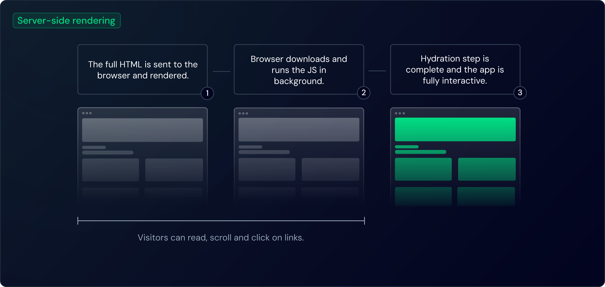

::: note
Vue3：<https://cn.vuejs.org/guide/scaling-up/ssr>

Vue2：<https://v2.ssr.vuejs.org/zh>

Vite：<https://cn.vite.dev/guide/ssr.html>

Nuxt：<https://nuxt.com/docs/guide/concepts/rendering>

其他：<https://www.builder.io/m/explainers/server-side-rendering>
:::

## 概念

### 客户端渲染 (CSR)

使用 Vue 开发的 SPA 项目一般都是 CSR（Client Side Rendering）模式，即客户端渲染。客户端接收到的是 HTML 模板和 JavaScript 脚本，在浏览器中运行 JavaScript 脚本，将 HTML 模板渲染成页面内容。

### 传统的服务端渲染 (SSR)

传统的 SSR（Server Side Rendering）是指在服务器端将 Vue 组件渲染为 HTML 字符串，然后将这些字符串发送到客户端。客户端接收到 HTML 字符串后，将其插入到页面中，并使用 JavaScript 进行交互。

### 同构的服务端渲染 (SSR)

同构的 SSR 是指**在服务器端和客户端都渲染 Vue 组件**（在 Nuxt 中叫做**通用渲染 Universal Rendering**）。服务器端渲染出初始的 HTML 字符串，然后将这些字符串发送到客户端。客户端接收到 HTML 字符串后，浏览器会将其插入到页面中，同时 Vue.js 会接管该文档，曾经在服务端上运行的 JavaScript 代码**再次**在客户端上运行，然后通过**水合**（Hydration）过程将 DOM 状态同步到客户端上。当水合完成后，客户端的 Vue.js 应用程序就完全接管了页面的控制权，包括响应用户的交互和更新页面内容。

- 用户可以立即访问页面内容，因为浏览器显示静态内容的速度比 JavaScript 生成的内容快得多。同时，在水合过程中保留了 Web 应用程序的交互性
- 通用渲染将页面的整个 HTML 内容作为经典服务器应用程序传递给浏览器。网络爬虫可以直接索引页面的内容，这使得通用渲染成为您想要快速索引的任何内容的绝佳选择



## 实现

### 虚拟 DOM

```html
<ul id="list">
  <li class="item">1</li>
  <li class="item">2</li>
  <li class="item">3</li>
</ul>
```

```js
const tree = {
  tag: "ul", // 节点标签名
  props: {
    id: "list", // DOM 的属性，用一个对象存储键值对
  },
  children: [
    // 该节点的子节点
    { tag: "li", props: { class: "item" }, children: ["1"] },
    { tag: "li", props: { class: "item" }, children: ["2"] },
    { tag: "li", props: { class: "item" }, children: ["3"] },
  ],
};
```

虚拟 DOM 为组件的跨平台渲染提供了可能，在 Vue 中内置了 `vue-server-renderer` (Vue2) 和 `vue/server-renderer` (Vue3) 库，用于跨平台渲染

该库的功能简单来说就是将 Vue 组件变为字符串，并且通过模板引擎将数据注入到字符串中，最后返回一个完整的 HTML 页面

### 代码实现

#### 1️⃣ 通用创建应用

在这里执行应用的创建逻辑，包括创建应用实例、注册插件、挂载路由、挂载状态管理器等操作，这里的代码在客户端和服务端都会执行
::: details 通用代码，在服务端和客户端共享 `main.ts`

```typescript
// 通用代码，在服务器和客户端之间共享
import { createHead } from "@unhead/vue";
import { createSSRApp } from "vue";
import VueLazyLoad from "vue3-lazyload";

import App from "@/App.vue";
import AdsbyGoogle from "@/components/AdsbyGoogle/index.vue";
import { loadSvg } from "@/icons";
import { createRouter } from "@/router";
import { createStore } from "@/stores";

// SSR 每个请求都需要一个新的应用实例，因此我们导出一个函数来创建一个新的应用实例
// 如果使用状态管理器，我们也会在这里创建一个新的存储（store）
// 每次请求时调用
export async function createApp(type: "client" | "server") {
  const app = createSSRApp(App);

  // 集成 Pinia 状态管理器
  const store = createStore();
  app.use(store);

  // 集成 Vue Router
  const router = createRouter(type);
  app.use(router);

  // 集成 unhead
  const head = createHead();
  app.use(head);

  // 集成 VueLazyLoad
  app.use(VueLazyLoad, {});

  // 全局注册组件 SvgIcon
  loadSvg(app);

  // 全局注册组件 AdSense
  app.component("AdsbyGoogle", AdsbyGoogle);

  return { app, store, router, head };
}
```

:::

#### 2️⃣ 服务端渲染

在服务端渲染中，我们需要将 Vue 组件渲染为 HTML 字符串或数据流，然后将这些字符串发送到客户端。因此，我们需要在服务器端创建一个 Vue 应用实例，并将该实例渲染为 HTML 字符串或数据流。

::: details 服务端渲染代码 `entry.server.ts`

```typescript
// 服务端入口文件
import { basename } from "node:path";

import { renderSSRHead } from "@unhead/ssr";
import type { Request } from "express";
import { renderToWebStream } from "vue/server-renderer";

import { DeviceEnum } from "@/configs/constants";
import { createApp } from "@/main";
import { useAppStore } from "@/stores/modules/app";
import webConfigs from "@/web-configs";

export async function render(url: string, host: string, ssrManifest: string, req: Request) {
  const manifest: Record<string, string[]> = ssrManifest && JSON.parse(ssrManifest); // 将字符串格式的 manifest 转换为对象
  // 根据请求的 host 获取对应的网站配置
  const webConfig = webConfigs[host] || webConfigs.localhost;

  const { app, store, router, head } = await createApp("server");

  // 根据请求头判断设备类型并存储状态
  const userAgent = req.headers["user-agent"] || "mobile";
  const isMobile = /mobile|android|webos|iphone|ipod|blackberry/i.test(userAgent);
  // NOTE 这里必须传入 store，否则会导致状态污染
  const appStore = useAppStore(store);

  // 服务端设置设备类型和网站配置，存储到 state 中
  appStore.toggleDevice(isMobile ? DeviceEnum.Mobile : DeviceEnum.Desktop);
  appStore.webConfig = webConfig;

  // 将状态序列化为 JSON 字符串
  const state = JSON.stringify(store.state.value);

  await router.push(url);
  await router.isReady();

  const headPayload = await renderSSRHead(head);

  const ctx: { modules?: string[] } = {};
  const stream = renderToWebStream(app, ctx);

  // Vite 生成的 SSR manifest 包含模块到 chunk/资源的映射，之后我们可以利用它来确定此请求需要预加载哪些文件
  const preloadLinks = renderPreloadLinks(ctx.modules, manifest);

  return { stream, preloadLinks, state, headPayload };
}

/** 服务端预加载文件 */
const renderPreloadLinks = (modules: undefined | string[], manifest: Record<string, string[]>) => {
  let links = "";
  const seen = new Set();
  if (modules === undefined || manifest === undefined) {
    return links;
  }
  modules.forEach((id) => {
    const files = manifest[id];
    if (files) {
      files.forEach((file) => {
        if (!seen.has(file)) {
          seen.add(file);
          const filename = basename(file);
          if (manifest[filename]) {
            for (const depFile of manifest[filename]) {
              links += renderPreloadLink(depFile);
              seen.add(depFile);
            }
          }
          links += renderPreloadLink(file);
        }
      });
    }
  });
  return links;
};

const renderPreloadLink = (file: string) => {
  if (file.endsWith(".js")) {
    return `<link rel="modulepreload" href="${file}">`;
  } else if (file.endsWith(".css")) {
    return `<link rel="stylesheet" href="${file}">`;
  } else if (file.endsWith(".woff")) {
    return `<link rel="preload" href="${file}" as="font" type="font/woff">`;
  } else if (file.endsWith(".woff2")) {
    return `<link rel="preload" href="${file}" as="font" type="font/woff2">`;
  } else if (file.endsWith(".gif")) {
    return `<link rel="preload" href="${file}" as="image" type="image/gif">`;
  } else if (file.endsWith(".jpg") || file.endsWith(".jpeg")) {
    return `<link rel="preload" href="${file}" as="image" type="image/jpeg">`;
  } else if (file.endsWith(".png")) {
    return `<link rel="preload" href="${file}" as="image" type="image/png">`;
  } else if (file.endsWith(".webp")) {
    return `<link rel="preload" href="${file}" as="image" type="image/webp">`;
  } else {
    return "";
  }
};

/** 生产环境下暴露获取 webConfigs 的函数 */
export function getWebConfigs() {
  return webConfigs;
}
```

:::

#### 3️⃣ 客户端水合

客户端接收到 HTML 之后，也需要执行一次 Vue 实例的初始化，然后拿到服务端传递过来的状态，将其注入到客户端的 Vue 实例中，然后执行客户端的代码，实现页面激活。

::: details 客户端激活代码 `entry.client.ts`

```typescript
// 客户端入口文件
// 用于挂载应用实例，将服务端渲染的 HTML 转换为可交互的 DOM（Hydrate）
import "@/styles/main.scss";

import { createApp } from "@/main";

const initializeApp = async () => {
  const { app, store, router } = await createApp("client");

  // 将服务端渲染的初始状态注入到 store 中
  if (window.__INITIAL_STATE__) {
    const stateObj = JSON.parse(window.__INITIAL_STATE__);
    store.state.value = stateObj;
  }

  router.isReady().then(() => {
    app.mount("#app", true);
  });
};

initializeApp();
```

:::

#### 4️⃣ 服务器配置

服务器配置文件用于启动一个服务器，处理客户端请求，将客户端渲染的 HTML 返回给客户端。

::: details 服务器配置代码 `server.js`

```js
// 入口文件，启动 SSR 服务器
import fs from "node:fs/promises"; // 导入文件系统模块，用于读取文件（使用 Promises）
import os from "node:os"; // 导入操作系统模块，用于获取环境变量

import express from "express"; // 导入 Express，用于创建 HTTP 服务器

// 常量
const isProduction = process.env.NODE_ENV === "production";
const port = process.env.PORT || 5173;
const base = process.env.BASE || "/";

// 在生产环境中缓存静态文件（HTML 和 ssr-manifest）
const templateHtml = isProduction
  ? await fs.readFile("./dist/client/index.html", "utf-8") // 读取生产环境下的 HTML 模板
  : ""; // 开发环境下 HTML 模板不缓存，后续动态读取
const ssrManifest = isProduction
  ? await fs.readFile("./dist/client/.vite/ssr-manifest.json", "utf-8") // 读取生产环境下的 SSR Manifest 文件
  : undefined; // 开发环境不使用 SSR Manifest

// 创建 HTTP 服务器实例
const app = express();

// 根据环境加载相应的中间件
let vite;
if (!isProduction) {
  // 如果是开发环境，使用 Vite 的中间件
  const { createServer } = await import("vite"); // 动态导入 Vite
  vite = await createServer({
    server: { middlewareMode: true }, // 以中间件模式启动 Vite
    appType: "custom", // 自定义应用类型
    base, // 设置基础路径
  });
  app.use(vite.middlewares); // 使用 Vite 中间件
} else {
  // 如果是生产环境，使用生产中间件
  const compression = (await import("compression")).default; // 动态导入 compression 模块，用于压缩响应
  const sirv = (await import("sirv")).default; // 动态导入 sirv，用于提供静态文件服务
  app.use(compression()); // 启用 gzip 压缩
  app.use(base, sirv("./dist/client", { extensions: [] })); // 提供静态资源服务，服务路径为 './dist/client'
}

// 处理 ads.txt 请求
app.get("/ads.txt", async (req, res) => {
  try {
    const originHost = req.headers.host.split(":")[0] || "localhost";
    const host = originHost.replace(/^www\./, "");
    let content;
    if (!isProduction) {
      content = (await vite.ssrLoadModule("/src/web-configs.ts")).default[host].adSense.ads;
    } else {
      content = (await import("../dist/server/entry-server.js")).getWebConfigs()[host].adSense.ads;
    }
    res.type("text/plain").send(content);
  } catch (e) {
    console.log(e.stack); // 打印错误堆栈
    res.status(500).end(e.stack); // 返回 500 错误，并输出堆栈信息
  }
});

// 处理所有的 HTML 请求
app.use("*", async (req, res) => {
  try {
    const originHost = req.headers.host.split(":")[0] || "localhost";
    const host = originHost.replace(/^www\./, "");
    const url = req.originalUrl.replace(base, ""); // 获取请求的 URL，并去除基础路径

    let template;
    let render;
    if (!isProduction) {
      // 在开发环境下，动态读取 HTML 模板并处理
      template = await fs.readFile("./index.html", "utf-8"); // 读取开发环境的 HTML 模板
      template = await vite.transformIndexHtml(url, template); // 使用 Vite 处理模板
      render = (await vite.ssrLoadModule("/src/entry-server.ts")).render; // 动态加载 SSR 入口并获取 render 函数
    } else {
      // 在生产环境下，使用缓存的模板和 render 函数
      template = templateHtml; // 使用缓存的生产环境模板
      render = (await import("../dist/server/entry-server.js")).render; // 从已构建的服务器端模块中导入 render 函数
    }

    // 调用服务端的 render 函数，生成流式内容和 Pinia 状态
    const { stream, preloadLinks, state, headPayload } = await render(url, host, ssrManifest, req);

    const [htmlStart, htmlEnd] = template
      .replace("<!--preload-links-->", preloadLinks)
      .replace("<!--pinia-state-->", state)
      .replace("<!--headTags-->", headPayload.headTags)
      .split("<!--app-html-->"); // 将模板分割为头部和尾部

    res.status(200).set({ "Content-Type": "text/html" }); // 设置响应头，表示返回 HTML 内容

    // 流式发送 HTML 的头部内容
    res.write(htmlStart);
    // 通过流式发送组件渲染的 HTML 内容
    for await (const chunk of stream) {
      if (res.closed) break; // 如果连接已关闭，则停止写入
      res.write(chunk); // 写入每个渲染块
    }
    // 发送 HTML 的尾部内容
    res.write(htmlEnd);
    res.end(); // 完成响应
  } catch (e) {
    vite?.ssrFixStacktrace(e); // 在开发环境中，修复 Vite 的 SSR 堆栈跟踪
    console.log(e.stack); // 打印错误堆栈
    res.status(500).end(e.stack); // 返回 500 错误，并输出堆栈信息
  }
});

// 启动 HTTP 服务器并监听指定端口
app.listen(port, "0.0.0.0", () => {
  // 获取局域网 IP 地址
  const interfaces = os.networkInterfaces();
  let localIP = "localhost";

  for (let iface in interfaces) {
    for (let alias of interfaces[iface]) {
      if (alias.family === "IPv4" && !alias.internal && alias.address.startsWith("192.168")) {
        localIP = alias.address; // 获取非本地回环地址的 IPv4
        break;
      }
    }
  }
  console.log(`Server started at:`);
  console.log(`- Local:   http://localhost:${port}`);
  console.log(`- Network: http://${localIP}:${port}`); // 打印局域网内可访问的 IP 地址
});
```

:::
