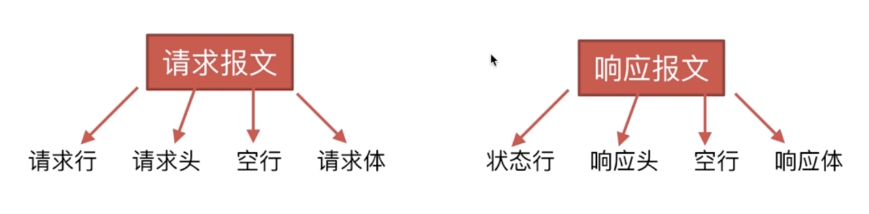
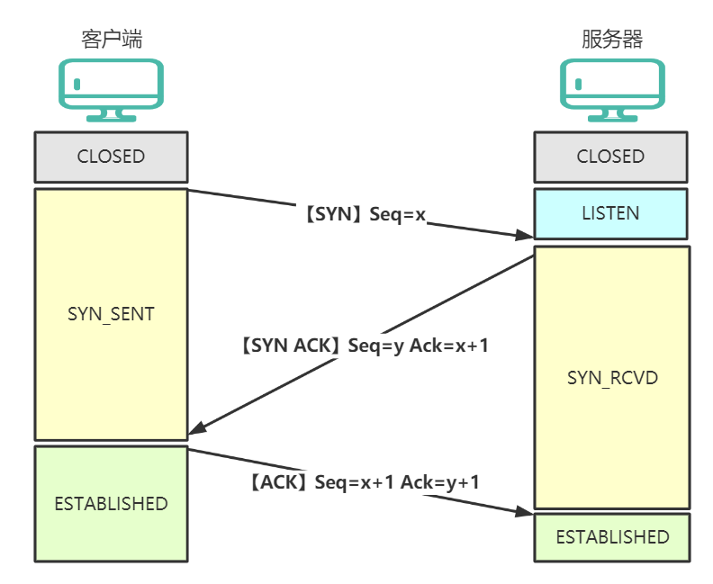
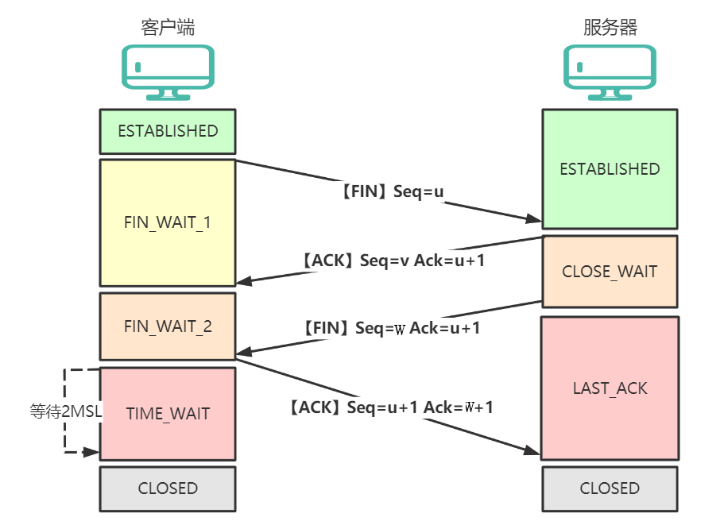

## 01 Ajax

### 1.1 ajax 请求

- 类比 form 表单的请求，需要页面刷新；
- Asynchronous JavaScript And XML，在浏览器中向服务器发送异步请求，**页面无刷新获取数据**；
- Ajax 请求是 HTTP 请求的一种，只有通过 `XHR` 或 `fetch` 发出的才是 ajax 请求；
- 对于一般请求，浏览器会直接显示响应体数据，也就是自动刷新或跳转页面；
- 对于 ajax 请求，浏览器不会对页面进行任何更新操作，只**调用监视的回调函数**并传入响应相关数据。

#### 特点

- 没有历史记录，无法回退；
- 存在跨域问题；
- SEO 不友好；

### 1.2 练习服务器

- 用 api-doc 生成 api 文档
- 使用 express 创建服务器

```javascript
const express = require("express");
const app = express();

app.use(express.static(__dirname + "/static")); // 前端打包好的静态资源就放在 static 文件夹下，服务器根目录

app.use((request, response, next) => {
  console.log("有人请求服务器1了");
  next();
});
// 配置后端路由
app.get("/students", (request, response) => {
  const students = [
    { id: "001", name: "tom", age: 18 },
    { id: "002", name: "jerry", age: 19 },
    { id: "003", name: "tony", age: 120 },
  ];
  response.send(students);
});
// 绑定端口监听
app.listen(5000, (err) => {
  if (!err) console.log("服务器1启动成功了,请求学生信息地址为：http://localhost:5000/students");
});
```

### 1.3 XHR 的基本使用

```javascript
// 1.实例化一个 xhr 对象
const xhr = new XMLHttpRequest();
// 2.状态监听
xhr.onreadystatechange = () => {
  if(xhr.readyState === 4) {
    if(xhr.status === 200) {
      console.log(xhr.response);
    }
  }
}
// 3.请求方式 请求地址 请求参数
xhr.open("GET", "URL");
// 4.发送请求
xhr.send();

// 取消请求 把整个请求的四个步骤包在一个函数中，赋值
lastXhr = getCode(){ xhr请求 }
lastXhr.abort() // 取消请求
```

#### xhr 内部五种状态

- 0：xhr 实例出来的那一刻，就是 0 状态；
- 1：send 方法还没有调用，依然可以修改请求头；
- 2：send 方法已经调用了，此时已经不可以修改请求头了；
- 3：服务器给浏览器的数据，已经回来一部分了，小的数据会在此阶段一次性接收完毕，大的数据，有待进一步接收；
- 4：所有数据都完美的回来了；

### 1.4 跨域

所谓同源是指：协议，域名（IP），端口必须要完全相同

- Cookie 不能读取；
- DOM 无法获得；
- Ajax 请求不能获取数据

## 02 HTTP

### HTTP 协议

特点：简单快速；灵活（数据类型）；无连接；无状态

### HTTP 报文



### 请求报文

- 请求行：包括请求方法、请求的 URL、HTTP 协议及版本；
- 请求头：一大堆的键值对

  - **accept**：接收的内容类型
  - **accept-charset**；**accept-language**；accepte-encoding
  - **cache-control**：缓存机制
  - **cookie**：请求携带的 cookie
  - **user-agent**：浏览器身份标识
  - **authorization**：超文本传输协议的认证信息
  - **connection**：连接方式

- **空行**指的是：当服务器在解析请求头的时候，如果遇到了空行，则表明，后面的内容是请求体。
- 请求体：数据部分


### 响应报文


### HTTP 方法

- GET：获取资源（可缓存，有历史记录，可收藏为书签）
- POST：传输资源（不可缓存，无历史记录，不可收藏为书签，一般是表单在用）
- PUT：更新资源
- DELETE：删除资源
- HEAD：获得报文首部

### 响应状态码

- 1\*\*：服务器收到请求，需要请求者继续执行操作；
- 2\*\*：请求成功（200：请求成功）
- 3\*\*：重定向（301：资源已永久转移到其他 URL）
- 4\*\*：客户端错误，请求包含语法错误或无法完成请求
  - 400：请求信息错误；
  - 401：需要用户身份认证 Unauthorized；
  - 403：服务器拒绝客户端的请求 Forbidden；
  - 404：资源不存在 Not Found；
- 5\*\*：服务器错误（500：服务器内部错误）

### URL 加载过程

- 解析 URL，分析所需要使用的**传输协议**和请求的**资源的路径**；
- 缓存判断，判断浏览器中是否有**缓存**；
- DNS 解析，判断本地是否有该域名的 IP 地址的缓存，如果有则使用，如果没有则向本地 DNS 服务器发起请求；
- 获取 MAC 地址，数据链路层的发送需要加入通信双方的 MAC 地址；
- TCP 三次握手
  - 客户端向服务器发送一个 SYN **连接请求报文段**和一个**随机序号**，服务端接收到请求；
  - 服务端向客户端发送一个 SYN ACK **报文段，确认连接请求**，并且也向客户端发送一个**随机序号**，客户端收到确认应答和随机序号；
  - 客户端接收服务器的确认应答后，**进入连接建立的状态**，同时向服务器也发送一个 ACK **确认报文段**，服务器端接收到确认后，也进入连接建立状态。
- HTTPS 握手（ TLS 四次握手）（这个可以不说）
- 客户端发送请求报文，服务端返回响应报文
- 浏览器解析 HTML，页面渲染

  - 请求 css、js、图片等外部资源
  - 解析 html，生成 DOM 树
  - 解析 CSS，生成 CSS 树
  - 合并 render 树
  - js 是否操作样式，如果操作了，重绘重排，如果没有则显示最终页面

- TCP 四次挥手
  - 浏览器向服务器发送断开连接请求
  - 服务器告诉浏览器稍等一下还有数据没发完或者要验证一下
  - 服务器告诉浏览器，数据处理完了，可以断开了
  - 浏览器发送给服务器，断开了

\*\*\*\*



## 03 Axios

Axios 是一个基于 Promise 的 HTTP 库，可以用在浏览器和 node.js 中。

### 特性

- 从浏览器中创建 [XMLHttpRequests](https://developer.mozilla.org/en-US/docs/Web/API/XMLHttpRequest)
- 从 node.js 创建 [http](http://nodejs.org/api/http.html) 请求
- 支持 [Promise](https://developer.mozilla.org/en-US/docs/Web/JavaScript/Reference/Global_Objects/Promise) API
- 拦截请求和响应
- 转换请求数据和响应数据
- 取消请求
- 自动转换 JSON 数据
- 客户端支持防御 [XSRF](http://en.wikipedia.org/wiki/Cross-site_request_forgery)

### 前置知识

#### 请求体参数

- 下面两行写在请求报文的请求头中
- `urlencoded`：Content-Type: application/x-www-form-urlencoded

  - `username=tom&pwd=123`

- `json`：Content-Type: application/json

  - `{ "username": "tom", "pwd": 123 }`

- 一般 form 表单发送 post 请求，用 urlencoded 编码的请求体参数

#### API 分类

- REST API
  - 发送请求进行 CRUD 的操作由请求方式来决定；
  - 同一个请求路径可以进行多个操作；
  - 请求方式有 GET/POST/PUT/DELETE；
- 非 REST API
  - 请求方式不决定请求的 CRUD 操作；
  - 一个请求路径只对应一个操作；
  - 一般只有 GET/POST 请求

#### json-server

- 快速搭建 REST API 风格的工具包
- 全局安装 `npm i -g json-server`
- 执行 `json-server db.json`

### 3.1 axios API

可以通过向 axios 传递相关配置来创建请求 axios(config)

- axios 调用的返回值是一个 Promise 实例；
- 成功的值叫 response，失败叫 error；
- response 是一个封装的对象，服务器返回的数据在 response.data 中；

```javascript
// 发送 POST 请求（axios 函数）
axios({
  method: 'post',  // 请求类型 POST GET PUT DELETE
  url: '/user/12345',  // 请求URL地址
  data: {  // 请求体
    firstName: 'Fred',
    lastName: 'Flintstone'
  }
}).then(response => {
  console.log(response);
};

// 发送 GET 请求
axios('/user/12345');  // 只写 url 即可，其他都为默认配置
```

### 3.2 请求方法的别名

```javascript
// axios.request(config)  该方法与 axios 函数的使用方法一样，写成对象格式
axios
  .request({
    method: "post",
    url: "/user/12345",
  })
  .then((response) => {
    console.log(response);
  });

// axios.get(url[, config])  等等
// axios.post(url[, data[, config]]) 中括号表示可选，下面的这些都不用写成对象格式
axios
  .post("http://localhost:3000/comments", {
    body: "喜大普奔",
    postId: 2,
  })
  .then((response) => {
    console.log(response);
  });
```

### 3.3 请求配置对象

```javascript
config = {
  url: '/user',  // url 是用于请求的服务器 URL
  method: 'get', // method 是创建请求时使用的方法， 默认为 get
  baseURL: 'https://some-domain.com/api/',  // baseURL 将自动加在 url 前面
  data: { firstName: 'Fred' },  // 请求体
  params: { ID: 12345 },  // params 是即将与请求一起发送的 URL 参数
  timeout: 10000,  // 如果请求花费了超过 timeout 的时间，请求将被中断
  headers: {'X-Requested-With': 'XMLHttpRequest'},  // 自定义请求头
  transformRequest: [function (data, headers) {  // 请求前对数据预处理
    return data;
  }],
  transformResponse: [function (data) {  // 响应前对数据预处理
    return data;
  }],
  ...
}
```

### 3.4 请求的默认配置

```javascript
axios.defaults.method = "GET";
axios.defaults.baseURL = "...";

axios.defaults = {
  method: "GET",
  baseURL: "...",
};
```

### 3.5 请求响应结果

```javascript
response = {
  data: {}, // data 由服务器提供的响应数据
  status: 200, // status 来自服务器响应的 HTTP 状态码
  statusText: "OK", // statusText 来自服务器响应的 HTTP 状态信息
  headers: {}, // headers 服务器响应的头
  config: {}, // config 是为请求提供的配置信息
  request: {}, // 原生的 AJAX 对象 XMLHttpRequest实例对象
};
```

### 3.6 创建实例对象发送请求

如果数据接口来自多个服务器，就可以为不同的服务器配置不同的请求实例对象，做不同的默认配置

```javascript
// 使用 axios.create(config) 方法创建一个请求的实例对象

// 1. 创建实例对象（与 axios 本身功能几乎一致）
const duanzi = axios.create({
  baseURL: "https://api.apiopen.top",
  timeout: 2000,
});

// 2. 使用实例对象
duanzi({
  url: "/getJoke",
}).then((response) => {
  console.log(response);
});

duanzi.get("/getJoke").then((response) => {
  console.log(response.data);
});
```

### 3.7 拦截器

拦截器就是一些函数，分为请求拦截器和响应拦截器；他们可以在请求前或者响应前对数据进行一些处理
use 方法传入成功和失败两个回调函数

请求拦截：1. 加一个进度条；2. 携带 token；3.添加特殊的请求头
响应拦截：1. 登陆状态失效时跳转到登录页

```javascript
// 设置 【请求】 拦截器  （config 是请求配置对象）
axios.interceptors.request.use(
  (config) => {
    console.log("请求拦截器 成功");
    config.params = { a: 100 }; // 修改 config 中的参数
    return config;
  },
  (error) => {
    // 请求失败的回调
    console.log("请求拦截器 失败");
    return Promise.reject(error); // 会引起 axios 里面的 catch
  }
);

// 设置 【响应】 拦截器  （response 是响应结果）
axios.interceptors.response.use(
  (response) => {
    console.log("响应拦截器 成功");
    return response.data;
  },
  (error) => {
    // 对响应错误做点什么
    if (error.response.status === 401) {
      // 身份过期 | token 无效
      store.commit("setToken", ""); // 清空 vuex 的 token
      store.commit("setRefreshToken", "");
      localStorage.removeItem("token"); // 清空本地 token
      localStorage.removeItem("refresh_token");
      router.push({ path: "/login" }); // 跳转到登录页面登录
    }
    return Promise.reject(error);
  }
);
```

### 3.8 取消请求

```javascript
// 2. 声明全局变量 cancel
let cancel = null;

btns[0].onclick = function () {  // 发送请求
  if (cancel !== null) { // 检测上一次的请求是否已经完成，如果没有，则取消上一次请求
    cancel();  // 取消上一次的请求
  };
  axios({
    method: "GET",
    url: "http://localhost:3000/posts",
    // 1. 添加配置对象的属性
    cancelToken: new axios.CancelToken(function (c) { // c是一个函数，调用c就可以取消请求
      // 3. 将 c 的值赋值给 cancel
      cancel = c;
    }),
  }).then(
    response => {
      console.log(response);
      cancel = null;  // 请求完成后将 cancel 的值初始化
    },
    error => {
      if(isCancel(error)) {
        console.log("用户取消请求", error.message);
      } else {
        console.log("请求失败", error)；
      }
    }
  );
};

// 绑定第二个事件取消请求
btns[1].onclick = function () {
	cancel();
};
```

取消请求配合拦截器使用

```javascript
const { CancelToken, isCancel } = axios;
let cancel = null;
// 请求拦截器
axios.interceptiors.request.use((config) => {
  if (cancel) cancel("取消请求");
  config.cancelToken = new CancelToken((c) => (cancel = c));
  return config;
});
// 响应拦截器
axios.interceptiors.response.use(
  (response) => response.data,
  (error) => {
    if (isCancel(error)) {
      console.log("用户取消请求", error.message);
    } else {
      console.log("请求失败", error);
    }
    return new Promise(() => {}); // 中断Promise链
  }
);

btn.onclick = async () => {
  const result = await axios.get("url");
};
```

### 3.9 批量发送请求

```javascript
axios.all([axios.get("url1"), axios.get("url2"), axios.get("url3")]).then(
  (response) => console.log(response),
  (error) => console.log(error)
);
```

### 3.10 axios 二次封装

1. 利用 `axios.create()` 方法创建一个请求实例对象，做一些默认配置；
2. 利用 `axios.interceptors.<request|response>.use` 方法设置请求拦截器和响应拦截器。
