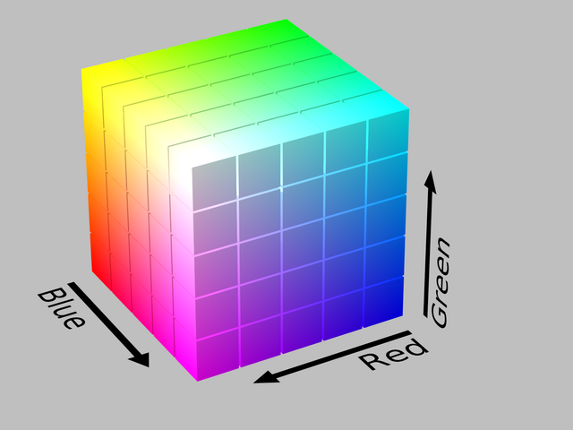
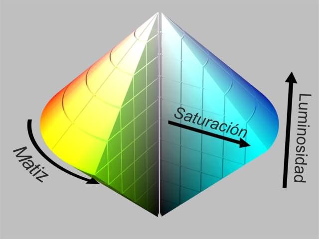

## RGB（红绿蓝）

RGB（Red, Green, Blue）是通过混合不同强度的红色、绿色和蓝色光来表示颜色的一种方法。这是计算机显示器、电视屏幕等设备使用的标准颜色模型。

### `rgb(red, green, blue)`

red, green, blue 值通常是整数，范围从 0 到 255，代表颜色的强度。

例如：`rgb(255, 0, 0)` 表示纯红色，`rgb(0, 255, 0)` 表示纯绿色，`rgb(0, 0, 255)` 表示纯蓝色。

RGBA：除了 RGB，还有一个 A（透明度）的扩展，表示 alpha 通道（透明度）：

### `rgba(red, green, blue, alpha)`

alpha 值的范围是 0 到 1，0 表示完全透明，1 表示完全不透明。

### `#RRGGBB`

Hex（十六进制颜色值）：一种常见的用于网页中的颜色表示方法，格式为 `#RRGGBB`，其中 RR、GG 和 BB 是红色、绿色和蓝色的十六进制值。

### `#RRGGBBAA`

RGBA 的十六进制表示法：`#RRGGBBAA`，其中 AA 是 alpha 通道的十六进制值。00 表示完全透明，FF 表示完全不透明

## HSV（色相、饱和度、明度）

HSV（Hue, Saturation, Value）是一种与 RGB 不同的色彩模型，它更接近人类对颜色的感知方式。

这个模型通过以下三个参数来定义颜色：

色相（Hue）：表示颜色的类型，与 HSL 相同，范围是 0° 到 360°。

饱和度（Saturation）：表示颜色的纯度，范围是 0% 到 100%，0% 表示灰色，100% 表示最纯的颜色。

明度（Value）：表示颜色的亮度，范围是 0% 到 100%，0% 表示黑色，100% 表示最亮的颜色。

例如：`hsv(0, 100%, 100%)` 表示纯红色，`hsv(120, 100%, 100%)` 表示纯绿色，`hsv(240, 100%, 100%)` 表示纯蓝色。

## HSL（色相、饱和度、亮度）

HSL（Hue, Saturation, Lightness）与 HSV 很相似，主要区别在于它的第三个分量是亮度（Lightness），而不是明度（Value）。

色相（Hue）：表示颜色的种类，范围是 0° 到 360°。例如：0° 表示红色，120° 表示绿色，240° 表示蓝色。

饱和度（Saturation）：表示颜色的纯度，范围是 0% 到 100%。0% 表示灰色，100% 表示最纯的颜色。

亮度（Lightness）：表示颜色的明暗程度，范围是 0% 到 100%。0% 表示黑色，100% 表示白色，50% 通常是最纯的颜色。

例如：`hsl(0, 100%, 50%)` 表示纯红色，`hsl(120, 100%, 50%)` 表示纯绿色，`hsl(240, 100%, 50%)` 表示纯蓝色。
