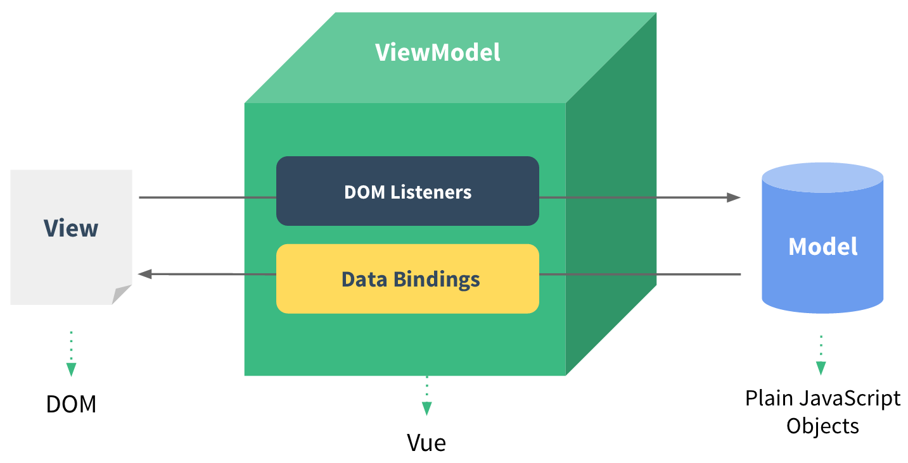
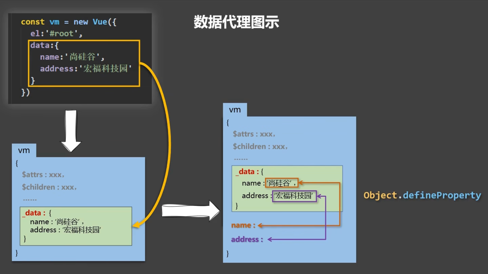
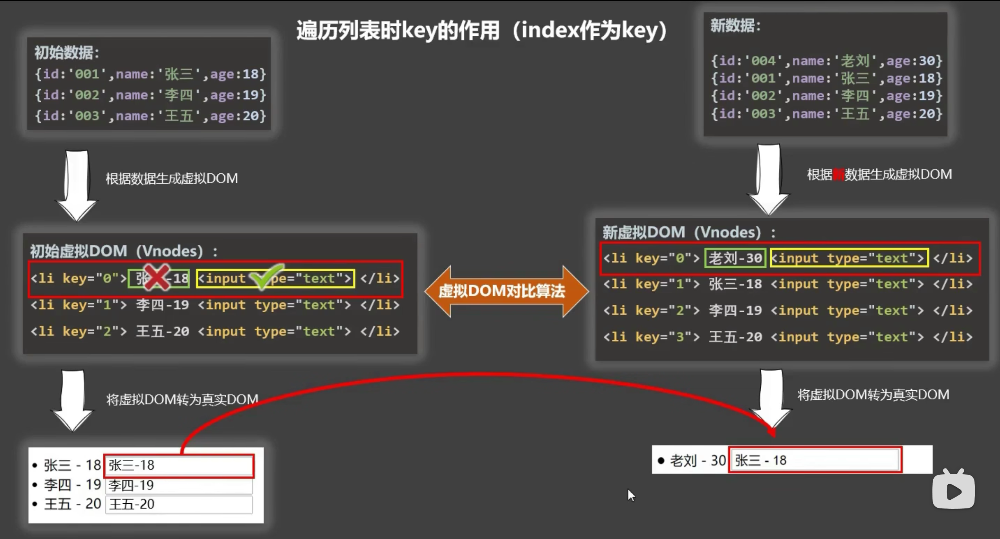
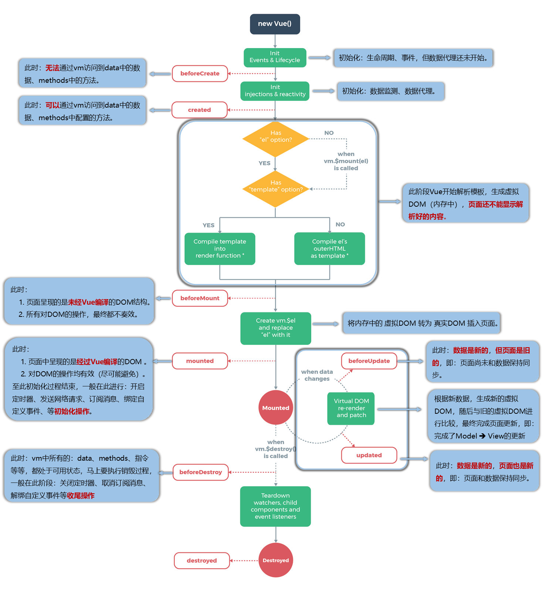
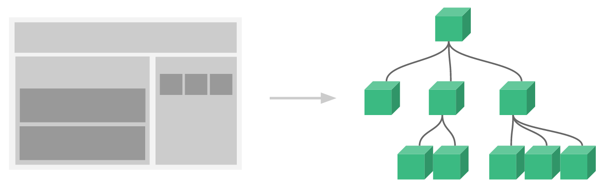
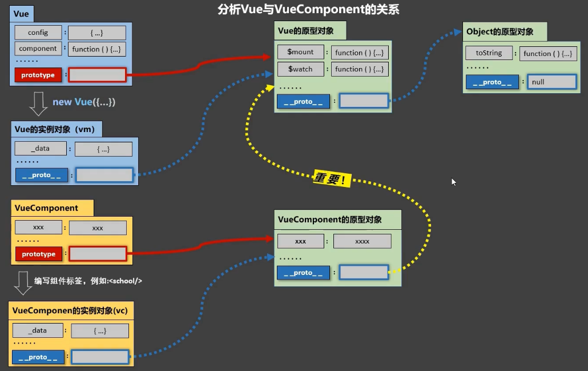

基于 Vue 2.0 的笔记

## 01 初识 Vue

Vue.js（简称 Vue）是一个用于构建用户界面的渐进式 JavaScript 框架。Vue 的设计核心是通过简洁的 API 和高效的响应式数据绑定，帮助开发者更容易地创建现代化的前端应用。

- 想让 Vue 工作，就必须创建一个 **Vue 实例（ViewModel，vm）**，且要传入一个配置对象
- root 容器里的代码依然符合 HTML 规范，只不过混入了一些特殊的 Vue 语法
- root 容器里的代码被称为 **Vue 模板**
- Vue 实例和容器是一一对应的
- 真实开发中只有一个 Vue 实例，并且会配合着组件 (Vue Components，vc) 一起使用
- `{{ xxx }}` 中的 `xxx` 要写 **JS 表达式**，且 `xxx` 可以自动读取到 `data` 中的所有属性
- 一旦 `data` 中的数据发生改变，那么页面中用到该数据的地方也会自动更新

```js
// Vue 实例和 Vue 组件中常用的配置项（vm 和 vc 共有的）
// main.js 里面 new Vue 生成的叫做 vm；其他 .vue 文件中 export default 的都是 vc
new Vue({
  // 1.数据
  data() {}, // 可简写为对象形式，但不推荐
  computed: {}, // 计算属性
  watch: {}, // 监视属性
  methods: {}, // 方法（函数）
  props: {}, // 接收父组件和路由传来的数据
  // 2.DOM
  el: "#app", // 仅用于 new Vue 的 vm 中
  template: "<App/>", // 一个字符串模板作为 Vue 实例的标识
  render: (h) => h(App), // 字符串模板的替代方案
  renderError: {}, // 渲染失败时的输出
  // 3.生命周期钩子（回调函数，有省略）
  beforeCreate() {},
  created() {}, // 出现 $
  beforeMount() {},
  mounted() {}, // 出现 $el
  beforeUpdate() {},
  updated() {},
  activated() {}, // 当使用 keep-alive 缓存组件时会出现
  deactivated() {}, // 当使用 keep-alive 缓存组件时会出现
  beforeDestroy() {},
  destroyed() {},
  // 4.资源
  components: {}, // 组件
  directives: {}, // 指令
  filters: {}, // 过滤器
  mixins: {}, // 混合、混入
  // 5.其他
  name: "", // 用在组件 vc 身上
  store: store, // 当使用 Vue.use(Vuex) 后，就可以传入 store 配置项（vm 身上）
  router: router, // 当使用 Vue.use(VueRouter) 后，就可以传入 router 配置项（vm 身上）
  beforeRouteEnter, // 组件内守卫（进入守卫），vc 身上
  beforeRouteLeave, // 组件内守卫（离开守卫），vc 身上
});
```

## 02 模板语法

写在 `<template>` 标签中的语法

### 插值语法

功能：用于解析标签体内容

```html
<template>
  <div>{{ xxx }}</div>
</template>
```

`xxx` 是 **JS 表达式**，且可以直接读取到 `data` 中的所有属性

### 指令语法

功能：用于解析标签（包括：标签属性、标签体内容、绑定事件......）

举例：`v-bind:href="xxx"` 或 简写为 `:href="xxx"`，`xxx` 同样要写 **JS 表达式**，且可以直接读取到 `data` 中的所有属性

## 03 数据绑定

`v-bind` `v-model` `sync`

### 单向绑定 v-bind

- 数据只能从 `data` 流向页面，`v-bind:attr="xxx"` 可以简写成 `:attr="xxx"`
- 可以绑定其他属性，通常在属性前面加上冒号，这样属性等号后面的值就当作 **JS 表达式**来解析

### 双向绑定 v-model

- 数据不仅可以从 `data` 流向页面，也可以从页面流向 `data`，只能应用于**表单元素**
- `v-model:value="xxx"` 可以简写为 `v-model="xxx"`，**默认收集的是 value 值**
- `label` 标签为 `input` 元素定义标注（标记）；**它不会向用户呈现任何特殊效果**。不过，它为鼠标用户改进了可用性。如果您在 `label` 元素内点击文本，就会触发此控件。就是说，当用户选择该标签时，浏览器就会自动将焦点转到和标签相关的表单控件上；使用 `for` 属性指定表单控件的 `id`
- 三个修饰符
  - `v-model.lazy` 失去焦点再收集数据
  - `v-model.number` 输入字符串转为有效数字（整数，有加减号）
  - `v-model.trim` 去除首尾空格

::: details 收集表单数据

```html
<!-- 收集表单数据 -->
<form action="/submit" method="post" @submit.prevent="() => { console.log('表单提交事件') }">
  <!-- action 指定表单提交的地址，不过基本不用   -->
  <label for="demo">账号</label>
  <!-- 用 lable 之后，点击“账号”也可以使输入框获取焦点 -->
  <input type="text" id="demo" v-model.trim="userInfo.account" />
  <!-- trim 去掉前后的空格 -->
  密码：<input type="password" v-model="userInfo.password" /> 年龄：<input
    type="number"
    v-model.number="userInfo.age"
  />
  <!-- 字符串转数字 -->

  性别：
  <!-- 单选，需配置相同的 name 和 value  属性，收集 value 值 -->
  男<input type="radio" name="sex" v-model="userInfo.sex" value="male" /> 女<input
    type="radio"
    name="sex"
    v-model="userInfo.sex"
    value="female"
  />

  <!-- 多选，如果没有 value 属性，或者有 value 属性，但是 v-model 初始值不是数组，则收集是否选择的布尔值，即 checked 属性值；如果配置了 value 属性，且 v-model 初始值为数组，则收集 value 组成的数组 -->
  爱好： 学习<input type="checkbox" v-model="userInfo.hobby" value="study" /> 打游戏<input
    type="checkbox"
    v-model="userInfo.hobby"
    value="game"
  />
  吃饭<input type="checkbox" v-model="userInfo.hobby" value="eat" />

  所属校区
  <select v-model="userInfo.city">
    <option value="">请选择校区</option>
    <option value="beijing">北京</option>
    <option value="shanghai">上海</option>
    <option value="shenzhen">深圳</option>
    <option value="wuhan">武汉</option>
  </select>
  其他信息：
  <textarea v-model.lazy="userInfo.other"></textarea>
  <button type="submit">提交</button>
  <button type="reset">重置</button>
  <!-- 表单中的按钮，如果不配置 type 属性，会被当成提交按钮，点击按钮会触发表单数据提交，提交的地址和方法在 form 标签的 action 和 method 中配置，同时会刷新页面。点击提交按钮会触发 form 标签的 submit 事件 -->
</form>
<script>
  const userInfo = {
    account: "",
    password: "",
    age: 18,
    sex: "female",
    hobby: ["study"],
    city: "beijing",
    other: "",
    agree: false,
  };
</script>
```

:::

### 表单相关知识

- `form` 标签用于收集表单数据，里面主要包裹 `input`，`textarea` 等输入类型元素
- `form` 标签具有几个属性，`action` 表示想服务器提交表单的地址，`method` 表示提交表单的方法，表单提交时会触发 `submit` 事件
- `form` 标签中的 `button` 如果不指定 `type`，则默认为 `submit`，点击按钮时会触发表单的 `submit` 事件

### sync 修饰符

- `sync` 修饰符可以实现类似 `v-model` 的双向绑定，因为一个组件只能有一个 `v-model`，而且 `props` 的数据是不可以修改的，所以需要双向绑定 `props` 的数据或其他数据的时候，可以用 `sync` 修饰符。它也是组件通信方式的一种；
- `:money.sync` 表示父组件通过 props 给子组件传递一个数据 `money`，同时给当前子组件绑定一个自定义事件`update:money`

```html
<child :show="show" @update:show="show=$event"></child>
<!-- 等价于 -->
<child :show.sync="show"></child>

<!-- 注意：子组件中触发自定义事件的形式必须类似如下 -->
<script>
  this.$emit("update:show", !this.show);
</script>

<!-- 在 Vue 3 中，v-model 可以绑定多个值 v-model:demo="" v-model:test="" -->
<child v-model:demo="demo" v-model:test="test"></child>

<!-- 子组件 defineModel 的写法 -->
<script>
  const demo = defineModel("demo");
  const test = defineModel("test");

  const changeDemo = () => {
    demo.value = "demo";
  };

  const changeTest = () => {
    test.value = "test";
  };
</script>
```

## 04 el 与 data 的两种写法

### el 的写法

```js
// 方法1
new Vue({
  el: '#root', // new Vue 时配置 el 属性
  ...
})

// 方法2
const vm = new Vue({ ... })
vm.$mount('#root') // 创建 Vue 实例 vm，使用 vm.$mount('#root')，这是 Vue 原型身上的方法
```

### data 的写法

组件中的 `data` 必须写成函数式，定义组件时会通过 `Vue.extend()` 生成组件实例，每次都返回一个全新的 `VueComponent`；**如果采用对象的方式，一个组件在复用的时候，`data` 都指向同一个对象地址，改变一处会影响其他处**；而采用函数返回的对象地址是不同的，不会产生污染。

```js
new Vue({
  // 对象式，vue3 中已被废弃
  data: {
    name: "demo",
  },

  // 函数式（推荐使用）
  data: function () {
    return { name: "demo" };
  },
  // 简写
  data() {},
});
```

由 Vue 管理的函数，一定不要写箭头函数，一旦写了箭头函数，`this` 就不再是 Vue 实例了

## 05 数据代理和数据劫持

### MVVM 模型



- M：模型 (Model) ：`data` 中的数据
- V：视图 (View) ：模板代码，即 `template` 标签中的内容
- VM：视图模型 (ViewModel)：Vue 实例对象

> `data` 中所有的属性，最后都出现在了 `vm` 身上
>
> `vm` 身上所有的属性及 Vue 原型上所有属性，在 Vue 模板中都可以直接使用

### Object.defineProperty

- 给对象添加属性，直接用 `=` 添加的时候，添加的属性是不可以枚举的
- 使用 JS 实现**给对象添加或修改属性**：`Object.defineProperty(obj, prop, descriptor)`
- 可以添加 `getter` 和 `setter` 以实现响应式

::: details Vue 响应式原理

```js
let number = 18;

// 1. 数据属性 (4 项)
Object.defineProperty(person, "age", {
  value: 18,
  writable: true, // 控制属性是否可以被修改，默认值是 false
  enumerable: true, // 控制属性是否可以枚举，默认值是 false
  configurable: true, // 控制属性是否可以被删除，默认值是 false
});

// 2. 访问器属性 (4 项)
Object.defineProperty(person, "age", {
  enumerable: true, // 控制属性是否可以枚举，默认值是 false
  configurable: true, // 控制属性是否可以被删除，默认值是 false
  // 当有人读取 person 的 age 属性时，get 函数(getter)就会被调用，且返回值就是 age 的值
  get() {
    // 收集依赖
    console.log("有人读取age属性了");
    return number;
  },
  // 当有人修改 person 的 age 属性时，set 函数(setter)就会被调用，且会收到修改的具体值
  set(newVal) {
    // 如果新的值和旧的值相等就不用修改
    if (newVal === number) return;
    // 触发依赖更新
    console.log("有人修改了age属性，且值是", newVal);
    number = newVal;
  },
});

// 定义属性时两种属性只能二选一
```

:::

### 数据代理

- 数据代理：通过一个对象 B 代理对另一个对象 A 中属性的操作，给对象 B 添加对象 A 的属性即可
- **Vue 中的数据代理**：通过 `vm` 对象来代理 `vm._data` 对象中属性的操作，添加了 `getter` 和 `setter`
- `vm._data` 中的数据来自于 `data` 配置项，使用的是**数据劫持**，为了实现响应式



### 数据劫持 (监听)

### Vue 响应式原理

#### 1️⃣ Vue 监测对象中数据的改变

1. 通过一个 `Observer` 加工劫持 `data` 对象中的数据，添加 `getter` 和 `setter`，**在 `setter` 中加入重新解析模板操作**
2. 将加工后的数据给 `vm._data`
3. 使用数据代理，把 `vm._data` 下的数据给到 `vm`

```js
// Vue 数据劫持的基本原理 (实现响应式)

// 1. 数据
const data = { name: "Vue", version: "2.0" };

// 2. 创建一个监视的实例对象，用于监视 data 中属性的变化
const obs = new Observer(data); // 订阅者

// 3. 观察者 obs 上具有 data 的所有属性和对应的 getter 和 setter；将 obs 赋给 data 和 vm._data
const vm = {};
vm._data = data = obs; // 使用 obs 包装 data

// 创建一个 Observer 构造函数，Observer 复制了 data 对象的所有数据，并添加了 getter 和 setter
// 没有考虑递归
function Observer(obj) {
  // 汇总对象中所有的属性形成一个数组
  const keys = Object.keys(obj);
  // 遍历属性，添加 getter 和 setter
  keys.forEach((key) => {
    // this 是 Observer 的实例对象 obs，用于监视的实例对象！！！
    Object.defineProperty(this, key, {
      get() {
        return obj[key];
      },
      set(newVal) {
        // 1. 如果新的值和旧的值相等就不用修改
        if (newVal === obj[key]) return;
        // 2. 新的值和旧的值不相等
        obj[key] = newVal;
        // 在 setter 中触发重新解析模板操作
        console.log("数据发生变化了，我要去解析模板，生成虚拟 DOM，接着忙了");
        // 一般是调用原生的 DOM 方法，修改页面
      },
    });
  });
  // 每个 Observer 实例中都有一个 Dep
}
```

> 如果想直接为 data 添加 getter 和 setter 可以使用下面方法

```js
// 这种方法使用中转变量 value 存储了 obj[key] 的值，避免了无限循环
const data = { name: "Vue", version: "2.0" };

function Observer(obj) {
  Object.keys(obj).forEach((key) => {
    // 需要用中转变量存储 obj[key] 值，防止死循环
    let value = obj[key];

    Object.defineProperty(obj, key, {
      enumerable: true,
      configurable: true,
      get() {
        console.log(`Getting ${key}!`);
        return value;
      },
      set(newVal) {
        if (newVal === obj[key]) return;
        console.log(`Setting ${key}! 触发解析模板操作`);
        value = newVal;
      },
    });
  });
}

new Observer(data);
```

> 总结：Vue 先劫持 data 对象，添加 getter 和 setter，并在 setter 中调用重新解析模板的操作（每个 setter 中有一个 watcher）；之后将劫持的数据赋给 `vm._data` 对象；然后使用数据代理，将数据赋给 vm 对象做代理，这样就可以直接在 vm 身上拿到 data 中的数据了。

**`Vue.set()`**

- 如果初始化时 vm 的 data 里面没有的属性，需要增加时，要调用 `Vue.set()`，不能直接使用 `vm._data` 添加，不然会没有 getter 和 setter
- 但是注意：**不能使用此方法往 vm 和 vm.data 中添加属性**，只能往其下一层添加

```js
// Vue.set(target, key, val) or vm$set(target, key, val)
Vue.set(vm._data.student, "sex", "男");
Vue.set(vm.student, "sex", "男");
vm$set(vm.student, "sex", "男");
```

#### 2️⃣ Vue 监测数组中数据的改变

- Vue 没有为 data 中**数组**里面的元素匹配 getter 和 setter，所以通过索引修改数组中的元素时，无法触发响应式；
- 只有调用这 7 个数组身上的方法，才能触发响应式 `[push, pop, shift, unshift, splice, sort, reverse]`，Vue 对这 7 个方法进行了包装。或者直接使用 `Vue.set()` 方法。

#### 3️⃣ Vue 2 响应式原理

采用数据劫持结合观察者模式的方式实现响应式，也借鉴了发布订阅模式的思想

> obs 身上具有 data 的所有属性，读取或修改这些属性时就会触发 getter 或 setter

```js
const data = { name: "Vue", version: "2.0" };

/** Vue 2 这里用了递归 */
function Observer(obj) {
  Object.keys(obj).forEach((key) => {
    // 如果写 Object.defineProperty(obj, key, {}) 就会出现超出最大回调栈错误
    // 因为下方 getter 中的 return obj[key] 会再次触发 getter 操作
    // 所以不能把 getter 加在 data 自身，而是放在实例 obs 上
    Object.defineProperty(this, key, {
      enumerable: true,
      configurable: true,
      get() {
        console.log(`Getting ${key}!`);
        return obj[key];
      },
      set(newVal) {
        if (newVal === obj[key]) return;
        console.log(`Setting ${key}! 触发解析模板操作`);
        obj[key] = newVal;
      },
    });
  });
}

const obs = new Observer(data);
obs.name; // Getting name!
obs.name = "React"; // Setting name=React! 触发解析模板操作
```

#### 4️⃣ Vue 3 响应式原理

```js
// 使用代理和反射 API 替代 Object.defineProperty
const data = { name: "Vue", version: "2.0" };

const proxy = new Proxy(data, {
  get(target, property, receiver) {
    console.log(`Getting ${property}!`);
    return Reflect.get(...arguments);
  },
  set(target, property, value, receiver) {
    console.log(`Setting ${property}=${value}! 触发解析模板操作`);
    return Reflect.set(...arguments);
  },
});

proxy.name; // Getting name!
proxy.name = "React"; // Setting name=React! 触发解析模板操作
```

### 双向绑定原理

#### 1️⃣ 发布订阅模式

> 以全局事件总线为例

```js
class Vue {
  constructor() {
    // 用来存储 事件-事件回调函数 { 'myclick': [fn1, fn2, fn3] }
    this.subs = {};
  }
  // 【订阅者】实现 $on 方法
  $on(type, fn) {
    this.subs[type] = this.subs[type] ? [...this.subs[type], fn] : [fn];
  }
  // 【发布者】实现 $emit 方法
  $emit(type) {
    // 首先得判断该方法是否存在
    if (this.subs[type]) {
      // 获取到参数数组 (从第二位开始截取参数，因为第一个参数是 type)
      // arguments 不是真正的数组，不能直接使用 slice 方法
      // const args = Array.from(arguments).slice(1);
      const args = Array.prototype.slice.call(arguments, 1);
      // 循环队列调用 fn
      this.subs[type].forEach((fn) => fn(...args));
    } else {
      console.log("该事件不存在");
    }
  }
}

// 使用
const eventHub = new Vue();
// 使用 $on 添加一个 sum 类型的 方法到 subs['sum']中
eventHub.$on("sum", function () {
  let count = [...arguments].reduce((x, y) => x + y);
  console.log(count);
});
// 触发 sum 方法
eventHub.$emit("sum", 1, 2, 4, 5, 6, 7, 8, 9, 10);
```

#### 2️⃣ 观察者模式

```js
/** 发布者 (被观察者-主题-老师) */
class Subject {
  constructor() {
    // 1. 被观察者拥有所有观察者的完整数组
    this.observerList = []; // 观察者列表
  }

  // 添加观察者
  addObs(obs) {
    // 判断观察者是否有和存在更新订阅的方法
    if (obs && obs.update) {
      // 添加到观察者列表中
      this.observerList.push(obs);
    }
  }

  // 通知观察者，发送消息
  notify(msg) {
    // 2. 事件发布时遍历观察者列表，通知每一个观察者 (调用观察者的更新事件函数)
    this.observerList.forEach((obs) => obs.update(msg));
  }
}

/** 观察者 (学生) */
class Observer {
  constructor(name) {
    this.name_ = name;
  }

  // 定义更新事件函数
  update(msg) {
    console.log(`目标更新了，我${this.name_}收到了这条消息：${msg}`);
  }
}

// 创建发布者
const sub = new Subject();

// 创建观察者
const obs1 = new Observer("张三");
const obs2 = new Observer("李四");

// 把观察者添加到列表中
sub.addObs(obs1);
sub.addObs(obs2);

// 发布者开启了通知 (发送了消息)，每个观察者者都会自己触发 update 更新事件
sub.notify("这是一条消息");
```

1. `new Vue()` 首先执行初始化，对 `data` 执行响应化处理，这个过程发生 `Observer` 中；
2. 同时对模板执行编译，找到其中动态绑定的数据，从 `data` 中获取并初始化视图，这个过程发生在 `Compile` 中；
3. 同时定义⼀个更新函数和 `Watcher` ，将来对应数据变化时 `Watcher` 会调用更新函数；
4. 由于 `data` 的某个 `key` 在⼀个视图中可能出现多次，所以每个 `key` 都需要⼀个管家 `Dep` 来管理多个 `Watcher`；
5. 将来 data 中数据⼀旦发生变化，会首先找到对应的 `Dep`，通知所有 `Watcher` 执行更新函数；

## 06 事件处理

### 事件的基本使用

- 在 HTML 标签中，使用 `v-on:xxx` 或 `@xxx` 绑定事件，其中 xxx 是事件名
- 事件的回调函数需要写在 `methods` 对象中（不能用箭头函数，否则 this 指向就不是 vm 或 vc）
- 事件的回调函数的第一个参数默认会传入**事件对象**，比如点击事件对象
- 事件函数调用传参使用 `$event` 占位，这样就不会丢失默认传入的 event 参数
- 在组件标签中，默认绑定的是自定义事件，如果要使用原生 DOM 事件，需要加 `.native` 修饰符

```js
// 如果在调用事件回调时没有传递 $event 参数，事件回调函数则不会收到事件对象
@click = "sayName('Tom')"
sayName(name) { console.log(name) }

// 调用事件回调时使用 $event 占位，事件回调函数会收到事件对象
@click = "showInfo($event, 66)"
// 调用方法 func 括号可加可不加
showInfo(e, num) { console.log(e, num) }
```

### 事件修饰符

```js
@click.prevent="func"  // 阻止默认事件 如阻止链接自动跳转
@click.stop= "func"    // 阻止事件冒泡 当内外标签绑定相同事件时，触发内部标签不会同时触发外部标签
@click.once= "func"    // 事件只触发一次
@click.capture= "func" // 使用事件的捕获模式 先外层标签，再内层标签，与冒泡相反
@click.self= "func"    // 当event.target是当前操作元素时才出发操作  仅作用于绑定事件的标签，点击其内部标签无作用
@click.passive= "func" // 事件的默认行为立即执行 无需等待事件的回调函数执行完毕（有可能事件回调执行时间很长）
// 事件修饰符可以连续写
```

### 键盘事件

```js
@keydown
@keyup
@keyup.enter.native="login" // enter 键抬起时触发登录
```

## 07 计算属性 computed

- `computed` 计算属性应写成对象的形式，**包含 get 和 set 两个方法**；当**读取**计算属性时，get 方法就会被调用，且返回值就作为计算属性的值；当**修改**计算属性时，set 方法就会被调用；
- 计算属性依赖 return 实现功能；
- 计算属性简写：当只读不改时，计算属性可简写为一个函数。

```js
new Vue({
  computed: {
    fullName: {
      // 读取计算属性
      // get 在初次读取 fullName 的值和所依赖的数据发生变化时被调用
      get() {
        return this.firstName + "-" + this.lastName;
      },
      // 修改计算属性
      set(value) {
        const arr = value.split("-");
        this.firstName = arr[0];
        this.lastName = arr[1];
      },
    },
  },
  // 简写（只读不改）
  computed: {
    fullName() {
      return this.firstName + "-" + this.lastName;
    },
  },
});
```

- 要用的属性不存在，要通过已有的属性计算得来，就使用计算属性；
- 与 methods 实现相比，计算属性内部有**缓存机制 (复用)**，效率更高，调试方便；
- **计算属性最终会出现在 vm 上**，在模板中直接读取使用即可；
- 把计算属性当作一个快照，不要修改计算属性的返回值；
- 被 Vue 管理的函数，最好写成普通函数，这样 this 的指向才是 vm 或 vc；
- 不被 Vue 所管理的函数 (定时器的回调函数、ajax 的回调函数、Promise 的回调函数等)，最好写成箭头函数。

### 手动实现一个 computed 函数

```js
const memory = (fn) => {
  // 缓存对象，用于存储函数的计算结果
  const cache = new Map();

  // 返回一个新的函数
  return function (...args) {
    // 将参数转换为字符串，用作缓存的键
    const key = JSON.stringify(args);

    // 如果缓存中存在结果，则直接返回缓存结果
    if (cache.has(key)) {
      return cache.get(key);
    }

    // 否则，调用原函数计算结果
    const result = fn(...args);

    // 将结果存入缓存中
    cache.set(key, result);

    // 返回计算结果
    return result;
  };
};

// 示例用法
const complexCalculation = (num) => {
  console.log("计算中...");
  return num * num;
};

const memoizedCalculation = memory(complexCalculation);

console.log(memoizedCalculation(5)); // 计算中... 25
console.log(memoizedCalculation(5)); // 25（从缓存中读取，不会再次计算）
console.log(memoizedCalculation(6)); // 计算中... 36
console.log(memoizedCalculation(6)); // 36（从缓存中读取，不会再次计算）
```

## 08 监视属性 watch

- **当被监视的属性变化时， 回调函数自动调用， 进行相关操作**；
- 监视的属性必须存在，才能进行监视；
- 两种写法：new Vue 时传入 watch 配置项；或者用 `vm.$watch`；
- `immediate: true` 表示初始化时调用一下；
- 配置 `deep: true` 表示深度监视，检测对象内部多层的变化；Vue 中的 watch 默认不监测对象内部值的改变（一层）；
- 当只需要 handler 时，可简写为 handler 函数形式，传入形参 newValue 和 oldValue；**只传一个形参时，就是 newValue**；
- computed 能完成的功能，watch 都可以完成；
- watch 能完成的功能，computed 不一定能完成，例如：watch 可以进行**异步操作**。计算属性 computed 靠的是 return 的返回值来实现功能，无法做到异步生成返回值；而 watch 不依赖返回值，用的是 handler 函数；
- watch 不缓存；

```html
<script>
  new Vue({
    watch: {
      isHot: {
        immediate: true, // 初始化时让 handler 调用一下
        deep: true, // 深度监视
        handler(newValue, oldValue) {
          console.log("isHot被修改了", newValue, oldValue);
        },
      },
    },
    // 简写
    watch: {
      isHot(newValue, oldValue) {
        console.log("isHot被修改了", newValue, oldValue, this);
      },
    },
  });

  vm.$watch("firstName", {
    function(val) {
      // 这里必须用箭头函数，因为定时器是 JS 引擎控制的，这个函数不是 Vue 管理的
      setTimeout(() => {
        (this.fullName = val + "-" + this), lastName;
      });
    },
  });
</script>
```

## 09 绑定样式

使用 `v-bind` 单向绑定

### 绑定 class 样式

```js
:class="mood"     // 字符串写法，适用于样式的类名不确定，需要动态指定
:class="classArr" // 数组写法，适用于样式的个数不确定，类名也不确定
:class="classObj" // 对象写法，适用于样式的个数确定，类名确定，但需要动态决定用不用

data: {
  mood: 'normal',
  classArr: ['style1', 'style2', 'style3'],
  classObj: {
    style1: false,
    style2: false,
  }
}
```

### 绑定 style 样式

```js
:style="styleObj"  // 对象写法
:style="styleArr"  // 数组写法

data: {
  styleObj: { fontSize: '40px', color: 'red', },
  styleArr: [
    { fontSize: '40px', color: 'blue', },
    { backgroundColor: 'gray' }
  ]
}
```

## 10 条件渲染

- `v-if="xxx"` 当表达式为 false 时，不展示的 DOM 元素直接被**移除**，适用于切换频率较低的场景 (管理系统的权限列表)；配合 `v-else` 使用；
- `v-show="xxx"` 当表达式为 false 时，不展示的 DOM 元素隐藏，`display: none` 适用于切换频率较高的场景 (前台页面的数据展示)；
- xxx 表示的是一个表达式，可以求出一个值，判断这个值是 true 或 false，当他们的表达式为 true 时则显示；
- `v-if` 一般和 `template` 搭配使用，在一个 `template` 标签中使用 `v-if`；因为 `template`标签不影响结构，在解析时会被移除；

> 当 v-for 和 v-if 同时使用的时候，v-for 的优先级更高，会导致 v-if 重复运行在每个 for 循环中，会重复操作 DOM。（vue3 中 v-if 优先级更高）
>
> 1. 如果循环内部没有条件判断，则用 template 标签包裹 v-for，在外面进行 v-if 判断；
>
> 2. 如果循环内部有条件判断，则**用计算属性提前过滤掉不需要显示的项（就不需要 v-if 了）**

## 11 列表渲染

### 列表渲染

遍历数组 `v-for="(item, index) in items" :key="item.id"`（推荐用 `item.id` 作为 `key` ）
遍历对象 `v-for="(val, key) in items` 拿到的分别是对象的 **value 和 key**

- 可省略数组的 index 或者对象的 key，这样拿到的就是 item 或者 val；
- 使用 v-for 时一定要加 `:key`；
- v-for 可应用在数组、对象、字符串。

**`key` 的重要性**



- key 是 Vue 内部在用，不会出现在 DOM 结构上；
- key 是虚拟 DOM 对象的标识，当数据发生变化时，Vue 会根据【新数据】生成【新的虚拟 DOM】，随后 Vue 进行【新虚拟 DOM】与【旧虚拟 DOM】的差异比较；
- **对比规则：**
  - 旧虚拟 DOM 中找到了与新虚拟 DOM 相同的 key
    - **若虚拟 DOM 中节点内容没变, 直接复用之前的真实 DOM**
    - 若虚拟 DOM 中节点内容变了, 则生成新的真实 DOM，随后替换掉页面中之前的真实 DOM
  - 旧虚拟 DOM 中未找到与新虚拟 DOM 相同的 key
    - 创建新的真实 DOM，随后渲染到到页面

### 列表过滤 filter

```js
new Vue({
  data: {
    // 1.data 中配置 keyWord 和 filPersons 数组
    keyWord: "", // 关键词
    filPersons: [], // 用一个新数组接收过滤后的数组（监视属性用）
    persons: [], // 原数组
  },
  // 1. watch 监视属性写法
  watch: {
    keyWord: {
      immediate: true, // 对起始的空字符串进行一次过滤，展示整个数组
      handler(val) {
        // 只传一个参数表示变化后的 newValue
        this.filPerons = this.persons.filter((p) => {
          return p.name.indexOf(val) !== -1; // 字符串中 indexOf 空字符串，结果是 0
        });
      },
    },
  },
  // 2. computed 计算属性写法（推荐）
  computed: {
    filPerons() {
      return this.persons.filter((p) => p.name.indexOf(this.keyWord) !== -1);
    },
  },
});
```

### Diff 算法 (待优化)

Vue 的 diff 算法（主要在 Vue 的 Virtual DOM 实现中）的核心是高效地对比两棵虚拟 DOM 树，找出最小的更新操作。Vue 的 diff 算法使用的是双端比较（双指针）的方法。下面是其详细的流程说明：

### Diff 算法流程

1. **初始化双指针**：
   - `oldStartIdx` 指向旧节点列表的开始位置。
   - `oldEndIdx` 指向旧节点列表的结束位置。
   - `newStartIdx` 指向新节点列表的开始位置。
   - `newEndIdx` 指向新节点列表的结束位置。
2. **双端比较**： 在双端比较的过程中，Vue 会同时从旧节点列表和新节点列表的两端进行对比：
   - **旧头与新头比较** (`oldStartVnode` 和 `newStartVnode`)： 如果匹配，则直接更新该节点，然后指针分别向右移动。
   - **旧尾与新尾比较** (`oldEndVnode` 和 `newEndVnode`)： 如果匹配，则直接更新该节点，然后指针分别向左移动。
   - **旧头与新尾比较** (`oldStartVnode` 和 `newEndVnode`)： 如果匹配，说明节点需要移动到新的位置。将旧头节点移动到旧尾之后，然后旧头指针右移，新尾指针左移。
   - **旧尾与新头比较** (`oldEndVnode` 和 `newStartVnode`)： 如果匹配，说明节点需要移动到新的位置。将旧尾节点移动到旧头之前，然后旧尾指针左移，新头指针右移。
3. **四种情况均不匹配**：
   - 如果以上四种情况都不匹配，则通过 key 来查找旧节点列表中是否存在与当前新节点 key 相同的节点。
   - 如果找到匹配的节点，则移动该节点到正确位置，并更新该节点。
   - 如果没有找到匹配的节点，则创建新的节点并插入到正确位置。
4. **处理剩余节点**：
   - 当某一方的指针先走完时（例如 `oldStartIdx > oldEndIdx` 或 `newStartIdx > newEndIdx`），说明另一方还有剩余节点需要处理。
   - 如果新节点列表还有剩余节点，则这些节点是新增的，需要创建并插入。
   - 如果旧节点列表还有剩余节点，则这些节点是多余的，需要移除。

## 12 过滤器 filters

对要显示的数据进行特定格式化后再显示（适用于一些简单逻辑的处理），本质上是一个函数

- 注册过滤器（局部或全局）

  - 局部过滤器：在创建 vm 时传入 `filters` 配置项；
  - 全局过滤器：`Vue.filter(filterName, callback)`

- 使用过滤器：`&#123;&#123; xxx | 过滤器名 &#125;&#125;` 或 `v-bind: 属性 = "xxx | 过滤器名"`
- **callback 函数默认传入第一个参数是需要过滤的数据的 `value`**，上面的 xxx 是需要过滤的数据

```html
<script type="text/javascript">
  // 全局过滤器（写在 Vue 实例之前）
  Vue.filter("mySlice", function (value) {
    return value.slice(0, 4); // 截取前四位
  });

  new Vue({
    // 局部过滤器（本质是一个函数）
    filters: {
      timeFormater(value, str = "YYYY年MM月DD日 HH:mm:ss") {
        // str 传一个形参默认值
        return dayjs(value).format(str);
      },
    },
  });
</script>
```

## 13 其他指令

- `v-text` 向所在节点渲染文本内容，会直接替换掉标签中的内容，不解析标签；
- `v-html` 向所在节点渲染包含 html 结构的内容，但是有安全性问题；
- `v-cloak` 是一个特殊属性，没有值；当 Vue 实例创建完毕接管容器后，会删掉该属性，配合 css（属性选择器）使用解决网速过慢时展示出未经解析模板的问题（给带有 `v-cloak` 属性的节点设置 `display: none`），这样在 Vue 实例创建完毕之前，带有 `v-cloak` 的节点不会显示；接管完毕之后，`v-cloak` 属性被删除，就可以显示了；
- `v-once` 所在节点初次动态渲染后，就视为静态内容，以后数据的改变不会引起所在结构的更新；
- `v-pre` 让 Vue 跳过其所在节点的编译过程，跳过没有指令语法和插值语法的节点，加快编译过程。

```html
<template>
  <div v-cloak>{{ demo }}</div>
</template>

<style>
  [v-cloak] {
    display: none;
  }
</style>
```

## 14 自定义指令 directives

`bind` `inserted` `update`

自定义指令可以**简写成函数形式**，完整形式要写成对象（可用于权限控制）

自定义指令允许开发者封装一段操作 DOM 的逻辑，以便在模板中简洁地复用这些逻辑

- 第一个形参是真实的 **DOM 元素** `<span></span>`
- 第二个形参是绑定的元素对象，我们需要用到其 value 值 `binding.value = n`

- 定义一个 `v-big` 指令，和 `v-text` 功能类似，但会把绑定的数值放大 10 倍
- 定义一个 `v-fbind` 指令，和 `v-bind` 功能类似，但可以让其所绑定的 `input` 元素默认获取焦点
- 如果想在不同的时机调用不同的函数，就要写成对象式

```html
<h2>放大10倍后的 n 值是：<span v-big="n"></span></h2>
<input type="text" v-fbind:value="n" />

<script>
  // 定义全局指令(对象式)
  Vue.directive("fbind", {
    bind(element, binding) {
      // 指令与元素成功绑定时（一上来）被调用
      element.value = binding.value;
    },
    inserted(element, binding) {
      // 指令所在元素被插入页面时被调用
      element.focus();
    },
    update(element, binding) {
      // 指令所在的模板被重新解析时被调用
      element.value = binding.value;
    },
  });
  new Vue({
    // 定义局部指令(函数式简写)
    directives: {
      big(element, binding) {
        // 第一个形参：真实 DOM 元素；第二个形参：绑定元素对象
        element.innerText = binding.value * 10; // 原生 DOM 操作
      },
    },
  });
</script>
```

## 15 生命周期



- 生命周期回调函数、生命周期函数、生命周期钩子，是 Vue 在关键时刻帮我们调用的一些特殊名称的函数；生命周期函数中的 `this` 指向是 `vm` 或组件实例对象 `vc`；
- `mounted` Vue 完成模板的解析并把初始的真实 DOM 元素放入页面后（挂载完毕）调用；发送 `ajax` 请求、启动定时器、绑定自定义事件、订阅消息等**初始化操作**；
- `beforeUpdated` 页面和数据未同步；
- `beforeDestroy` 清除定时器、解绑自定义事件、取消订阅消息等**收尾工作**，对数据的修改不会再更新了；
- 另外还有三个生命周期 `activated` `deactivated` `nextTick`；
- `vm.$el` 存储着 Vue 解析后的真实 DOM；
- 放在 `mounted` 中的请求有可能导致页面闪动（因为此时页面 DOM 结构已经生成），但如果在页面加载前完成请求，则不会出现此情况。建议对页面内容的改动放在 `created` 生命周期当中。

## 16 组件

组件：实现应用中局部功能代码和资源的集合，在 Vue 中组件的本质是一个 VueComponent 构造函数，在书写组件标签时，Vue 会帮我们调用该构造函数，生成一个组件实例对象 vc，每个 vc 就是一个组件。

### 非单文件组件



- 什么是组件：**实现应用中局部功能代码和资源的集合**；组件就是把图形、非图形的各种逻辑均抽象为一个统一的概念（组件）来实现开发的模式，在 Vue 中每一个 `.vue` 文件都可以视为一个组件；
- 组件化的优点：复用代码，简化项目编码，提高效率；
- **Vue 中的组件本质是一个构造函数；**

**01 定义（创建）组件**

- `Vue.extend({ options })` 创建一个**构造函数**（`options` 对象表示配置项，如 `data`、`methods`、`template` 等，和 `new Vue` 时传入的配置项几乎相同）；
- 不写 `el`，最后由一个 `vm` 统一管理并挂载；`data` 写成函数，避免组件复用时数据间引用关系；
- 利用 `template` 配置项创建内容，里面用模板字符串插入 HTML 结构；
- 可以简写为 `const school = { options }`；**`Vue.extend` 可省略**；
- `name` 属性用于定义在开发者工具中的名称，给程序员看的。

**02 注册组件**

- 全局注册 `Vue.component('组件名', 定义的组件对象)`
- 局部注册 `new Vue({ components: { 组件名: 定义的组件对象 } })`
- 注意：注册组件时的组件名是应用在**使用组件**时，不是显示在开发者工具中的，是给代码看的；但如果定义组件时没有传入 `name` 配置项，那么开发者工具中展示的就是现在这个组件名

**03 使用组件**

- 编写组件标签（注册组件时的组件名）即可，如 `<Student></Student>`；在脚手架环境中使用自闭和标签即可。

```html
<!-- 第三步：使用组件 -->
<Hello></Hello>

<!-- 第一步：创建hello组件 -->
<script>
  const hello = Vue.extend({
    name: 'Hello',
    template: `<div><h2>你好啊！{{ name }}</h2></div>`,
    data() {
      return { name: 'Tom' }
    }
  })

  // 第二步：全局注册组件
  Vue.component('Hello', hello)  // 前面一个hello是注册时的组件名，用它来写组件标签
  // 或者局部注册
  new Vue({
    ...,
    components:{ Hello: hello },
  })
</script>
```

**组件名写法建议**

- 一个单词：建议首字母大写，与开发者工具呼应；
- 多个单词：建议 CamelCase 写法，每个单词首字母大写 MySchool（仅限脚手架中使用）；
- 可以使用 `name` 配置项指定组件在开发者工具中呈现的名字；如果不用 `name` 配置项，则开发者工具中展示的是组件注册时的名字；
- 单文件组件中组件文件名建议与组件名一致。

### VueComponent

`const Hello = Vue.extend({ })`

- `Hello` 组件本质上是一个名为 `VueComponent` 的构造函数，且不是程序员定义的，是 `Vue.extend` 生成的；
- 我们只需要写 `<Hello/>`，Vue 解析时会帮我们创建 `Hello` 组件的实例对象，即 Vue 帮我们执行的：`new VueComponent(options)`;
- 每次调用 `Vue.extend`，返回的都是一个全新的 `VueComponent`；
- Vue 的实例对象，简称 `vm`；`VueComponent` 的实例对象，简称 `vc`（组件实例对象）；
- **组件配置中**，`data` 函数、`methods` 中的函数、`watch` 中的函数、`computed` 中的函数 它们的 `this` 均是【`VueComponent` 实例对象 `vc`】；
- **new Vue(options) 配置中**，`data` 函数、`methods` 中的函数、`watch` 中的函数、`computed` 中的函数 它们的 `this` 均是【`Vue` 实例对象 `vm`】



> `Vue.prototype === VueComponent.prototype.__proto__`
>
> 让组件实例对象（vc）可以访问到 Vue 原型上的属性、方法（$mount 等）

- `const d = new Demo()`
- 构造函数 `Demo` 具有 `prototype` 属性，指向自己的原型对象；（显式原型属性）
- `Demo` 的实例对象 `d` 具有 `__proto__` 属性，指向自己的原型对象；（隐式原型属性）
- `Demo.prototype == d.__proto__`

### 单文件组件

**在 `index.html` 里面只写了一个 id 为 `app` 的容器**

```js
// main.js 程序入口文件
import Vue from "vue"; // 引入 Vue（使用 ES6 的模块化语法替代了在 HTML 的 src 属性中引入 vue）
import App from "./App.vue"; // 引入根组件

new Vue({
  // 创建 vm
  // template: `<App></App>`,  // 相当于在容器里面写 <App></App>
  // components: { App },  // 注册根组件
  render: (h) => h(App), // 使用 render 代替以上两行，即将 App 组件渲染到 HTML 结构中
}).$mount("#app"); // 挂载到容器中（指明挂载的容器）
```

```html
<!-- 根组件 App.vue -->
<template>
  <div>
    <School></School>
    <!-- 使用组件 -->
    <Student></Student>
  </div>
</template>

<script>
  import School from "./School.vue"; // 引入组件
  import Student from "./Student.vue";

  export default {
    // 这里实际上调用了 Vue.extend，生成了根组件实例 vc
    name: "App", // 根组件
    components: { School, Student }, // 注册组件
  };
</script>
```
