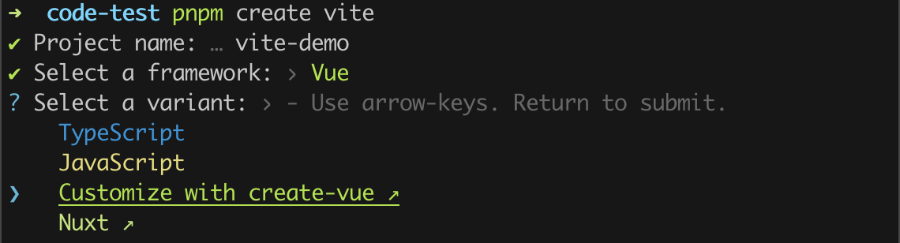

## 01 Vue 3 简介

### 源码的升级

- 使用 `Proxy` 代替 `defineProperty` 实现响应式

- 重写虚拟 `DOM` 的实现和 `Tree-Shaking`

### 拥抱 TypeScript

`Vue3` 可以更好的支持 `TypeScript`

### 新的特性

`Composition API` (组合式 `API`)

- `setup`

- `ref` 与 `reactive`

- `computed` 与 `watch`

  ......

新的内置组件

- `Fragment`

- `Teleport`

- `Suspense`

  ......

其他改变

- 新的生命周期钩子

- `data` 选项应始终被声明为一个函数

- 移除 `keyCode` 支持作为 ` v-on` 的修饰符

  ......

## 02 创建 Vue 3 工程

### 1️⃣ 基于 [create-vue](https://github.com/vuejs/create-vue) 创建

`create-vue` 是 Vue 官方的项目脚手架工具。你将会看到一些诸如 TypeScript 和测试支持之类的可选功能提示：

```sh
pnpm create vue@latest
```

### 2️⃣ 基于 [create-vite](https://github.com/vitejs/vite/tree/main/packages/create-vite) 创建

`Vite` 是新一代前端构建工具，`Vite` 的优势如下：

- 轻量快速的热重载（`HMR`），能实现极速的服务启动。
- 对 `TypeScript`、`JSX`、`CSS` 等支持开箱即用。
- 真正的按需编译，不再等待整个应用编译完成。
- `webpack` 构建与 `Vite `构建对比图如下：


`create-vite` 是 Vite 官方的项目脚手架工具。使用 Vite 创建项目时可以选择多种项目模板，包括 Vue、React、SSR 等等类型

```sh
## 执行创建命令
pnpm create vite
```

选择某个框架之后，还可以自定义模板，比如这里选择 Vue 框架，还可以通过 create-vue 来自定义模板，也可以选择 Nuxt 模板等



### 自己动手编写一个 App 组件

```vue
<template>
  <div class="app">
    <h1>你好啊！</h1>
  </div>
</template>

<script lang="ts">
export default {
  name: "App", // 组件名
};
</script>

<style></style>
```

安装官方推荐的 `VSCode` 插件：Vue-Official

### 一个简单的效果

`Vue3` 向下兼容 `Vue2` 语法，且 `Vue3` 中的模板中可以没有根标签

```html
<template>
  <div class="person">
    <h2>姓名：{{ name }}</h2>
    <h2>年龄：{{ age }}</h2>
    <button @click="changeName">修改名字</button>
    <button @click="changeAge">年龄+1</button>
    <button @click="showTel">点我查看联系方式</button>
  </div>
</template>

<script lang="ts">
  export default {
    name: "App",
    data() {
      return {
        name: "张三",
        age: 18,
        tel: "13888888888",
      };
    },
    methods: {
      changeName() {
        this.name = "zhang-san";
      },
      changeAge() {
        this.age += 1;
      },
      showTel() {
        alert(this.tel);
      },
    },
  };
</script>
```

## 03 拉开序幕的 setup

### 1️⃣ setup 概述

`setup` 是 `Vue3` 中一个新的配置项，值是一个函数，它是 `Composition API` **表演的舞台**，组件中所用到的数据、方法、计算属性、监视......等等，均配置在 `setup` 中。

- `setup` 函数返回值 (对象) 中的内容，可直接在模板中使用
- `setup` 函数会在 `beforeCreate` 之前调用
- `setup` 函数中访问 `this` 是 `undefined` (因为它领先于所有生命周期钩子)

```vue
<template>
  <div class="person">
    <h2>姓名：{{ name }}</h2>
    <h2>年龄：{{ age }}</h2>
    <button @click="changeName">修改名字</button>
    <button @click="changeAge">年龄+1</button>
  </div>
</template>

<script lang="ts">
export default {
  name: "Person",
  setup() {
    // 数据，原来写在 data 中（注意：此时的 name、age、tel 数据都不是响应式数据）
    let name = "张三";
    let age = 18;

    // 方法，原来写在 methods 中
    function changeName() {
      name = "zhang-san"; //注意：此时这么修改 name 页面是不变化的
      console.log(name);
    }
    function changeAge() {
      age += 1; //注意：此时这么修改 age 页面是不变化的
      console.log(age);
    }

    // 返回一个对象，对象中的内容，模板中可以直接使用
    return { name, age, changeName, changeAge };
  },
};
</script>
```

### 2️⃣ setup 的返回值

- 若返回一个**对象**：则对象中的：属性、方法等，在模板中均可以直接使用 (最常使用)
- 若返回一个**函数**：则可以自定义渲染内容，代码如下：

```jsx
setup() {
  return () => '你好啊！'
}
```

### 3️⃣ setup 与组合式 API

- `Vue2` 的配置（`data`、`methods`......）中**可以访问到** `setup` 中的属性、方法
- 但在`setup`中**不能访问到** `Vue2` 的配置（`data`、`methods`......）
- 如果与 `Vue2` 冲突，则 `setup` 优先

### 4️⃣ setup 语法糖

`setup `函数有一个语法糖，这个语法糖，可以让我们把 `setup` 独立出去，代码如下

> 该 `<script setup lang="ts">` 标签中的内容相当于 setup 函数的函数体，并且无需书写 return，其中定义的变量和方法会自动 return

```vue
<template>
  <div class="person">
    <h2>姓名：{{ name }}</h2>
    <button @click="changName">修改名字</button>
  </div>
</template>

<script lang="ts">
export default {
  name: "Person",
};
</script>

<!-- 下面的写法是 setup 语法糖 -->
<script setup lang="ts">
let name = "张三";

function changName() {
  name = "李四";
}
</script>
```

扩展：上述代码，还需要编写一个不写 `setup` 的 `script` 标签，去指定组件名字，比较麻烦，我们可以借助`Vite` 中的插件简化

1. 安装插件

```sh
pnpm i vite-plugin-vue-setup-extend -D
```

2. 在 `vite.config.ts` 中配置插件

```js
import { defineConfig } from "vite";
import VueSetupExtend from "vite-plugin-vue-setup-extend";

export default defineConfig({
  plugins: [VueSetupExtend()],
});
```

3. 在语法糖标签中书写 name 属性

```vue
<script setup lang="ts" name="Person">
import { ref } from "vue";
</script>
```

## 04 ref 基本类型

- **作用：**定义响应式变量
- **语法：**`const xxx = ref(初始值)`
- **返回值：**一个 `RefImpl` 的实例对象，简称 `ref对象` 或 `ref`，`ref` 对象的 `value` **属性是响应式的**
- **注意点：**
  - `JS` 中操作数据需要：`xxx.value`，但模板中不需要`.value`，直接使用即可
  - 对于 `const name = ref('张三')` 来说，`name` 不是响应式的，`name.value` 是响应式的

```vue
<template>
  <div class="person">
    <h2>姓名：{{ name }}</h2>
    <h2>年龄：{{ age }}</h2>
    <button @click="changeName">修改名字</button>
    <button @click="changeAge">年龄+1</button>
    <button @click="showTel">点我查看联系方式</button>
  </div>
</template>

<script setup lang="ts" name="Person">
import { ref } from "vue";
// name 和 age 是一个 RefImpl 的实例对象，简称 ref 对象，它们的 value 属性是响应式的
const name = ref("张三");
const age = ref(18);
// tel 就是一个普通的字符串，不是响应式的
const tel = "13888888888";

function changeName() {
  // JS 中操作 ref 对象时候需要 .value
  name.value = "李四";
  console.log(name.value);

  // 注意：name 不是响应式的，name.value 是响应式的，所以如下代码并不会引起页面的更新。
  // name = ref('zhang-san')
}
function changeAge() {
  age.value += 1;
  console.log(age.value);
}
function showTel() {
  alert(tel);
}
</script>
```

## 05 reactive 对象类型

- **作用：**定义一个**响应式对象**（基本类型不要用它，要用 `ref`，否则报错）
- **语法：**`const 响应式对象 = reactive(源对象)`
- **返回值：**一个 `Proxy` 的实例对象，简称：响应式对象
- **注意点：**`reactive` 定义的响应式数据是“深层次”的

```vue
<template>
  <div class="person">
    <h2>汽车信息：一台{{ car.brand }}汽车，价值{{ car.price }}万</h2>
    <h2>游戏列表：</h2>
    <ul>
      <li v-for="game in games" :key="game.id">{{ game.name }}</li>
    </ul>
    <h2>测试：{{ obj.a.b.c.d }}</h2>
    <button @click="changeCarPrice">修改汽车价格</button>
    <button @click="changeFirstGame">修改第一游戏</button>
    <button @click="test">测试</button>
  </div>
</template>

<script lang="ts" setup name="Person">
import { reactive } from "vue";

// 数据
const car = reactive({ brand: "奔驰", price: 100 });
const games = reactive([
  { id: "abcd01", name: "英雄联盟" },
  { id: "abcd02", name: "王者荣耀" },
  { id: "abcd03", name: "原神" },
]);
const obj = reactive({
  a: {
    b: {
      c: {
        d: 666,
      },
    },
  },
});

function changeCarPrice() {
  car.price += 10;
}
function changeFirstGame() {
  games[0].name = "流星蝴蝶剑";
}
function test() {
  obj.a.b.c.d = 999;
}
</script>
```

## 06 ref 对象类型

- 其实 `ref` 接收的数据可以是：**基本类型**、**对象类型**
- 若 `ref` 接收的是对象类型，内部其实也是调用了 `reactive` 函数

```vue
<template>
  <div class="person">
    <h2>汽车信息：一台{{ car.brand }}汽车，价值{{ car.price }}万</h2>
    <h2>游戏列表：</h2>
    <ul>
      <li v-for="g in games" :key="g.id">{{ g.name }}</li>
    </ul>
    <h2>测试：{{ obj.a.b.c.d }}</h2>
    <button @click="changeCarPrice">修改汽车价格</button>
    <button @click="changeFirstGame">修改第一游戏</button>
    <button @click="test">测试</button>
  </div>
</template>

<script lang="ts" setup name="Person">
import { ref } from "vue";

// 数据
const car = ref({ brand: "奔驰", price: 100 });
const games = ref([
  { id: "ahsgdyfa01", name: "英雄联盟" },
  { id: "ahsgdyfa02", name: "王者荣耀" },
  { id: "ahsgdyfa03", name: "原神" },
]);
const obj = ref({
  a: {
    b: {
      c: {
        d: 666,
      },
    },
  },
});

console.log(car);

function changeCarPrice() {
  car.value.price += 10;
}
function changeFirstGame() {
  games.value[0].name = "流星蝴蝶剑";
}
function test() {
  obj.value.a.b.c.d = 999;
}
</script>
```

## 07 ref 对比 reactive

**用法**

- `ref` 用来定义：**基本类型数据**、**对象类型数据**

- `reactive` 用来定义：**对象类型数据**

**区别**

- `ref` 创建的变量必须使用 `.value`(可以使用插件自动添加 `.value` )

- `reactive` 重新分配一个新对象，会**失去**响应式 (可以使用 `Object.assign` 去整体替换)

```js
let car = reactive({ brand: "奔驰", price: 100 });
// car = { brand:  '大众', price:  10 } // 这样操作会失去响应式

Object.assign(car, { brand: "大众", price: 10 }); // 正确做法
```

**使用原则**

- 若需要一个基本类型的响应式数据，必须使用 `ref`
- 若需要一个响应式对象，层级不深，`ref`、`reactive` 都可以
- 若需要一个响应式对象，且层级较深，推荐使用 `reactive`

## 08 toRef 与 toRefs

- 作用：将一个响应式对象中的每一个属性，转换为 `ref` 对象

- `toRefs` 与 `toRef` 功能一致，但 `toRefs` 可以批量转换

- 改变 `name` `age` `gender` 时，`person` 中的相应属性值也会被改变

  > toRef：创建的 ref 与其源属性保持同步：改变源属性的值将更新 ref 的值，反之亦然

```vue
<script lang="ts" setup name="Person">
import { reactive, toRefs, toRef } from "vue";

const person = reactive({ name: "张三", age: 18, gender: "男" });

// 通过 toRefs 将 person 对象中的 n 个属性批量取出，且依然保持响应式的能力
const { name, age } = toRefs(person);

// 通过 toRef 将 person 对象中的 gender 属性取出，且依然保持响应式的能力
const gender = toRef(person, "gender");
</script>
```

## 09 computed

作用：根据已有数据计算出新数据（和 `Vue2` 中的 `computed` 作用一致）

参数：一个 getter 函数

返回值：一个计算数属性 ref

```vue
<template>
  <div class="person">
    姓：<input type="text" v-model="firstName" /> <br />
    名：<input type="text" v-model="lastName" /> <br />
    全名：<span>{{ fullName }}</span> <br />
    <button @click="changeFullName">全名改为：li-si</button>
  </div>
</template>

<script setup lang="ts" name="App">
import { ref, computed } from "vue";

const firstName = ref("zhang");
const lastName = ref("san");

// 计算属性——只读取，不修改
/* const fullName = computed(() => {
    return firstName.value + '-' + lastName.value
  }) */

// 计算属性——既读取又修改
const fullName = computed({
  // 读取
  get() {
    return firstName.value + "-" + lastName.value;
  },
  // 修改
  set(val) {
    console.log("有人修改了fullName", val);
    firstName.value = val.split("-")[0];
    lastName.value = val.split("-")[1];
  },
});

function changeFullName() {
  fullName.value = "li-si";
}
</script>
```

## 10 watch

- 作用：监视数据的变化（和 `Vue2` 中的 `watch` 作用一致）
- `watch` 函数的返回值是一个函数，调用该函数可以停止监视
- 特点：`Vue3` 中的 `watch` 只能监视以下**四种数据**
  - `ref` 定义的数据
  - `reactive` 定义的数据
  - 函数返回一个值 (能返回一个值的函数，也叫 `getter` 函数)
  - 一个包含上述内容的数组

我们在 `Vue3` 中使用 `watch` 的时候，通常会遇到以下 5 种情况

### 1️⃣ 情况一

监视 `ref` 定义的【基本类型】数据：直接写数据名，监视的是其 `value` 值的改变

```vue
<template>
  <div class="person">
    <h1>情况一：监视 ref 定义的基本类型数据</h1>
    <h2>当前求和为：{{ sum }}</h2>
    <button @click="changeSum">点我 sum+1</button>
  </div>
</template>

<script lang="ts" setup name="Person">
import { ref, watch } from "vue";

const sum = ref(0);

function changeSum() {
  sum.value += 1;
}

// 监视 ref 定义的基本类型数据
const stopWatch = watch(sum, (newValue, oldValue) => {
  console.log("sum变化了", newValue, oldValue);
  if (newValue >= 10) {
    stopWatch();
  }
});
</script>
```

### 2️⃣ 情况二

监视 `ref` 定义的【对象类型】数据：直接写数据名，监视的是地址值，根据需求可开启深度监视

- 直接写数据名，监视的是对象的地址值
- 若想监视对象内部的数据，要手动开启深度监视

```vue
<template>
  <div class="person">
    <h1>情况二：监视 ref 定义的对象类型数据</h1>
    <h2>姓名：{{ person.name }}</h2>
    <h2>年龄：{{ person.age }}</h2>
    <button @click="changeName">修改名字</button>
    <button @click="changeAge">修改年龄</button>
    <button @click="changePerson">修改整个人</button>
  </div>
</template>

<script lang="ts" setup name="Person">
import { ref, watch } from "vue";

const person = ref({
  name: "张三",
  age: 18,
});

function changeName() {
  person.name += "~";
}
function changeAge() {
  person.value.age += 1;
}
function changePerson() {
  person.value = { name: "李四", age: 90 };
}

// 监视 ref 定义的对象类型数据，监视的是对象的地址值，若想监视内部属性的变化，需要开启深度监视
// watch 的第一个参数是：被监视的数据
// watch 的第二个参数是：监视的回调
// watch 的第三个参数是：配置对象（deep、immediate 等等.....）
watch(
  person,
  (newValue, oldValue) => {
    console.log("person变化了", newValue, oldValue);
  },
  { deep: true }
);
</script>
```

> 开启深度监视后，若修改的是 `ref` 定义的对象中的属性（对象.value 没有发生变化），`newValue` 和 `oldValue` 都是新值，因为它们是同一个对象
>
> 若修改整个 `ref` 定义的对象，`newValue` 是新值，`oldValue` 是旧值，因为不是同一个对象了

### 3️⃣ 情况三

监视 `reactive` 定义的【对象类型】数据：直接写数据名，默认开启了深度监视

```vue
<template>
  <div class="person">
    <h1>情况三：监视 reactive 定义的对象类型数据</h1>
    <h2>姓名：{{ person.name }}</h2>
    <h2>年龄：{{ person.age }}</h2>
    <button @click="changeName">修改名字</button>
    <button @click="changeAge">修改年龄</button>
    <button @click="changePerson">修改整个人</button>
  </div>
</template>

<script lang="ts" setup name="Person">
import { reactive, watch } from "vue";

const person = reactive({
  name: "张三",
  age: 18,
});

function changeName() {
  person.name += "~";
}
function changeAge() {
  person.age += 1;
}
function changePerson() {
  Object.assign(person, { name: "李四", age: 80 });
}

watch(person, (newValue, oldValue) => {
  // newValue 和 oldValue 是相同的
  console.log("person变化了", newValue, oldValue);
});
</script>
```

### 4️⃣ 情况四

监视 `ref` 或 `reactive` 定义的【对象类型】数据中的【某个属性】，建议都写成 `getter` 函数

1. 若该属性值是基本类型，需要写成 `getter` 函数形式
2. 若该属性值是对象类型，可直接监视，也可写成函数，建议写成函数

```vue
<template>
  <div class="person">
    <h1>情况四：监视 ref 或 reactive 定义的对象类型数据中的某个属性</h1>
    <h2>姓名：{{ person.name }}</h2>
    <h2>年龄：{{ person.age }}</h2>
    <h2>汽车：{{ person.car.c1 }}、{{ person.car.c2 }}</h2>
    <button @click="changeName">修改名字</button>
    <button @click="changeAge">修改年龄</button>
    <button @click="changeC1">修改第一台车</button>
    <button @click="changeC2">修改第二台车</button>
    <button @click="changeCar">修改整个车</button>
  </div>
</template>

<script lang="ts" setup name="Person">
import { reactive, watch } from "vue";

const person = reactive({
  name: "张三",
  age: 18,
  car: { c1: "奔驰", c2: "宝马" },
});

function changeName() {
  person.name += "~";
}
function changeAge() {
  person.age += 1;
}
function changeC1() {
  person.car.c1 = "奥迪";
}
function changeC2() {
  person.car.c2 = "大众";
}
function changeCar() {
  person.car = { c1: "雅迪", c2: "爱玛" };
}

// 监视响应式对象中的某个属性，且该属性是基本类型的，要写成函数式
watch(
  () => person.name,
  (newValue, oldValue) => {
    console.log("person.name变化了", newValue, oldValue);
  }
);

// 监视响应式对象中的某个属性，且该属性是对象类型的，可以直接写，也能写函数，更推荐写函数并配合深度监视
watch(
  () => person.car,
  (newValue, oldValue) => {
    console.log("person.car变化了", newValue, oldValue);
  },
  { deep: true }
);
</script>
```

> 如果直接监视 `person.car`，修改 car 里面的属性时可以被监视到，但是直接通过 person.car = xxx 时，会监视不到，因为这里的 person.car 相当于一个 reactive 定义的响应式对象，要使用 Object.assign 才行
>
> 如果写成函数式，监视 `() => person.car`，则 car 的属性的变化不会被监视到，只有修改整个 car 才会被监视到；如果需要同时监视 car 内部属性的变化，需要开启深度监视 (相当于把 `() => person.car` 变成了一个 ref 定义的响应式对象)

### 5️⃣ 情况五

监视上述的多个数据

```vue
<template>
  <div class="person">
    <h1>情况五：监视上述的多个数据</h1>
    <h2>姓名：{{ person.name }}</h2>
    <h2>年龄：{{ person.age }}</h2>
    <h2>汽车：{{ person.car.c1 }}、{{ person.car.c2 }}</h2>
    <button @click="changeName">修改名字</button>
    <button @click="changeAge">修改年龄</button>
    <button @click="changeC1">修改第一台车</button>
    <button @click="changeC2">修改第二台车</button>
    <button @click="changeCar">修改整个车</button>
  </div>
</template>

<script lang="ts" setup name="Person">
import {r eactive, watch } from 'vue'

const person = reactive({
  name:'张三',
  age:18,
  car: { c1: '奔驰', c2: '宝马' }
})

function changeName() { person.name += '~' }
function changeAge() { person.age += 1 }
function changeC1() { person.car.c1 = '奥迪' }
function changeC2() { person.car.c2 = '大众' }
function changeCar() { person.car = { c1: '雅迪', c2: '爱玛' } }

watch([() => person.name, person.car], (newValue, oldValue) => {
  console.log('person.car变化了', newValue, oldValue)
}, { deep: true })
</script>
```

## 11 watchEffect

立即运行一个函数，同时响应式地追踪其依赖，并在依赖更改时重新执行该函数

`watch` 对比 `watchEffect`

1. 都能监听响应式数据的变化，不同的是监听数据变化的方式不同

2. `watch` 要明确指出监视的数据

3. `watchEffect` 不用明确指出监视的数据（函数中用到哪些属性，那就监视哪些属性）

```vue
<template>
  <div class="person">
    <h1>需求：水温达到 50，或水位达到 20，则联系服务器</h1>
    <h2 id="demo">水温：{{ temp }}</h2>
    <h2>水位：{{ height }}</h2>
    <button @click="changePrice">水温+1</button>
    <button @click="changeSum">水位+10</button>
  </div>
</template>

<script lang="ts" setup name="Person">
import { ref, watch, watchEffect } from "vue";

const temp = ref(0);
const height = ref(0);

function changePrice() {
  temp.value += 10;
}
function changeSum() {
  height.value += 1;
}

// 1. 用 watch 实现，需要明确的指出要监视：temp、height
watch([temp, height], (value) => {
  // 从 value 中获取最新的 temp 值、height 值
  const [newTemp, newHeight] = value;
  if (newTemp >= 50 || newHeight >= 20) {
    console.log("联系服务器");
  }
});

// 2. 用 watchEffect 实现，不用明确指出要监视谁
const stopWtach = watchEffect(() => {
  if (temp.value >= 50 || height.value >= 20) {
    console.log("联系服务器");
  }
  // 水温达到 100，或水位达到 50，取消监视
  if (temp.value === 100 || height.value === 50) {
    console.log("取消监视");
    stopWtach();
  }
});
</script>
```

## 12 标签的 ref 属性

用于注册模板引用

- 用在普通 `DOM` 标签上，获取的是 `DOM` 节点
- 用在组件标签上，获取的是**子组件实例对象**

1️⃣ 用在普通 `DOM` 标签上

```vue
<template>
  <div class="person">
    <h1 ref="title1">前端</h1>
    <button @click="showLog">点我打印内容</button>
  </div>
</template>

<script lang="ts" setup name="Person">
import { ref } from "vue";

// 创建 ref 容器，用于存储 ref 标记的内容
const title1 = ref();

function showLog() {
  console.log(title1.value);
}
</script>
```

2️⃣ 用在组件标签上

```vue
<!-- 父组件 App.vue -->
<template>
  <Person ref="ren" />
  <button @click="test">测试</button>
</template>

<script lang="ts" setup name="App">
import Person from "./components/Person.vue";
import { ref } from "vue";

// 创建 ref 容器，用于存储 ref 标记的内容
const ren = ref();

function test() {
  console.log(ren.value.name);
  console.log(ren.value.age);
}
</script>

<!-- 子组件 Person.vue 中要使用 defineExpose 宏函数暴露内容 -->
<script lang="ts" setup name="Person">
import { ref } from "vue";

const name = ref("张三");
const age = ref(18);

// 使用 defineExpose 将组件中的数据交给外部
defineExpose({ name, age });
</script>
```

## 13 props

通过 `defineProps<泛型>()` 函数来定义组件接收到的 props

1️⃣ **`defineProps()` 函数接收的参数**

- 参数可以是一个数组，表示多个 props；

```js
const props = defineProps(["foo"]);
```

- 参数可以是一个对象，该对象称为类型检查对象，对象中的属性表示接收到的 props，对象的值是用于验证传入 props 类型的构造函数，只能是 String，Number，Boolean 等，不能是 TS 定义的普通类型。TypeScript 类型只能用于编译时检查，而不能在运行时使用

```js
const props = defineProps({
  foo: String,
});
```

2️⃣ **`defineProps()` 函数的泛型** (大部分代码都是传的泛型，单独定义一个 Props 的接口类型)

- 可以通过泛型来限制 props 的类型

- **写了泛型之后，函数不能再传参数了，否则会报错**

```js
const props = defineProps<{
  foo: string
  bar?: number
}>()
```

3️⃣ **`defineProps()` 函数的返回值**

- 函数的返回值是一个 Proxy 对象，相当于一个 reactive 定义的响应式对象

4️⃣ **代码示例**

`types.ts`

```typescript
// 定义一个接口，限制每个 Person 对象的格式
export interface IPerson {
  id: string;
  name: string;
  age: number;
}

// 定义一个自定义类型 PersonList
export type PersonList = Array<IPerson>;
```

父组件 `App.vue`

```vue
<!-- 父组件 App.vue -->
<template>
  <Person :list="persons" />
</template>

<script lang="ts" setup name="App">
import Person from "@/components/Person.vue";
import { reactive } from "vue";
import { type PersonList } from "./types";

// reactive 定义数据时可以传泛型
const persons = reactive<PersonList>([
  { id: "e98219e12", name: "张三", age: 18 },
  { id: "e98219e13", name: "李四", age: 19 },
  { id: "e98219e14", name: "王五", age: 20 },
]);
</script>
```

子组件 `Person.vue`

```vue
<!-- 子组件 Person.vue -->
<template>
  <div class="person">
    <ul>
      <li v-for="item in list" :key="item.id">{{ item.name }}--{{ item.age }}</li>
    </ul>
  </div>
</template>

<script lang="ts" setup name="Person">
import { defineProps } from "vue";
import { type PersonList } from "@/types"; // 这里加 type 是为了把值和类型规范区别开来

// 1. 仅接收
const props = defineProps(["list"]);

// 2. 接收+限制类型 (defineProps 可以传泛型，且传了泛型之后就不用给函数传递参数了)
defineProps<{ list: PersonList }>();

// 3. 接收+限制类型 (不用泛型，用运行时检查，但是值后面只能跟类型的构造函数，如 String，Number 等)
defineProps({
  list: String, // 不能写 PersonList !!!!!!
});

// 3. 接收+限制类型+指定默认值+限制必要性
// 当默认值给了 list，相当于给 list 的类型添加了可选性，表示 list 可传可不传，无需再添加 ?
// 当给一个对象类型的 props 指定默认值时，要写成 getter 函数的形式，不能直接写一个对象
const props = withDefaults(defineProps<{ list: PersonList }>(), {
  list: () => [{ id: "abcd01", name: "小猪佩奇", age: 18 }],
});
console.log(props);
</script>
```

## 14 生命周期

`Vue` 组件实例在创建时要经历一系列的初始化步骤，在此过程中 `Vue` 会在合适的时机，调用特定的函数，从而让开发者有机会在特定阶段运行自己的代码，这些特定的函数统称为：生命周期钩子

> 生命周期整体分为四个阶段，分别是：**创建、挂载、更新、销毁**，每个阶段都有两个钩子，一前一后

**`Vue2` 的生命周期**

> 创建阶段：`beforeCreate`、`created`
>
> 挂载阶段：`beforeMount`、`mounted`
>
> 更新阶段：`beforeUpdate`、`updated`
>
> 销毁阶段：`beforeDestroy`、`destroyed`

**`Vue3` 的生命周期**

> 创建阶段：`setup`
>
> 挂载阶段：`onBeforeMount`、`onMounted`
>
> 更新阶段：`onBeforeUpdate`、`onUpdated`
>
> 卸载阶段：`onBeforeUnmount`、`onUnmounted`

常用的钩子：`onMounted` (挂载完毕)、`onUpdated ` (更新完毕)、`onBeforeUnmount` (卸载之前)

```vue
<template>
  <div class="person">
    <h2>当前求和为：{{ sum }}</h2>
    <button @click="changeSum">点我sum+1</button>
  </div>
</template>

<!-- Vue3 写法 -->
<script lang="ts" setup name="Person">
import { ref, onBeforeMount, onMounted, onBeforeUpdate, onUpdated, onBeforeUnmount, onUnmounted } from "vue";

const sum = ref(0);
// 方法
function changeSum() {
  sum.value += 1;
}
console.log("setup"); // 创建

// 生命周期钩子
onBeforeMount(() => {
  console.log("挂载之前");
});
onMounted(() => {
  console.log("挂载完毕");
});
onBeforeUpdate(() => {
  console.log("更新之前");
});
onUpdated(() => {
  console.log("更新完毕");
});
onBeforeUnmount(() => {
  console.log("卸载之前");
});
onUnmounted(() => {
  console.log("卸载完毕");
});
</script>
```

## 15 自定义 hook

`hook` 本质是一个函数，把 `setup` 函数中使用的 `Composition API` 进行了封装，类似于 `Vue2` 中的 `mixin`

自定义 `hook` 的优势：复用代码，让 `setup` 中的逻辑更清楚易懂。一般使用 useXxx 命名

```js
// useSum.ts
import { ref, onMounted } from "vue";

export default function useSum() {
  const sum = ref(0);

  const increment = () => {
    sum.value += 1;
  };
  const decrement = () => {
    sum.value -= 1;
  };
  onMounted(() => {
    increment();
  });

  // 向外部暴露数据
  return { sum, increment, decrement };
}
```

```js
// useDog.ts
import { reactive, onMounted } from 'vue'
import axios, { AxiosError } from 'axios'

export default function useDog() {
  const dogList = reactive<string[]>([])

  async function getDog () {
    try {
      const { data } = await axios.get('https://dog.ceo/api/breed/pembroke/images/random')
      dogList.push(data.message)
    } catch (error) {
      const err = <AxiosError>error
      console.log(err.message)
    }
  }

  onMounted(()=>{
    getDog()
  })

  // 向外部暴露数据
  return { dogList, getDog }
}
```

组件中具体使用这两个自定义 `hooks` ：

```vue
<template>
  <h2>当前求和为：{{ sum }}</h2>
  <button @click="increment">点我+1</button>
  <button @click="decrement">点我-1</button>
  <hr />
  
  <span v-show="dogList.isLoading">加载中......</span><br />
  <button @click="getDog">再来一只狗</button>
</template>

<script lang="ts" setup name="App">
import useSum from "./hooks/useSum";
import useDog from "./hooks/useDog";

const { sum, increment, decrement } = useSum();
const { dogList, getDog } = useDog();
</script>
```

## 16 组件通信

**`Vue3` 组件通信和 `Vue2` 的区别**

- 移除事件总线，使用 `mitt` 代替

* `Vuex `换成了 `Pinia`
* 把 `.sync` 优化到了 `v-model` 里面了
* 把 `$listeners` 所有的东西，合并到 `$attrs` 中了
* `$children` 被砍掉了

### props

`props` 是使用频率最高的一种通信方式，常用与 ：**父 ↔ 子** `defineProps`

- 若 **父传子**：属性值是**非函数**
- 若 **子传父**：属性值是**函数**

```vue
<!-- 父组件 -->
<template>
  <div class="father">
    <h3>父组件</h3>
    <h4>我的车：{{ car }}</h4>
    <h4>儿子给的玩具：{{ toy }}</h4>
    <Child :car="car" :getToy="getToy" />
  </div>
</template>

<script setup lang="ts" name="Father">
import Child from "./Child.vue";
import { ref } from "vue";
// 数据
const car = ref("奔驰");
const toy = ref();
// 方法
function getToy(value: string) {
  toy.value = value;
}
</script>
```

```vue
<!-- 子组件 -->
<template>
  <div class="child">
    <h3>子组件</h3>
    <h4>我的玩具：{{ toy }}</h4>
    <h4>父给我的车：{{ car }}</h4>
    <button @click="getToy(toy)">玩具给父亲</button>
  </div>
</template>

<script setup lang="ts" name="Child">
import { ref } from "vue";

defineProps(["car", "getToy"]);

const toy = ref("奥特曼");
</script>
```

### 自定义事件

自定义事件常用于：**子 => 父** `defineEmits`

原生事件和自定义事件

- 原生事件：
  - 事件名是特定的（`click`、`mosueenter` 等等）
  - 事件对象 `$event`: 是包含事件相关信息的对象（`pageX`、`pageY`、`target`、`keyCode`）
- 自定义事件：
  - 事件名是任意名称
  - <strong style="color:red">事件对象  `$event` 是调用  `emit` 时所提供的数据，可以是任意类型！！！</strong >

示例

```html
<!-- 在父组件中，给子组件绑定自定义事件 -->
<Child @send-toy="toy = $event" />

<!-- 注意区分原生事件与自定义事件中的 $event -->
<button @click="toy = $event">测试</button>
```

```js
// 子组件中，声明并触发事件：
// 声明事件 (返回一个 emit 函数，用于触发声明接收的自定义事件)
const emit = defineEmits(["send-toy"]);
// 触发事件
emit("send-toy", 具体数据);
```

### mitt

与消息订阅与发布 (`pubsub`) 功能类似，可以实现任意组件间通信

1️⃣ 安装 `mitt`

```sh
pnpm i mitt
```

2️⃣ 新建文件 `src\utils\emitter.ts` 进行配置，创建 `emitter`

```js
// 1. 引入 mitt
import mitt from "mitt";

// 2. 创建 emitter，它可以绑定事件和触发事件
const emitter = mitt();

// 3. 创建并暴露 mitt
export default emitter;
```

emitter 语法

```js
// ***************************** emitter 语法 **************************
// 1. 绑定事件
emitter.on("test", (value) => {
  console.log("abc事件被触发", value);
});

// 2. 解绑事件
emitter.off("test");

setInterval(() => {
  // 3. 触发事件
  emitter.emit("test", 666);
}, 1000);

setTimeout(() => {
  // 4. 拿到所有自定义事件，并清理事件
  emitter.all.clear();
}, 3000);
```

3️⃣ 接收数据的组件中：绑定事件、同时在销毁前解绑事件

```typescript
// 接收数据的组件
import { onUnmounted } from "vue";
import emitter from "@/utils/emitter";

// 绑定事件
emitter.on("send-toy", (value) => {
  console.log("send-toy事件被触发", value);
});

onUnmounted(() => {
  // 解绑事件
  emitter.off("send-toy");
});
```

4️⃣ 提供数据的组件，在合适的时候触发事件

```js
// 提供数据的组件
import emitter from "@/utils/emitter";

function sendToy() {
  // 触发事件
  emitter.emit("send-toy", toy.value);
}
```

### v-model

实现 **父 ↔ 子** 之间相互通信。

1️⃣ 前序知识 —— `v-model`的本质

```vue
<!-- 使用 v-model 指令 -->
<input type="text" v-model="userName">

<!-- v-model 的本质是下面这行代码 -->
<input
  type="text"
  :value="userName"
  @input="userName =(<HTMLInputElement>$event.target).value"
>
```

2️⃣ 组件标签上的 `v-model`的本质：`:moldeValue` ＋ `update:modelValue`事件

```vue
<!-- 组件标签上使用 v-model 指令 -->
<AtguiguInput v-model="userName" />

<!-- 组件标签上v-model的本质 -->
<AtguiguInput :modelValue="userName" @update:model-value="userName = $event" />
```

`AtguiguInput` 组件中：

```vue
<template>
  <div class="box">
    <!-- 将接收的 value 值赋给 input 元素的 value 属性，目的是：为了呈现数据 -->
    <!--给 input 元素绑定原生 input 事件，触发 input 事件时，进而触发 update:model-value 事件-->
    <input type="text" :value="modelValue" @input="emit('update:model-value', $event.target.value)" />
  </div>
</template>

<script setup lang="ts" name="AtguiguInput">
// 接收 props
defineProps(["modelValue"]);
// 声明事件
const emit = defineEmits(["update:model-value"]);
</script>
```

3️⃣ 也可以更换 `value`，例如改成 `abc`

```vue
<!-- 也可以更换value，例如改成abc -->
<AtguiguInput v-model:abc="userName" />

<!-- 上面代码的本质如下 -->
<AtguiguInput :abc="userName" @update:abc="userName = $event" />
```

`AtguiguInput `组件中：

```vue
<template>
  <div class="box">
    <input type="text" :value="abc" @input="emit('update:abc', $event.target.value)" />
  </div>
</template>

<script setup lang="ts" name="AtguiguInput">
// 接收 props
defineProps(["abc"]);
// 声明事件
const emit = defineEmits(["update:abc"]);
</script>
```

4️⃣ 如果 `value` 可以更换，那么就可以在组件标签上多次使用 `v-model`

```html
<AtguiguInput v-model:abc="userName" v-model:xyz="password" />
```

### 6.5. $attrs

`$attrs` 用于实现**当前组件的父组件**，向**当前组件的子组件**通信 (**祖 → 孙**)

具体说明：`$attrs` 是一个对象，包含所有父组件传入的标签属性

> 注意：`$attrs` 会自动排除 `props` 中声明的属性 (可以认为声明过的 `props` 被子组件自己“消费”了)

```vue
<!-- 父组件 -->
<template>
  <div class="father">
    <h3>父组件</h3>
    <Child :a="a" :b="b" :c="c" :d="d" v-bind="{ x: 100, y: 200 }" :updateA="updateA" />
  </div>
</template>

<script setup lang="ts" name="Father">
import Child from "./Child.vue";
import { ref } from "vue";
const a = ref(1);
const b = ref(2);
const c = ref(3);
const d = ref(4);

function updateA(value) {
  a.value = value;
}
</script>
```

```js
v-bind="{ x:100, y:200 }"
// 相当于
:x="100" :y="200"
$attrs={ a: "1", b: "2", ... }
```

子组件

```vue
<!-- 子组件 -->
<template>
  <div class="child">
    <h3>子组件</h3>
    <GrandChild v-bind="$attrs" />
  </div>
</template>

<script setup lang="ts" name="Child">
import GrandChild from "./GrandChild.vue";
import { useAttrs } from "vue";

const attrs = useAttrs();
</script>
```

孙组件

```vue
<!-- 孙组件 -->
<template>
  <div class="grand-child">
    <h3>孙组件</h3>
    <h4>a：{{ a }}</h4>
    <h4>b：{{ b }}</h4>
    <h4>c：{{ c }}</h4>
    <h4>d：{{ d }}</h4>
    <h4>x：{{ x }}</h4>
    <h4>y：{{ y }}</h4>
    <button @click="updateA(666)">点我更新 A</button>
  </div>
</template>

<script setup lang="ts" name="GrandChild">
defineProps(["a", "b", "c", "d", "x", "y", "updateA"]);
</script>
```

### $refs $parent

- `$refs` 用于 ：**父 → 子**
- `$parent` 用于：**子 → 父**

```vue
<!-- 父组件 -->
<template>
  <Child ref="c1" />
</template>

<script>
import { ref } from "vue";
const c1 = ref();
// 访问子组件的数据 (前提是子组件使用 defineExpose 对外暴露数据了)
console.log(c1.value);
</script>
```

```vue
<!-- 子组件 -->
<template></template>

<script>
import { ref } from "vue";

const toy = ref("奥特曼");
const book = ref(3);

// 向父组件暴露数据
defineExpose({ toy, book });
</script>
```

| 属性      | 说明                                                         |
| --------- | ------------------------------------------------------------ |
| `$refs`   | 值为对象，包含所有被 `ref` 属性标识的 `DOM` 元素或组件实例。 |
| `$parent` | 值为对象，当前组件的父组件实例对象。                         |

### 依赖注入 provide inject

实现**祖孙组件**直接通信

- 在祖先组件中通过 `provide` 配置向后代组件提供数据
- 在后代组件中通过 `inject` 配置来声明接收数据

1️⃣ 父组件中，使用 `provide()` 提供数据

```vue
<!-- 父组件 -->
<template>
  <div class="father">
    <h3>父组件</h3>
    <h4>资产：{{ money }}</h4>
    <h4>汽车：{{ car }}</h4>
    <button @click="money += 1">资产+1</button>
    <button @click="car.price += 1">汽车价格+1</button>
    <Child />
  </div>
</template>

<script setup lang="ts" name="Father">
import Child from "./Child.vue";
import { ref, reactive, provide } from "vue";
// 数据
const money = ref(100);
const car = reactive({
  brand: "奔驰",
  price: 100,
});
// 用于更新 money 的方法
function updateMoney(value) {
  money.value += value;
}
/* 提供数据 */
provide("moneyContext", { money, updateMoney });
provide("car", car);
</script>
```

> 注意：后代组件中不用编写任何东西，是不受到任何打扰的

2️⃣ 后代组件中使用 `inject()` 接受数据

```vue
<!-- 后代组件 -->
<template>
  <div class="grand-child">
    <h3>我是孙组件</h3>
    <h4>资产：{{ money }}</h4>
    <h4>汽车：{{ car }}</h4>
    <button @click="updateMoney(6)">点我</button>
  </div>
</template>

<script setup lang="ts" name="GrandChild">
import { inject } from "vue";
/* 注入数据 (可指定默认值) */
const { money, updateMoney } = inject("moneyContext", {
  money: 0,
  updateMoney: (x: number) => {},
});
const car = inject("car");
</script>
```

### Pinia

参考之前 `Pinia` 部分的讲解

### 插槽 slot

插槽可以理解为**传递对象**和**调用函数**

> 😀 父组件中写在子组件标签体中的内容是一个对象，对象里面有插槽属性，属性值是一个函数

```vue
<!-- 父组件 -->
<template>
  <ChildComp>
    <p>default slot</p>

    <template v-slot:slot1>
      <p>slot1</p>
    </template>

    <template v-slot:slot2="{ msg }">
      <p>slot2: {{ msg }}</p>
    </template>
  </ChildComp>
</template>
```

```js
// 抽象
const obj = {
  // 默认插槽
  default: function () {
    return "<p>default slot</p>";
  },
  // 具名插槽
  slot1: function () {
    return "<p>slot1</p>";
  },
  // 作用域插槽
  slot2: function ({ msg }) {
    return "<p>slot2: {{ msg }}</p>";
  },
};
```

> 😀 子组件中通过书写 `<slot>` 标签调用相应的函数，返回对应的虚拟节点

```vue
<!-- 子组件 -->
<template>
  <div>
    <slot></slot>
    <!-- 调用 default 函数 -->

    <slot name="slot1"></slot>
    <!-- 调用 slot1 函数 -->

    <slot name="slot2" msg="hello world"></slot>
    <!-- 调用 slot2 函数，参数为 "hello world" -->
  </div>
</template>
```

### 1️⃣ 默认插槽

```vue
<!-- 父组件 -->
<template>
  <Category title="今日热门游戏">
    <ul>
      <li v-for="g in games" :key="g.id">{{ g.name }}</li>
    </ul>
  </Category>
</template>

<!-- 子组件 -->
<template>
  <div class="item">
    <h3>{{ title }}</h3>
    <!-- 默认插槽 -->
    <slot></slot>
  </div>
</template>
```

### 2️⃣ 具名插槽

```vue
<!-- 父组件 -->
<template>
  <Category title="今日热门游戏">
    <template v-slot:s1>
      <ul>
        <li v-for="g in games" :key="g.id">{{ g.name }}</li>
      </ul>
    </template>
    <template #s2>
      <a href="">更多</a>
    </template>
  </Category>
</template>

<!-- 子组件 -->
<template>
  <div class="item">
    <h3>{{ title }}</h3>
    <slot name="s1"></slot>
    <slot name="s2"></slot>
  </div>
</template>
```

### 3️⃣ 作用域插槽

数据在组件的自身，但根据数据生成的结构需要组件的使用者来决定 (新闻数据在 `News` 组件中，但使用数据所遍历出来的结构由 `App` 组件决定)

```vue
<!-- 父组件 -->
<template>
  <Game v-slot="params">
    <!-- <Game v-slot:default="params"> -->
    <!-- <Game #default="params"> -->
    <ul>
      <li v-for="g in params.games" :key="g.id">{{ g.name }}</li>
    </ul>
  </Game>
</template>

<!-- 子组件 -->
<template>
  <div class="category">
    <h2>今日游戏榜单</h2>
    <slot :games="games" a="哈哈"></slot>
  </div>
</template>

<script setup lang="ts" name="Category">
import { reactive } from "vue";
const games = reactive([
  { id: "asgdytsa01", name: "英雄联盟" },
  { id: "asgdytsa02", name: "王者荣耀" },
  { id: "asgdytsa03", name: "红色警戒" },
  { id: "asgdytsa04", name: "斗罗大陆" },
]);
</script>
```

## 17 其它 API

### shallowRef 与 shallowReactive

1️⃣ `shallowRef`

- 创建一个响应式数据，但只对顶层属性进行响应式处理

- 特点：只跟踪引用值的变化，不关心值内部的属性变化

```js
const myVar = shallowRef(initialValue);
```

2️⃣ `shallowReactive`

- 创建一个浅层响应式对象，只会使对象的最顶层属性变成响应式的，对象内部的嵌套属性则不会变成响应式的

- 特点：对象的顶层属性是响应式的，但嵌套对象的属性不是

```js
const myObj = shallowReactive({ ... });
```

总结

> 通过使用 [`shallowRef()`](https://cn.vuejs.org/api/reactivity-advanced.html#shallowref) 和 [`shallowReactive()`](https://cn.vuejs.org/api/reactivity-advanced.html#shallowreactive) 来绕开深度响应。浅层式 `API` 创建的状态只在其顶层是响应式的，对所有深层的对象不会做任何处理，避免了对每一个内部属性做响应式所带来的性能成本，这使得属性的访问变得更快，可提升性能

### readonly 与 shallowReadonly

1️⃣ `readonly`

- 用于创建一个对象的深只读副本
- 特点
  - 对象的所有嵌套属性都将变为只读
  - 任何尝试修改这个对象的操作都会被阻止 (在开发模式下，还会在控制台中发出警告)
- 应用场景
  - 创建不可变的状态快照
  - 保护全局状态或配置不被修改

```js
const original = reactive({ ... });
const readOnlyCopy = readonly(original);
```

2️⃣ `shallowReadonly`

- 与 `readonly` 类似，但只作用于对象的顶层属性
- 特点
  - 只将对象的顶层属性设置为只读，对象内部的嵌套属性仍然是可变的
  - 适用于只需保护对象顶层属性的场景

```js
const original = reactive({ ... });
const shallowReadOnlyCopy = shallowReadonly(original);
```

### toRaw 与 markRaw

1️⃣ `toRaw`

- 用于获取一个响应式对象的原始对象， `toRaw` 返回的对象不再是响应式的，不会触发视图更新

> 官网描述：这是一个可以用于临时读取而不引起代理访问/跟踪开销，或是写入而不触发更改的特殊方法。不建议保存对原始对象的持久引用，请谨慎使用。

> 何时使用？ —— 在需要将响应式对象传递给非 `Vue` 的库或外部系统时，使用 `toRaw` 可以确保它们收到的是普通对象

```js
import { reactive, toRaw } from "vue";

// 响应式对象
const person = reactive({ name: "tony", age: 18 });
// 原始对象
const rawPerson = toRaw(person);
```

2️⃣ `markRaw`

- 标记一个对象，使其**永远不会**变成响应式的

> 例如使用 `mockjs` 时，为了防止误把 `mockjs` 变为响应式对象，可以使用 `markRaw` 去标记 `mockjs`

用法：

```js
import { reactive, markRaw, isReactive } from "vue";

const citys = markRaw([
  { id: "asdda01", name: "北京" },
  { id: "asdda02", name: "上海" },
  { id: "asdda03", name: "天津" },
  { id: "asdda04", name: "重庆" },
]);

// 根据原始对象 citys 去创建响应式对象 citys2 ——> 创建失败，因为 citys 被 markRaw 标记了
const citys2 = reactive(citys);
```

### customRef

- 创建一个自定义的 `ref`，并对其依赖项跟踪和更新触发进行逻辑控制

实现防抖效果 `useDebouncedRef.ts`

```js
import { customRef } from "vue";

// value 初始值
export function useDebouncedRef(value, delay = 300) {
  return customRef((track, trigger) => {
    let timer;
    return {
      // msg 被读取时调用
      get() {
        track(); // 告诉 Vue 数据 msg 很重要，要对 msg 持续关注，一旦变化就更新
        return value;
      },
      // msg 被修改时调用
      set(newValue) {
        // 延迟派发更新
        clearTimeout(timer);
        timer = setTimeout(() => {
          value = newValue;
          trigger(); // 通知 Vue 数据 msg 变化了
        }, delay);
      },
    };
  });
}
```

组件中使用

```js
const msg = useDebouncedRef("你好", 2000);
```

## 18 Vue3 新组件

### 传送门 Teleport

Teleport 是一种能够将我们的**组件 html 结构**移动到指定位置的技术

to 后面可以写选择器

```vue
<teleport to="body">
  <div class="modal" v-show="isShow">
    <h2>我是一个弹窗</h2>
    <p>我是弹窗中的一些内容</p>
    <button @click="isShow = false">关闭弹窗</button>
  </div>
</teleport>
```

### 异步组件 Suspense

等待异步组件时渲染一些额外内容，让应用有更好的用户体验

父组件

```vue
<!-- 父组件 -->
<template>
  <div>我是 App 组件</div>

  <!-- 使用 Suspence 包裹异步组件 -->
  <Suspence>
    <!-- 1. 默认槽位 -->
    <template v-slot:default>
      <!-- <template> 默认槽位 -->
      <Child />
    </template>
    <!-- 2. 加载中槽位 -->
    <template v-slot:fallback>
      <!-- <template #fallback> 加载中槽位 -->
      <h3>加载中.......</h3>
    </template>
  </Suspence>
</template>

<script>
import { Suspense } from "vue";
import Child from "./Child.vue";
</script>
```

子组件

```vue
<!-- 子组件 -->
<template>
  <div>我是 Child 组件</div>
</template>

<script setup>
import axios from "axios";

// 由于这里使用了 await，外层的 setup 函数就变成了 async 异步的
// 使用这个子组件的时候就要使用 Suspence 包裹
const {
  data: { content },
} = await axios.get("url");
</script>
```

### 全局 API 转移到应用对象

- `app.component` 注册全局组件
- `app.config` 全局配置对象
- `app.directive` 注册全局指令
- `app.mount` 挂载
- `app.unmount` 卸载
- `app.use` 使用插件

### 其他

- 过渡类名 `v-enter` 修改为 `v-enter-from`、过渡类名 `v-leave` 修改为 `v-leave-from`。

- `keyCode` 作为 `v-on` 修饰符的支持。

- `v-model` 指令在组件上的使用已经被重新设计，替换掉了 `v-bind.sync。`

- `v-if` 和 `v-for` 在同一个元素身上使用时的优先级发生了变化。

- 移除了`$on`、`$off` 和 `$once` 实例方法。

- 移除了过滤器 `filter`。

- 移除了`$children` 实例 `propert`。

  ......
